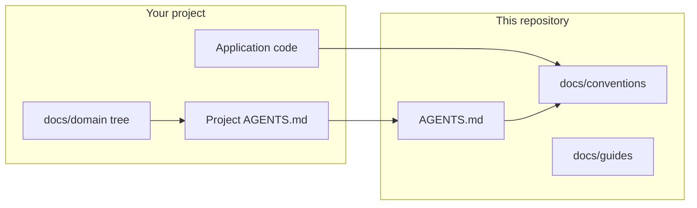

# Engineering Standards

**Pre-release** · [MIT License](LICENSE)

Normative conventions and agent contracts for full-stack .NET and Next.js projects. Use this repository as the single source of truth for architecture, coding rules, and AI agent behavior.



---

## Quick start

| Role | Start here |
|:---|:---|
| AI agent | [`AGENTS.md`](AGENTS.md) |
| Human engineer | [`docs/README.md`](docs/README.md) then the convention for your layer |
| New use case | [`docs/guides/agentic-domain-driven-design.md`](docs/guides/agentic-domain-driven-design.md), then [`docs/guides/add-new-use-case.md`](docs/guides/add-new-use-case.md) |

---

## Reference implementation

**[LitePress](https://github.com/Litenova-Solutions/LitePress)** is the canonical consumer of these standards: multiple Next.js apps under `apps/`, ASP.NET Core 10 API, ADDD domain docs, pinned `standards/` submodule, and CI gates from [`docs/conventions/shared/ci.md`](docs/conventions/shared/ci.md). Project docs in LitePress override these standards when they overlap. Use it as a working example when adopting this repository in a new project.

| Repository | Role |
|:---|:---|
| [Litenova-Solutions/LitePress](https://github.com/Litenova-Solutions/LitePress) | Reference application monorepo |
| This repository | Normative standards consumed via submodule |

---

## Versioning philosophy

**v1.0.0** will be the first pinned release tag. Until then, `main` is the working baseline. There is no `CHANGELOG.md` before **v2.0.0**; release notes for v1.x are captured in GitHub Release descriptions only.

| Semver | Meaning |
|:---|:---|
| `MAJOR` | Breaking change: previously compliant code may violate a new MUST rule |
| `MINOR` | Additive: new conventions or decisions; existing compliant code stays valid |
| `PATCH` | Clarifications, examples, typo fixes |

From **v2.0.0** onward, breaking and notable changes are tracked in `CHANGELOG.md`. A long-term goal is broad coverage across backend, frontend, CI, security, and operations; version numbers track **compatibility**, not a count of documents.

Check `standards.manifest.json` at the tag you pin for machine-readable paths.

---

## How to consume this repository

Pick one approach for your repository type. All approaches MUST pin a **semver tag**, not a moving branch.

### Consumption matrix

| Scenario | Recommended approach | Pin strategy | Agent entry |
|:---|:---|:---|:---|
| Single application repo (API + optional web) | Git submodule at `standards/` | Tag, e.g. `v1.0.0` | `standards/AGENTS.md` via project shim |
| Turborepo monorepo (api + web + packages) | Submodule at **repo root** `standards/` | Same tag for all packages | One shim at monorepo root |
| Solo / minimal visibility | Submodule at `.standards/` | Same | `.standards/AGENTS.md` |
| Platform team, many repos | Submodule + automated bump PRs | Renovate or internal bot on submodule SHA | Org template repo |
| Air-gapped / no git submodule | CI copies tagged tarball into `standards-snapshot/` read-only | Extract from release asset | Point shim at snapshot path |

**Avoid:** copying files manually into your repo without a submodule or tagged snapshot. Copies drift within weeks.

**Avoid:** editing files inside the submodule from the consumer repo. Propose changes here instead.

### Option A: Submodule at `standards/` (recommended)

```bash
git submodule add <YOUR_STANDARDS_REPO_URL> standards
git submodule update --init --recursive
cd standards && git checkout v1.0.0 && cd ..
git add standards
git commit -m "chore: pin engineering-standards to v1.0.0"
```

### Option B: Submodule at `.standards/`

```bash
git submodule add <YOUR_STANDARDS_REPO_URL> .standards
git submodule update --init --recursive
cd .standards && git checkout v1.0.0 && cd ..
```

### Bootstrap after clone

```bash
git clone --recursive <YOUR_PROJECT_REPO_URL>
./scripts/bootstrap.sh   # or bootstrap.ps1: git submodule update --init --recursive
```

Example `scripts/bootstrap.ps1`:

```powershell
Set-StrictMode -Version Latest
$ErrorActionPreference = "Stop"

git submodule update --init --recursive

Push-Location standards
git describe --tags HEAD
Pop-Location

dotnet tool restore
pnpm install

Write-Host "Next: pnpm dev:aspire (or see project development guide)"
```

### Project `AGENTS.md` shim

Copy [`docs/templates/project-agents.md`](docs/templates/project-agents.md) to your repo root as `AGENTS.md`. It should:

1. Point to `standards/AGENTS.md` (or `.standards/AGENTS.md`).
2. List project-specific MUST rules.
3. Point to the project `docs/domain/` tree (system index, feature READMEs, use case docs).

### CI enforcement

Copy [`docs/templates/ci-workflow.yml`](docs/templates/ci-workflow.yml) to `.github/workflows/ci.yml`. It runs backend and frontend gates plus optional checks:

- OpenAPI artifact freshness
- Playwright when `apps/web/` exists
- Submodule pinned to an exact tag (`git describe --exact-match --tags` inside `standards/`)

Full gate list: [`docs/conventions/shared/ci.md`](docs/conventions/shared/ci.md).

### Cursor / Copilot

- Submodule does not auto-load Cursor rules. Reference `standards/.cursor/rules/` from your project rules or duplicate thin shims that link to the standards paths.
- GitHub Copilot: use [`.github/copilot-instructions.md`](.github/copilot-instructions.md) pattern in the consumer repo pointing at the submodule.

---

## Repository layout

```
engineering-standards/
├── AGENTS.md                 Agent contract (read first)
├── standards.manifest.json   Version and paths for tooling
├── docs/
│   ├── README.md             Documentation map
│   ├── architecture/       Structural guide
│   ├── conventions/        Normative rules (agents load these)
│   ├── decisions/          Why choices were made (humans / new deps)
│   ├── guides/             DoD, add-feature playbooks
│   ├── philosophy.md       Human rationale (not for agents)
│   ├── agentic-development.md
│   └── templates/          Copy into consumer repos
└── .cursor/rules/            Cursor summaries when editing standards
```

Human-only rationale (not for routine agent loads): [`docs/philosophy.md`](docs/philosophy.md), [`docs/agentic-development.md`](docs/agentic-development.md).

---

## Normative vs decisions

| Layer | Location | Agent loads? |
|:---|:---|:---:|
| Rules | `docs/conventions/` | Yes |
| Playbooks | `docs/guides/` | Yes, when finishing work |
| Decisions | `docs/decisions/` | No (unless adding a dependency) |
| Rationale | `docs/philosophy.md` | No |

Decisions use **slug filenames** (no linear numbers). Index: [`docs/decisions/README.md`](docs/decisions/README.md).

---

## Project domain documentation

Convention files here stay generic. Each consumer project maintains living domain docs under `docs/domain/`:

- System index (`README.md`), feature READMEs, and use case docs
- See [`docs/guides/agentic-domain-driven-design.md`](docs/guides/agentic-domain-driven-design.md)

---

## Contributing

See [CONTRIBUTING.md](CONTRIBUTING.md). New decisions need a row in `docs/decisions/README.md`.

---

## License

[MIT](LICENSE)
