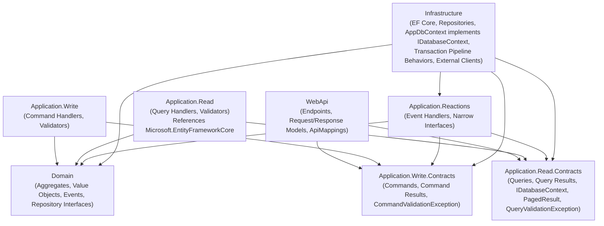
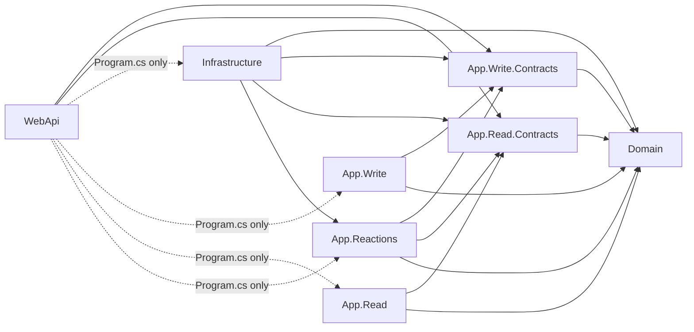
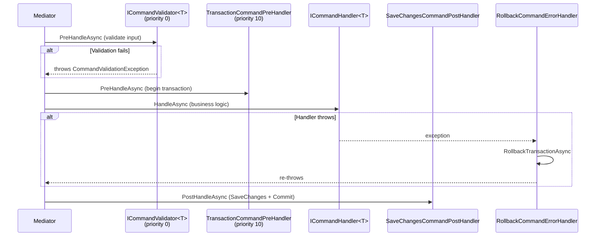

# Clean Architecture

This document explains how Clean Architecture is applied across all projects following these standards. Every project follows this structure regardless of domain complexity.

---

## 1. Layer Diagram



---

## 2. Layer Responsibilities

### Domain

The Domain layer contains the core business model. It has zero dependencies on any other project in the solution and zero dependencies on any external framework.

**Contains:**
- Aggregate roots and their child entities
- Value objects
- Domain events
- Domain exceptions (`DomainException` subclasses, `AggregateNotFoundException` subclasses)
- Repository interfaces (`IPostRepository`, `ICustomerRepository`, etc.)
- Strongly-typed IDs (`PostId`, `CustomerId`, etc.)

**Forbidden:**
- Any reference to `Microsoft.EntityFrameworkCore`
- Any reference to `Microsoft.AspNetCore.*`
- Application models, DTOs, or read projection types
- Infrastructure concerns: connection strings, HTTP clients, file paths

### Application.Write.Contracts

The public contract of the write path. Contains only types that form the API surface of write operations.

**Contains:**
- Command record types (`CreatePostCommand`, `PublishPostCommand`)
- Command result record types (`PostId` as a result, or dedicated result records)
- Write-side contract interfaces that Infrastructure implements
- NuGet reference: `LiteBus.Commands.Abstractions`

**Forbidden:**
- Command handler implementations
- Command validator implementations
- Any business logic

### Application.Write

The private implementation of the write path.

**Contains:**
- Command handler implementations (`ICommandHandler<TCommand>`, `ICommandHandler<TCommand, TResult>`)
- Command validator implementations (`ICommandValidator<TCommand>`)
- References: `Application.Write.Contracts`, `Domain`
- NuGet reference: `LiteBus.Commands.Abstractions`

**Forbidden:**
- Command or query type definitions (those belong in Contracts)
- Read store interfaces or query types
- Any reference to `Microsoft.EntityFrameworkCore`

### Application.Read.Contracts

The public contract of the read path. Contains only types that form the API surface of read operations.

**Contains:**
- Query record types (`GetPostByIdQuery`)
- Query result record types (`PostResult`, `PostSummary`)
- `IDatabaseContext` interface exposing `IQueryable<T>` per aggregate
- `PagedResult<T>` and `PaginationParameters` shared pagination types
- `QueryValidationException` base class
- NuGet reference: `LiteBus.Queries.Abstractions`

**Forbidden:**
- Query handler implementations
- Query validator implementations
- Any business logic

### Application.Read

The private implementation of the read path.

**Contains:**
- Query handler implementations (`IQueryHandler<TQuery, TResult>`)
- Query validator implementations (`IQueryValidator<TQuery>`)
- References: `Application.Read.Contracts`, `Domain`, `Microsoft.EntityFrameworkCore`
- NuGet reference: `LiteBus.Queries.Abstractions`
- Injects `IDatabaseContext` for all data access

**Forbidden:**
- Query or result type definitions (those belong in Contracts)
- Any reference to the Infrastructure project directly (use `IDatabaseContext` from `Application.Read.Contracts`)

### Application.Reactions

Event handler implementations that react to domain events.

**Contains:**
- Event handler implementations (`IEventHandler<TEvent>`)
- Narrow, per-handler interfaces for external side effects (`IPostPublishedNotifier`)
- References: `Application.Write.Contracts`, `Application.Read.Contracts`, `Domain`
- NuGet reference: `LiteBus.Events.Abstractions`

**Forbidden:**
- Any reference to external library packages (EF Core, email clients, HTTP clients)
- Any business rule enforcement (that belongs in Domain)

### Infrastructure

Adapts external systems to the interfaces defined by Domain and Application.

**Contains:**
- EF Core `DbContext` implementation (`AppDbContext` implements `IDatabaseContext`)
- `IEntityTypeConfiguration<T>` classes for all aggregates
- `IXxxRepository` implementations
- Global LiteBus pipeline behaviors: `TransactionCommandPreHandler`, `SaveChangesCommandPostHandler`, `RollbackCommandErrorHandler`
- Implementations of narrow interfaces defined in `Application.Reactions`
- External service clients (email, payment, blob storage)
- EF Core migrations
- DI registration extension methods

**Forbidden:**
- Business logic or domain rule enforcement
- Knowledge of the HTTP request lifecycle
- References to `Microsoft.AspNetCore.*` except for DI types

### WebApi

The HTTP adapter. Translates HTTP requests into application commands and queries.

**Contains:**
- `IEndpoint` implementations (one class per use case)
- Request and response record types
- `ApiMappings` extension classes
- `GlobalExceptionHandler` middleware
- OpenAPI configuration

**Forbidden:**
- Business logic of any kind
- Direct access to repositories, read stores, or `DbContext`
- `try-catch` blocks (handled by `GlobalExceptionHandler`)
- Domain types in response models

---

## 3. Dependency Rule

Dependencies point inward only. No inner layer may reference an outer layer.



| Project | May Reference |
|:---|:---|
| `Domain` | Nothing |
| `Application.Write.Contracts` | `Domain` |
| `Application.Read.Contracts` | `Domain` |
| `Application.Write` | `Application.Write.Contracts`, `Domain` |
| `Application.Read` | `Application.Read.Contracts`, `Domain`, `Microsoft.EntityFrameworkCore` |
| `Application.Reactions` | `Application.Write.Contracts`, `Application.Read.Contracts`, `Domain` |
| `Infrastructure` | `Domain`, `Application.Write.Contracts`, `Application.Read.Contracts`, `Application.Reactions` |
| `WebApi` | `Application.Write.Contracts`, `Application.Read.Contracts` |
| `WebApi` (`Program.cs` only) | `Infrastructure`, `Application.Write`, `Application.Read`, `Application.Reactions` for DI registration |

---

## 4. CQRS Split

Commands and queries are handled by separate classes in separate projects. This enforces a hard split between the read path and the write path at the compiler level.

**Commands** modify state. A command handler:
1. Validates input (a separate validator runs before the handler via LiteBus pipeline).
2. Loads the aggregate from its repository.
3. Calls a method on the aggregate that enforces the business rule.
4. Saves the aggregate back via the repository.
5. Returns void or a simple creation result.

**Queries** return data. A query handler:
1. Validates input (a separate validator runs before the handler).
2. Writes a LINQ projection against `IDatabaseContext`.
3. Returns the projection result or throws an `AggregateNotFoundException` subclass if not found.

Query handlers MUST NOT load domain aggregates. They MUST NOT inject repository interfaces. See `docs/conventions/backend/07-query-read-strategy.md` for full details.

---

## 5. LiteBus as Mediator

LiteBus is a modular mediator. Each project references only the package it needs, not the full metapackage. This keeps project dependencies minimal and explicit.

| LiteBus Package | Project | Purpose |
|:---|:---|:---|
| `LiteBus.Commands.Abstractions` | `Application.Write.Contracts`, `Application.Write` | `ICommand`, `ICommandHandler`, `ICommandValidator`, `ICommandMediator` |
| `LiteBus.Queries.Abstractions` | `Application.Read.Contracts`, `Application.Read` | `IQuery`, `IQueryHandler`, `IQueryValidator`, `IQueryMediator` |
| `LiteBus.Events.Abstractions` | `Application.Reactions` | `IEvent`, `IEventHandler`, `IEventPublisher` |
| `LiteBus.Extensions.Microsoft.DependencyInjection` | `WebApi` | Full DI registration |
| `LiteBus.Commands.Abstractions` | `Infrastructure` | `ICommandPreHandler<ICommand>`, `ICommandPostHandler<ICommand>`, `ICommandErrorHandler<ICommand>` for global pipeline behaviors |

Endpoints dispatch via `ICommandMediator` or `IQueryMediator`. These interfaces are the specific entry points for endpoints. WebApi does not reference the handler implementation projects directly in endpoint code; it references only the Contracts projects for the command and query types.

```csharp
// GOOD: endpoint dispatches via specific mediator, references only Contracts types
sealed class CreatePostEndpoint : IEndpoint
{
    public void MapEndpoint(IEndpointRouteBuilder app)
    {
        app.MapPost("/posts", HandleAsync);
    }

    private static async Task<IResult> HandleAsync(
        CreatePostRequest request,
        ICommandMediator commandMediator,
        CancellationToken cancellationToken)
    {
        var command = request.ToCommand();
        var postId = await commandMediator.SendAsync(command, cancellationToken);
        return Results.Created($"/posts/{postId.Value}", postId.ToResponse());
    }
}
```

---

## 6. Event Handling and the Reactions Project

Domain events originate in aggregates. An aggregate method raises a domain event by calling `RaiseDomainEvent(new PostPublished(Id))`. LiteBus dispatches these events after the command handler completes.

The `Application.Reactions` project contains event handlers. Each handler reacts to one domain event. There are three categories:

1. **Dispatches a command:** The handler receives an event and sends a follow-up command via `IMessageBus`. Example: `OnOrderPlaced` dispatches a `SendOrderConfirmationEmailCommand`.
2. **Updates a read model projection:** The handler receives an event and updates a denormalized read model. Example: `OnPostPublished` updates a `PublishedPostsSummary` table.
3. **Triggers an external side effect:** The handler receives an event and calls a narrow interface to notify an external system. Example: `OnPostPublished` calls `IPostPublishedNotifier.NotifySubscribersAsync(...)`.

The Reactions project MUST NOT reference external libraries. All external capabilities are accessed through narrow interfaces defined in the Reactions project and implemented by Infrastructure.

```csharp
// GOOD: narrow interface defined in Application.Reactions
internal interface IPostPublishedNotifier
{
    Task NotifySubscribersAsync(PostId postId, string postTitle, CancellationToken cancellationToken);
}

// GOOD: event handler uses the narrow interface
internal sealed class NotifySubscribersOnPostPublishedEventHandler : IEventHandler<PostPublished>
{
    private readonly IPostPublishedNotifier _notifier;

    public NotifySubscribersOnPostPublishedEventHandler(
        IPostPublishedNotifier notifier)
    {
        _notifier = notifier;
    }

    public async Task HandleAsync(PostPublished @event, CancellationToken cancellationToken)
    {
        await _notifier.NotifySubscribersAsync(
            @event.PostId,
            @event.PostTitle,
            cancellationToken);
    }
}

// BAD: event handler references an external library directly
internal sealed class NotifySubscribersOnPostPublishedEventHandler : IEventHandler<PostPublished>
{
    private readonly IEmailClient _emailClient; // BAD: external library in Application.Reactions
}
```

---

## 8. Transaction Pipeline Behaviors

Transaction management is handled by three global LiteBus pipeline behaviors registered in Infrastructure. Command handlers do not call `SaveChangesAsync`. Repositories do not call `SaveChangesAsync`. The pipeline handles all persistence.

The execution order for every command:



### Handler Priority Scheme

| Priority | Handler | Scope |
|:---|:---|:---|
| 0 (default) | `ICommandValidator<TCommand>` | Specific per command; runs before the transaction opens |
| 10 | `TransactionCommandPreHandler` | Global for all `ICommand`; opens transaction after validation |

### Implementation

```csharp
// Infrastructure/Behaviors/TransactionCommandPreHandler.cs
/// <summary>
/// Opens a database transaction before every command executes.
/// Runs at priority 10, after validators (priority 0), so no transaction
/// is opened for invalid input.
/// </summary>
[HandlerPriority(10)]
internal sealed class TransactionCommandPreHandler
    : ICommandPreHandler<ICommand>
{
    private readonly AppDbContext _dbContext;

    public TransactionCommandPreHandler(AppDbContext dbContext)
    {
        _dbContext = dbContext;
    }

    public async Task PreHandleAsync(
        ICommand command,
        CancellationToken cancellationToken)
    {
        await _dbContext.Database
            .BeginTransactionAsync(cancellationToken);
    }
}
```

```csharp
// Infrastructure/Behaviors/SaveChangesCommandPostHandler.cs
/// <summary>
/// Saves all pending changes and commits the transaction after every
/// command handler completes successfully.
/// </summary>
internal sealed class SaveChangesCommandPostHandler
    : ICommandPostHandler<ICommand>
{
    private readonly AppDbContext _dbContext;

    public SaveChangesCommandPostHandler(AppDbContext dbContext)
    {
        _dbContext = dbContext;
    }

    public async Task PostHandleAsync(
        ICommand command,
        object? result,
        CancellationToken cancellationToken)
    {
        await _dbContext.SaveChangesAsync(cancellationToken);
        await _dbContext.Database.CommitTransactionAsync(cancellationToken);
    }
}
```

```csharp
// Infrastructure/Behaviors/RollbackCommandErrorHandler.cs
/// <summary>
/// Rolls back the active transaction if any exception is thrown during
/// command execution, then re-throws the exception so the
/// GlobalExceptionHandler maps it to the correct HTTP response.
/// </summary>
internal sealed class RollbackCommandErrorHandler
    : ICommandErrorHandler<ICommand>
{
    private readonly AppDbContext _dbContext;

    public RollbackCommandErrorHandler(AppDbContext dbContext)
    {
        _dbContext = dbContext;
    }

    public async Task HandleErrorAsync(
        ICommand command,
        Exception exception,
        CancellationToken cancellationToken)
    {
        if (_dbContext.Database.CurrentTransaction is not null)
        {
            await _dbContext.Database
                .RollbackTransactionAsync(cancellationToken);
        }

        throw exception;
    }
}
```

### LiteBus Registration

LiteBus supports incremental module registration. Each assembly registers its own handlers:

```csharp
// WebApi/Program.cs (LiteBus registration excerpt)
builder.Services.AddLiteBus(liteBus =>
{
    liteBus.AddCommandModule(module =>
    {
        // Application.Write assembly — command handlers and validators
        module.RegisterFromAssembly(
            typeof(CreatePostCommandHandler).Assembly);
    });

    liteBus.AddCommandModule(module =>
    {
        // Infrastructure assembly — global pipeline behaviors
        // Explicit registration makes pipeline behaviors visible
        // to engineers reading Program.cs
        module.Register(typeof(TransactionCommandPreHandler));
        module.Register(typeof(SaveChangesCommandPostHandler));
        module.Register(typeof(RollbackCommandErrorHandler));
    });

    liteBus.AddQueryModule(module =>
    {
        module.RegisterFromAssembly(
            typeof(GetPostByIdQueryHandler).Assembly);
    });

    liteBus.AddEventModule(module =>
    {
        module.RegisterFromAssembly(
            typeof(UpdateReadModelOnPostPublishedEventHandler).Assembly);
    });
});
```

---

## 7. Architecture Tests

Structural rules are enforced by architecture tests using NetArchTest in addition to project reference constraints. Project references prevent the most obvious violations. Architecture tests catch violations that project references cannot.

Architecture tests live in `{ProjectName}.Architecture.Tests`. They run in CI on every PR. See `docs/conventions/backend/08-testing.md` for full examples.

Three concrete examples of rules that architecture tests enforce:

1. **Query handlers must not depend on repository interfaces.** The project reference alone does not prevent this if a future refactoring introduces a shared project containing both. The test explicitly asserts no such dependency exists.

2. **Handlers must be `internal sealed`.** Handlers are implementation details and must not be `public`. The test asserts this for all types implementing `ICommandHandler<,>` or `IQueryHandler<,>`.

3. **Reactions must not reference external libraries.** NetArchTest checks that no type in the Reactions assembly has a dependency on `Microsoft.EntityFrameworkCore` or similar packages.

---

## 8. The AggregateRoot Base Class

Every project defines two types in `Domain/Shared/`. They are not provided by a NuGet package; they are owned by the project.

```csharp
/// <summary>
/// The base class for all aggregate roots. Provides domain event collection
/// and the strongly-typed ID contract.
/// </summary>
abstract class AggregateRoot<TId>
    where TId : struct
{
    private readonly List<IDomainEvent> _domainEvents = [];

    /// <summary>
    /// The unique identifier of this aggregate root.
    /// </summary>
    public TId Id { get; protected init; }

    /// <summary>
    /// Domain events raised during this aggregate's lifetime, dispatched
    /// after the transaction commits.
    /// </summary>
    public IReadOnlyList<IDomainEvent> DomainEvents => _domainEvents.AsReadOnly();

    /// <summary>
    /// Records a domain event to be dispatched after the transaction commits.
    /// </summary>
    protected void RaiseDomainEvent(IDomainEvent domainEvent)
    {
        _domainEvents.Add(domainEvent);
    }

    /// <summary>
    /// Clears all recorded domain events. Called by Infrastructure after
    /// events have been dispatched.
    /// </summary>
    public void ClearDomainEvents()
    {
        _domainEvents.Clear();
    }
}
```

The `IDomainEvent` marker interface:

```csharp
/// <summary>
/// Marker interface for all domain events. Implement this interface on
/// every domain event record.
/// </summary>
interface IDomainEvent;
```

Both types live in `Domain/Shared/`. All aggregate roots extend `AggregateRoot<TId>`. All domain event records implement `IDomainEvent`. Infrastructure calls `ClearDomainEvents()` after dispatching events via LiteBus.