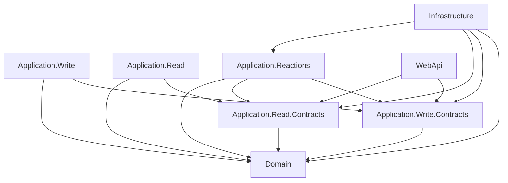

# Solution Structure

This document covers the physical structure of a .NET solution following these standards.

---

## 1. Solution Layout

Every project follows this standard layout. Replace `{ProjectName}` with the actual project name (PascalCase, no spaces).

```
{ProjectName}/
├── global.json
├── Directory.Build.props
├── Directory.Packages.props
├── {ProjectName}.slnx
├── src/
│   ├── {ProjectName}.Domain/
│   ├── {ProjectName}.Application.Write.Contracts/
│   ├── {ProjectName}.Application.Write/
│   ├── {ProjectName}.Application.Read.Contracts/
│   ├── {ProjectName}.Application.Read/
│   ├── {ProjectName}.Application.Reactions/
│   ├── {ProjectName}.Infrastructure/
│   └── {ProjectName}.WebApi/
├── tests/
│   ├── {ProjectName}.Domain.Tests/
│   ├── {ProjectName}.Application.Tests/
│   ├── {ProjectName}.Integration.Tests/
│   └── {ProjectName}.Architecture.Tests/
└── docs/
    └── adr/
```

The solution file uses the `.slnx` format (SDK-style solution files), not the legacy `.sln` format. See ADR 0001 for the decision.

---

## 2. `global.json`

Every solution MUST include a `global.json` at the solution root that pins the .NET SDK version.

```json
{
  "sdk": {
    "version": "10.0.100",
    "rollForward": "latestPatch"
  }
}
```

`rollForward: latestPatch` allows patch-level SDK updates (10.0.101, 10.0.102) without requiring a `global.json` update, while preventing major or minor version drift. This ensures all contributors and CI agents use the same SDK minor version.

This file MUST be committed to source control. It MUST NOT appear in `.gitignore`.

---

## 3. `Directory.Build.props`

A `Directory.Build.props` file at the solution root sets metadata shared across all projects. Every project in the solution inherits these settings automatically without any configuration in individual `.csproj` files.

```xml
<Project>
  <PropertyGroup>
    <TargetFramework>net10.0</TargetFramework>
    <Nullable>enable</Nullable>
    <ImplicitUsings>enable</ImplicitUsings>
    <TreatWarningsAsErrors>true</TreatWarningsAsErrors>
    <EnforceCodeStyleInBuild>true</EnforceCodeStyleInBuild>
    <LangVersion>preview</LangVersion>
  </PropertyGroup>
</Project>
```

`TreatWarningsAsErrors` ensures that nullable reference warnings, unused variable warnings, and similar issues are build failures, not silent warnings. `LangVersion: preview` enables the latest C# language features on the .NET 10 SDK.

---

## 4. `Directory.Packages.props`

All NuGet package versions are managed centrally via `Directory.Packages.props` at the solution root. Individual `.csproj` files reference packages without version numbers.

```xml
<Project>
  <PropertyGroup>
    <ManagePackageVersionsCentrally>true</ManagePackageVersionsCentrally>
  </PropertyGroup>
  <ItemGroup>
    <PackageVersion Include="LiteBus.Commands.Abstractions" Version="x.x.x" />
    <PackageVersion Include="LiteBus.Queries.Abstractions" Version="x.x.x" />
    <PackageVersion Include="LiteBus.Events.Abstractions" Version="x.x.x" />
    <PackageVersion Include="LiteBus.Messaging.Abstractions" Version="x.x.x" />
    <PackageVersion Include="LiteBus.Extensions.Microsoft.DependencyInjection" Version="x.x.x" />
    <PackageVersion Include="Ardalis.GuardClauses" Version="x.x.x" />
    <PackageVersion Include="Microsoft.EntityFrameworkCore" Version="x.x.x" />
    <PackageVersion Include="Npgsql.EntityFrameworkCore.PostgreSQL" Version="x.x.x" />
    <PackageVersion Include="Serilog.AspNetCore" Version="x.x.x" />
    <PackageVersion Include="xunit" Version="x.x.x" />
    <PackageVersion Include="NSubstitute" Version="x.x.x" />
    <PackageVersion Include="AwesomeAssertions" Version="x.x.x" />
    <PackageVersion Include="Testcontainers.PostgreSql" Version="x.x.x" />
    <PackageVersion Include="Microsoft.AspNetCore.Mvc.Testing" Version="x.x.x" />
    <PackageVersion Include="coverlet.collector" Version="x.x.x" />
  </ItemGroup>
</Project>
```

Individual `.csproj` files reference packages without version attributes:

```xml
<Project Sdk="Microsoft.NET.Sdk">
  <ItemGroup>
    <PackageReference Include="LiteBus.Commands.Abstractions" />
    <PackageReference Include="Ardalis.GuardClauses" />
  </ItemGroup>
</Project>
```

---

## 5. Project References

The dependency rule (outer layers depend on inner layers, never the reverse) is enforced via project references. The reference graph below is the authoritative source.



| Project | References |
|:---|:---|
| `{ProjectName}.Domain` | Nothing |
| `{ProjectName}.Application.Write.Contracts` | `Domain` |
| `{ProjectName}.Application.Read.Contracts` | `Domain` |
| `{ProjectName}.Application.Write` | `Application.Write.Contracts`, `Domain` |
| `{ProjectName}.Application.Read` | `Application.Read.Contracts`, `Domain` |
| `{ProjectName}.Application.Reactions` | `Application.Write.Contracts`, `Application.Read.Contracts`, `Domain` |
| `{ProjectName}.Infrastructure` | `Domain`, `Application.Write.Contracts`, `Application.Read.Contracts`, `Application.Reactions` |
| `{ProjectName}.WebApi` | `Application.Write.Contracts`, `Application.Read.Contracts` |
| `{ProjectName}.WebApi` (`Program.cs` only) | `Infrastructure`, `Application.Write`, `Application.Read`, `Application.Reactions` for DI registration |

No circular references exist anywhere in this graph. If a reference would create a cycle, the design is wrong.

---

## 6. Which LiteBus Package Goes Where

LiteBus is modular. Each project references only the package it needs. Never add the full `LiteBus` metapackage to a project that only needs abstractions.

| LiteBus Package | Project(s) | Purpose |
|:---|:---|:---|
| `LiteBus.Commands.Abstractions` | `Application.Write.Contracts`, `Application.Write` | `ICommand`, `ICommand<TResult>`, `ICommandHandler<TCommand>`, `ICommandHandler<TCommand, TResult>`, `ICommandValidator<TCommand>` |
| `LiteBus.Queries.Abstractions` | `Application.Read.Contracts`, `Application.Read` | `IQuery<TResult>`, `IQueryHandler<TQuery, TResult>`, `IQueryValidator<TQuery>` |
| `LiteBus.Events.Abstractions` | `Application.Reactions` | `IEvent`, `IEventHandler<TEvent>` |
| `LiteBus.Messaging.Abstractions` | `WebApi` | `IMessageBus` - the unified dispatcher used in endpoints |
| `LiteBus.Extensions.Microsoft.DependencyInjection` | `WebApi` | Full DI registration for all handlers |

---

## 7. NuGet Package Policy

Every new NuGet package MUST be justified with an ADR in `docs/adr/`. The ADR explains why the package was chosen, what alternatives were considered, and what the trade-offs are.

The following packages are pre-approved and do not require a new ADR:

| Package | Layer(s) | Purpose |
|:---|:---|:---|
| `LiteBus.Commands.Abstractions` | `Application.Write.Contracts`, `Application.Write` | Command mediator abstractions |
| `LiteBus.Queries.Abstractions` | `Application.Read.Contracts`, `Application.Read` | Query mediator abstractions |
| `LiteBus.Events.Abstractions` | `Application.Reactions` | Event mediator abstractions |
| `LiteBus.Messaging.Abstractions` | `WebApi` | Unified message bus for dispatch |
| `LiteBus.Extensions.Microsoft.DependencyInjection` | `WebApi` | LiteBus DI registration |
| `Ardalis.GuardClauses` | `Domain`, `Application.Write`, `Application.Read` | Guard clause helpers |
| `Microsoft.EntityFrameworkCore` | `Infrastructure` | ORM |
| `Npgsql.EntityFrameworkCore.PostgreSQL` | `Infrastructure` | PostgreSQL EF Core provider |
| `Serilog.AspNetCore` | `WebApi` | Structured logging |
| `xunit` | All test projects | Test framework |
| `NSubstitute` | `Application.Tests` | Mocking framework |
| `AwesomeAssertions` | All test projects | Assertion library |
| `Testcontainers.PostgreSql` | `Integration.Tests` | PostgreSQL container for tests |
| `Microsoft.AspNetCore.Mvc.Testing` | `Integration.Tests` | `WebApplicationFactory<T>` |
| `coverlet.collector` | All test projects | Code coverage |

Any package not in this list requires an ADR before being added to any project.

---

## 8. `GlobalUsings.cs`

Each project contains a single `GlobalUsings.cs` file at the project root. Global usings reduce repetition but MUST only contain namespaces used in the majority of files in that project.

```
{ProjectName}.Domain/
└── GlobalUsings.cs          <- only domain-wide namespaces

{ProjectName}.Application.Write/
└── GlobalUsings.cs          <- only application-write-wide namespaces
```

Global usings MUST NOT contain:
- Namespaces for types used in only one or two files (add the `using` locally instead)
- Aliases that could be confused with standard library types
- Infrastructure namespaces in Domain or Application global usings

---

Project-specific configuration is documented in the project repository. See `docs/templates/` in the standards repository for the templates to use.