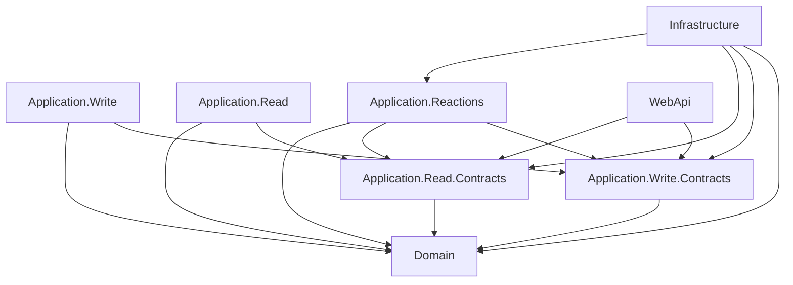

# Solution Structure

This document covers the physical structure of a .NET solution following these standards.

---

## 1. Solution Layout

Every project follows this standard layout. Replace `{ProjectName}` with the actual project name (PascalCase, no spaces).

```
{ProjectName}/
├── global.json
├── Directory.Build.props
├── Directory.Packages.props
├── {ProjectName}.slnx
├── src/
│   ├── {ProjectName}.Domain/
│   ├── {ProjectName}.Application.Write.Contracts/
│   ├── {ProjectName}.Application.Write/
│   ├── {ProjectName}.Application.Read.Contracts/
│   ├── {ProjectName}.Application.Read/
│   ├── {ProjectName}.Application.Reactions/
│   ├── {ProjectName}.Infrastructure/
│   ├── {ProjectName}.WebApi/
│   ├── {ProjectName}.AppHost/         ← .NET Aspire orchestration
│   └── {ProjectName}.ServiceDefaults/ ← shared OTel, health checks
├── tests/
│   ├── {ProjectName}.Domain.Tests/
│   ├── {ProjectName}.Application.Tests/
│   ├── {ProjectName}.Integration.Tests/
│   └── {ProjectName}.Architecture.Tests/
└── docs/
    └── adr/
```

The solution file uses the `.slnx` format (SDK-style solution files), not the legacy `.sln` format.

The `AppHost` project is the local development entry point. Run `dotnet run --project src/{ProjectName}.AppHost` to start all services including the database container. See `docs/conventions/backend/13-deployment-and-migrations.md` for Aspire setup details.

---

## 2. `global.json`

Every solution MUST include a `global.json` at the solution root that pins the .NET SDK version.

```json
{
  "sdk": {
    "version": "10.0.100",
    "rollForward": "latestPatch"
  }
}
```

`rollForward: latestPatch` allows patch-level SDK updates (10.0.101, 10.0.102) without requiring a `global.json` update, while preventing major or minor version drift. This ensures all contributors and CI agents use the same SDK minor version.

This file MUST be committed to source control. It MUST NOT appear in `.gitignore`.

---

## 3. `Directory.Build.props`

A `Directory.Build.props` file at the solution root sets metadata shared across all projects. Every project in the solution inherits these settings automatically without any configuration in individual `.csproj` files.

```xml
<Project>
  <PropertyGroup>
    <TargetFramework>net10.0</TargetFramework>
    <Nullable>enable</Nullable>
    <ImplicitUsings>enable</ImplicitUsings>
    <TreatWarningsAsErrors>true</TreatWarningsAsErrors>
    <EnforceCodeStyleInBuild>true</EnforceCodeStyleInBuild>
    <LangVersion>preview</LangVersion>
  </PropertyGroup>
</Project>
```

`TreatWarningsAsErrors` ensures that nullable reference warnings, unused variable warnings, and similar issues are build failures, not silent warnings. `LangVersion: preview` enables the latest C# language features on the .NET 10 SDK.

`EnforceCodeStyleInBuild` promotes IDE-only style rules to build-time errors. The following rules are enforced and **will cause build failures** if violated:

| Rule | Behaviour |
|:---|:---|
| IDE0011 | Braces required for all `if`, `else`, `foreach`, `while`, and `switch` bodies, including single-line bodies. |
| IDE0161 | File-scoped namespaces required. Block-scoped `namespace Foo { }` is a build error. This applies to EF Core generated migration files — convert them after generation. |
| IDE0040 | Explicit access modifier required on every type member. Interface method implementations must declare `public`. |

```csharp
// IDE0011 — required braces
if (x > 0)
{
    DoSomething();
}

// IDE0161 — file-scoped namespace
namespace MyApp.Domain;

public sealed class Post { }

// IDE0040 — explicit access modifier
public sealed class PostConfiguration : IEntityTypeConfiguration<Post>
{
    public void Configure(EntityTypeBuilder<Post> builder) { }  // explicit public required
}
```

---

## 4. `Directory.Packages.props`

All NuGet package versions are managed centrally via `Directory.Packages.props` at the solution root. Individual `.csproj` files reference packages without version numbers.

```xml
<Project>
  <PropertyGroup>
    <ManagePackageVersionsCentrally>true</ManagePackageVersionsCentrally>
  </PropertyGroup>
  <ItemGroup>
    <PackageVersion Include="LiteBus.Commands.Abstractions" Version="x.x.x" />
    <PackageVersion Include="LiteBus.Queries.Abstractions" Version="x.x.x" />
    <PackageVersion Include="LiteBus.Events.Abstractions" Version="x.x.x" />
    <PackageVersion Include="LiteBus.Extensions.Microsoft.DependencyInjection" Version="x.x.x" />
    <PackageVersion Include="Ardalis.GuardClauses" Version="x.x.x" />
    <PackageVersion Include="Microsoft.EntityFrameworkCore" Version="x.x.x" />
    <PackageVersion Include="Microsoft.EntityFrameworkCore.Sqlite" Version="x.x.x" />
    <PackageVersion Include="Npgsql.EntityFrameworkCore.PostgreSQL" Version="x.x.x" />
    <PackageVersion Include="Serilog.AspNetCore" Version="x.x.x" />
    <PackageVersion Include="Serilog.Sinks.Console" Version="x.x.x" />
    <PackageVersion Include="Serilog.Enrichers.Environment" Version="x.x.x" />
    <PackageVersion Include="Serilog.Enrichers.Thread" Version="x.x.x" />
    <PackageVersion Include="OpenTelemetry.Extensions.Hosting" Version="x.x.x" />
    <PackageVersion Include="OpenTelemetry.Instrumentation.AspNetCore" Version="x.x.x" />
    <PackageVersion Include="OpenTelemetry.Instrumentation.Http" Version="x.x.x" />
    <PackageVersion Include="OpenTelemetry.Instrumentation.Runtime" Version="x.x.x" />
    <PackageVersion Include="OpenTelemetry.Exporter.OpenTelemetryProtocol" Version="x.x.x" />
    <PackageVersion Include="xunit" Version="x.x.x" />
    <PackageVersion Include="NSubstitute" Version="x.x.x" />
    <PackageVersion Include="AwesomeAssertions" Version="x.x.x" />
    <PackageVersion Include="Testcontainers.PostgreSql" Version="x.x.x" />
    <PackageVersion Include="Microsoft.AspNetCore.Mvc.Testing" Version="x.x.x" />
    <PackageVersion Include="coverlet.collector" Version="x.x.x" />
  </ItemGroup>
</Project>
```

Individual `.csproj` files reference packages without version attributes:

```xml
<Project Sdk="Microsoft.NET.Sdk">
  <ItemGroup>
    <PackageReference Include="LiteBus.Commands.Abstractions" />
    <PackageReference Include="Ardalis.GuardClauses" />
  </ItemGroup>
</Project>
```

---

## 5. Project References

The dependency rule (outer layers depend on inner layers, never the reverse) is enforced via project references. The reference graph below is the authoritative source.



| Project | References |
|:---|:---|
| `{ProjectName}.Domain` | Nothing |
| `{ProjectName}.Application.Write.Contracts` | `Domain` |
| `{ProjectName}.Application.Read.Contracts` | `Domain` |
| `{ProjectName}.Application.Write` | `Application.Write.Contracts`, `Domain` |
| `{ProjectName}.Application.Read` | `Application.Read.Contracts`, `Domain`, `Microsoft.EntityFrameworkCore` |
| `{ProjectName}.Application.Reactions` | `Application.Write.Contracts`, `Application.Read.Contracts`, `Domain` |
| `{ProjectName}.Infrastructure` | `Domain`, `Application.Write.Contracts`, `Application.Read.Contracts`, `Application.Reactions` |
| `{ProjectName}.WebApi` | `Application.Write.Contracts`, `Application.Read.Contracts` |
| `{ProjectName}.WebApi` (`Program.cs` only) | `Infrastructure`, `Application.Write`, `Application.Read`, `Application.Reactions` for DI registration |

No circular references exist anywhere in this graph. If a reference would create a cycle, the design is wrong.

---

## 6. Which LiteBus Package Goes Where

LiteBus is modular. Each project references only the package it needs. Never add the full `LiteBus` metapackage to a project that only needs abstractions.

| LiteBus Package | Project(s) | Purpose |
|:---|:---|:---|
| `LiteBus.Commands.Abstractions` | `Application.Write.Contracts`, `Application.Write`, `Application.Reactions` | `ICommand`, `ICommand<TResult>`, `ICommandHandler<TCommand>`, `ICommandHandler<TCommand, TResult>`, `ICommandValidator<TCommand>`, `ICommandMediator` |
| `LiteBus.Queries.Abstractions` | `Application.Read.Contracts`, `Application.Read` | `IQuery<TResult>`, `IQueryHandler<TQuery, TResult>`, `IQueryValidator<TQuery>`, `IQueryMediator` |
| `LiteBus.Events.Abstractions` | `Application.Reactions`, `Infrastructure` | `IEventHandler<TEvent>`, `IEventPublisher`. **Do not add this to the Domain project.** Domain event classes are plain records with no LiteBus dependency. |
| `LiteBus.Commands.Abstractions` | `WebApi` | `ICommandMediator` for command endpoints |
| `LiteBus.Queries.Abstractions` | `WebApi` | `IQueryMediator` for query endpoints |
| `LiteBus.Extensions.Microsoft.DependencyInjection` | `WebApi` | Full DI registration for all handlers. Provides `AddLiteBus`, `AddCommandModule`, `AddQueryModule`, `AddEventModule`. |

> **Namespaces.** Each module's DI extension methods require a separate `using`:
> - `using LiteBus.Commands;` for `AddCommandModule`
> - `using LiteBus.Queries;` for `AddQueryModule`
> - `using LiteBus.Events;` for `AddEventModule`
>
> Check the current LiteBus docs for the precise package and namespace names. The LiteBus package structure may change between major versions.

> **Assembly markers.** Handler classes are `internal sealed`. Each implementation project must expose a `public static class {Layer}AssemblyMarker { }` so `Program.cs` in `WebApi` can pass `typeof({Layer}AssemblyMarker).Assembly` to `RegisterFromAssembly` without depending on internal types.

---

## 7. NuGet Package Policy

Every new NuGet package MUST be justified with an ADR in `docs/decisions/`. The ADR explains why the package was chosen, what alternatives were considered, and what the trade-offs are.

The following packages are pre-approved and do not require a new ADR:

| Package | Layer(s) | Purpose |
|:---|:---|:---|
| `LiteBus.Commands.Abstractions` | `Application.Write.Contracts`, `Application.Write`, `Application.Reactions`, `WebApi` | Command mediator abstractions |
| `LiteBus.Queries.Abstractions` | `Application.Read.Contracts`, `Application.Read` | Query mediator abstractions |
| `LiteBus.Events.Abstractions` | `Application.Reactions` | Event mediator abstractions |
| `LiteBus.Commands.Abstractions` | `WebApi` | `ICommandMediator` for command endpoints |
| `LiteBus.Queries.Abstractions` | `WebApi` | `IQueryMediator` for query endpoints |
| `LiteBus.Extensions.Microsoft.DependencyInjection` | `WebApi` | LiteBus DI registration |
| `Ardalis.GuardClauses` | `Domain` | Project-owned custom guard extensions that throw approved domain exceptions |
| `Microsoft.EntityFrameworkCore` | `Infrastructure`, `Application.Read` | ORM and async LINQ extensions for query handlers |
| `Microsoft.EntityFrameworkCore.Sqlite` | `Application.Tests` | Fast relational query handler tests |
| `Npgsql.EntityFrameworkCore.PostgreSQL` | `Infrastructure` | PostgreSQL EF Core provider |
| `Serilog.AspNetCore` | `WebApi` | Structured logging |
| `Serilog.Sinks.Console` | `WebApi` | JSON console logs |
| `Serilog.Enrichers.Environment` | `WebApi` | Environment log enrichment |
| `Serilog.Enrichers.Thread` | `WebApi` | Thread log enrichment |
| `OpenTelemetry.Extensions.Hosting` | `WebApi`, worker projects | OpenTelemetry registration |
| `OpenTelemetry.Instrumentation.AspNetCore` | `WebApi` | HTTP server traces and metrics |
| `OpenTelemetry.Instrumentation.Http` | `Infrastructure`, `WebApi` | Outbound HTTP traces |
| `OpenTelemetry.Instrumentation.Runtime` | `WebApi`, worker projects | Runtime metrics |
| `OpenTelemetry.Exporter.OpenTelemetryProtocol` | `WebApi`, worker projects | OTLP export |
| `xunit` | All test projects | Test framework |
| `NSubstitute` | `Application.Tests` | Mocking framework |
| `AwesomeAssertions` | All test projects | Assertion library |
| `Testcontainers.PostgreSql` | `Integration.Tests` | PostgreSQL container for tests |
| `Microsoft.AspNetCore.Mvc.Testing` | `Integration.Tests` | `WebApplicationFactory<T>` |
| `coverlet.collector` | All test projects | Code coverage |

Any package not in this list requires an ADR before being added to any project.

---

## 8. npm Package Policy (Frontend Monorepo)

Every new npm package MUST be justified with an ADR unless listed below. Forbidden packages are in `docs/conventions/shared/forbidden-packages.md`.

Pre-approved npm packages (no new ADR required):

| Package | Purpose |
|:---|:---|
| `next`, `react`, `react-dom` | Framework (versions pinned in `AGENTS.md`) |
| `typescript` | Type checking |
| `openapi-typescript` | Generate `api.d.ts` from OpenAPI |
| `@tanstack/react-query` | Server state cache and mutations |
| `zustand` | Client UI state |
| `zod` | Validation (v4 APIs) |
| `react-hook-form`, `@hookform/resolvers` | Forms |
| `tailwindcss`, `clsx`, `tailwind-merge` | Styling and `cn` helper |
| `radix-ui` | shadcn/ui primitives (single package import) |
| `next-auth` / `auth` (Auth.js v5) | Authentication per `docs/decisions/authjs-v5-authentication.md` |
| `vitest` (4.x), `@testing-library/react`, `@testing-library/dom` | Unit and component tests |
| `@playwright/test` | E2E tests |
| `sonner` | Toasts |
| `date-fns` | Dates when `Temporal` is unavailable |
| `@microsoft/signalr` | Realtime per `docs/decisions/signalr-for-real-time-updates.md` |
| `eslint`, `eslint-plugin-boundaries` | Lint and feature boundary enforcement |

Owned source copied into the repo (for example vendored `openapi-fetch` in `packages/api-client/`) is allowed when documented in `docs/decisions/openapi-typescript-client-generation.md`.

---

## 9. `GlobalUsings.cs`

Each project contains a single `GlobalUsings.cs` file at the project root. Global usings reduce repetition but MUST only contain namespaces used in the majority of files in that project.

```
{ProjectName}.Domain/
└── GlobalUsings.cs          <- only domain-wide namespaces

{ProjectName}.Application.Write/
└── GlobalUsings.cs          <- only application-write-wide namespaces
```

Global usings MUST NOT contain:
- Namespaces for types used in only one or two files (add the `using` locally instead)
- Aliases that could be confused with standard library types
- Infrastructure namespaces in Domain or Application global usings

---

Project-specific configuration is documented in the project repository. See `docs/templates/` in the standards repository for the templates to use.
