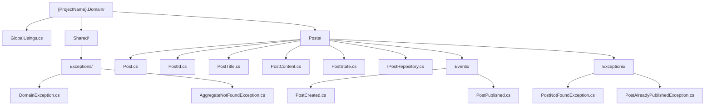

# Domain Layer

This document is the authoritative guide for all design decisions in the Domain layer. Read it in full before writing or modifying any domain code.

## Agent Quick Rules

- Aggregates MUST enforce invariants; handlers MUST NOT contain business rules.
- Mutations MUST go through aggregate methods; MUST NOT set properties from handlers.
- Domain events MUST use past-tense names (`PostPublished`, not `PublishPost`).
- IDs MUST use `Guid.CreateVersion7()` for new aggregates.
- Concrete types MUST be `sealed` unless explicitly a base class.
- MUST NOT reference EF Core, ASP.NET Core, or application DTOs in Domain.
- Repository interfaces live in Domain; implementations live in Infrastructure only.

---

## Guiding Philosophy

The Domain layer models the business. It knows nothing about databases, HTTP, or the application that hosts it. Every class in this layer must be understandable by a domain expert who has never seen a line of C#.

The Domain layer is the most important layer. It is the only layer that never changes because of transport decisions such as REST, gRPC, or messaging. Its aggregate shape is deliberately compatible with EF Core materialisation, so an ORM change may require structural adjustments such as constructors, backing fields, and value converter setup. That compatibility is an accepted implementation constraint, not permission to reference Infrastructure.

---

## Core Principles

### Purity and Isolation

The Domain layer has no NuGet dependencies on infrastructure, persistence, web, or UI packages. The only acceptable dependencies are:
- The .NET BCL
- `Ardalis.GuardClauses` only for project-owned custom guard extensions that throw approved `DomainException` subclasses

Any class that imports `Microsoft.EntityFrameworkCore`, `Microsoft.AspNetCore.*`, or any third-party library not in the above list does not belong in the Domain layer.

### Aggregate as Consistency Boundary

Each aggregate is a cluster of objects (the aggregate root and its child entities) that must be kept consistent together. A single transaction modifies a single aggregate. The aggregate root is the only entry point; nothing outside the aggregate calls methods on child entities directly.

### Reference by ID

Aggregates do not hold references to other aggregate roots. They hold the ID of the other aggregate. If an `Order` aggregate needs to associate with a `Customer`, it stores a `CustomerId`, not a `Customer` instance.

```csharp
// GOOD:
sealed class Order : AggregateRoot<OrderId>
{
    public CustomerId CustomerId { get; private set; }
}

// BAD:
sealed class Order : AggregateRoot<OrderId>
{
    public Customer Customer { get; private set; }
}
```

### Why Repository Interfaces Live in the Domain Layer

Repository interfaces such as `IPostRepository` are defined in the Domain layer, not the Application layer. The reason is that the interface's signature is expressed entirely in Domain types: it accepts a `PostId` and returns a `Post`. Both types are Domain types. The Domain layer owns its own persistence contract. Infrastructure satisfies that contract. This keeps the Domain layer self-contained: it defines what it needs without knowing how the need is satisfied.

```csharp
// GOOD: repository interface in Domain/Posts/IPostRepository.cs
// The signature uses only Domain types (PostId, Post)
interface IPostRepository
{
    Task<Post> GetByIdAsync(PostId id, CancellationToken cancellationToken);
    Task AddAsync(Post post, CancellationToken cancellationToken);
    Task UpdateAsync(Post post, CancellationToken cancellationToken);
}

// BAD: repository interface in Application layer
// Application layer now owns a contract expressed in Domain types,
// creating a conceptual mismatch
```

### Ubiquitous Language

Every type, property, and method name in the Domain layer reflects the language used by domain experts and stakeholders. If the business calls it "publishing a post", the method is `Publish()`, not `SetStatus(PostStatus.Published)`. If the business calls it an "order line", the type is `OrderLine`, not `OrderItem` or `LineItem`.

---

## Naming Conventions

| Concept | Naming Pattern | Example |
|:---|:---|:---|
| Aggregate root | `{AggregateName}` | `Post`, `Order`, `Customer` |
| Child entity | `{EntityName}` | `OrderLine`, `PostTag` |
| Value object | `{ConceptName}` | `Money`, `EmailAddress`, `PostTitle` |
| Strongly-typed ID | `{AggregateName}Id` | `PostId`, `OrderId`, `CustomerId` |
| Repository interface | `I{AggregateName}Repository` | `IPostRepository`, `IOrderRepository` |
| Domain event | `{AggregateName}{PastTenseVerb}` | `PostPublished`, `OrderPlaced` |
| Domain exception | `{AggregateName}{Reason}Exception` | `PostAlreadyPublishedException` |
| Not-found exception | `{AggregateName}NotFoundException` | `PostNotFoundException` |
| State discriminated union base | `{AggregateName}State` | `PostState` |
| State case | `{StateName}{AggregateName}State` | `DraftPostState`, `PublishedPostState` |

The read-side pattern for queries is `IDatabaseContext`, defined in `Application.Read.Contracts/Shared/`. Query handlers inject `IDatabaseContext` and write LINQ projections directly. There is no per-aggregate `IXxxReadStore` interface. See `docs/conventions/backend/07-query-read-strategy.md` and `docs/decisions/idatabasecontext-over-per-aggregate-read-stores.md`.

---

## Folder Structure



One folder per aggregate. Repository interfaces live inside the aggregate's folder (`Posts/IPostRepository.cs`), not in a separate `Repositories/` folder.

---

## Strongly-Typed ID Reference

A strongly-typed ID is a `readonly record struct` wrapping a `Guid`. Define one per aggregate root. This section shows every piece of supporting infrastructure required to make an ID work end-to-end.

### Base Definition

```csharp
// Domain/Posts/PostId.cs
readonly record struct PostId(Guid Value) : IParsable<PostId>
{
    public static PostId New() => new(Guid.CreateVersion7());

    // Required for route and query-string binding (ASP.NET Core model binding)
    public static PostId Parse(string s, IFormatProvider? provider)
        => new(Guid.Parse(s));

    public static bool TryParse(string? s, IFormatProvider? provider, out PostId result)
    {
        if (Guid.TryParse(s, out var guid))
        {
            result = new PostId(guid);
            return true;
        }
        result = default;
        return false;
    }

    public override string ToString() => Value.ToString();
}
```

For global infrastructure support, define a marker interface once in `Domain/Shared/StronglyTypedIds/`.

```csharp
// Domain/Shared/StronglyTypedIds/IStronglyTypedId.cs
public interface IStronglyTypedId
{
    Guid Value { get; }
}
```

Each ID implements the marker:

```csharp
readonly record struct PostId(Guid Value) : IStronglyTypedId, IParsable<PostId>
{
    public static PostId New() => new(Guid.CreateVersion7());
    public static PostId Empty => new(Guid.Empty);

    public static PostId Parse(string s, IFormatProvider? provider)
        => new(Guid.Parse(s));

    public static bool TryParse(string? s, IFormatProvider? provider, out PostId result)
    {
        if (Guid.TryParse(s, out var guid))
        {
            result = new PostId(guid);
            return true;
        }

        result = default;
        return false;
    }

    public override string ToString() => Value.ToString();
}
```

### JSON Serialization (System.Text.Json)

Define converters in WebApi. Register them in `Program.cs` via `builder.Services.ConfigureHttpJsonOptions(...)`.

```csharp
// WebApi/Json/PostIdJsonConverter.cs
sealed class PostIdJsonConverter : JsonConverter<PostId>
{
    public override PostId Read(ref Utf8JsonReader reader, Type typeToConvert, JsonSerializerOptions options)
        => new(reader.GetGuid());

    public override void Write(Utf8JsonWriter writer, PostId value, JsonSerializerOptions options)
        => writer.WriteStringValue(value.Value);
}
```

For a project with many IDs, use a converter factory in WebApi rather than repeating one converter per ID. The factory MUST only match `IStronglyTypedId` types, not every `IParsable<T>` type.

### EF Core Value Converter

Register the value converter in `OnModelCreating` in `AppDbContext`, or in the aggregate's `IEntityTypeConfiguration<T>` class in Infrastructure.

```csharp
// Infrastructure/Posts/PostConfiguration.cs
builder.Property(p => p.Id)
    .HasConversion(id => id.Value, value => new PostId(value));
```

### OpenAPI Schema

Without registration, OpenAPI documents `PostId` as an object with a `value` property. Register a schema transformer so it documents as a plain `string` (`format: uuid`).

```csharp
// WebApi/OpenApi/StronglyTypedIdSchemaTransformer.cs
sealed class StronglyTypedIdSchemaTransformer : IOpenApiSchemaTransformer
{
    public Task TransformAsync(OpenApiSchema schema, OpenApiSchemaTransformerContext context, CancellationToken cancellationToken)
    {
        if (context.JsonTypeInfo.Type.IsAssignableTo(typeof(IStronglyTypedId)))
        {
            schema.Type = "string";
            schema.Format = "uuid";
            schema.Properties?.Clear();
        }
        return Task.CompletedTask;
    }
}
```

Register in `Program.cs`:
```csharp
builder.Services.AddOpenApi(options =>
{
    options.AddSchemaTransformer<StronglyTypedIdSchemaTransformer>();
});
```

### TypeScript Generated Type

After `openapi-typescript` generates types from the OpenAPI spec, `PostId` appears as `string` (not an object) because the schema transformer emits `type: string, format: uuid`. The generated type alias requires no further adjustment.

### Route Binding

Because `PostId` implements `IParsable<PostId>`, ASP.NET Core's minimal API model binder resolves it automatically from route parameters and query strings. No `TypeConverter` or custom binder is needed.

```csharp
// GOOD: PostId binds directly from route parameter
app.MapGet("/posts/{id}", async (PostId id, IQueryMediator queryMediator, CancellationToken cancellationToken) =>
{
    var result = await queryMediator.QueryAsync(new GetPostByIdQuery { PostId = id }, cancellationToken: cancellationToken);
    return Results.Ok(result);
});
```

---

## Aggregate Root Design

### The AggregateRoot Base Class

Every aggregate root extends `AggregateRoot<TId>` defined in `Domain/Shared/AggregateRoot.cs`. This base class is defined in each project, not provided by a NuGet package. See `docs/architecture/clean-architecture.md` for the canonical implementation.

> **Note on EF Core compatibility.** The private parameterless constructor (`private Post() { }`) and `private set` properties on aggregates exist because EF Core requires a way to materialise objects without calling the public factory method. Collection navigation properties use private `List<T>` backing fields (e.g., `_lines`) configured in Infrastructure via field-mode navigation. The Domain project carries no EF Core package reference, but its structural conventions are deliberately compatible with EF Core materialisation. A future ORM change would require adjustments to aggregate shape.

```csharp
// GOOD: aggregate root extends the base class
sealed class Post : AggregateRoot<PostId>
{
    private Post() { }

    public static Post Create(PostId id, PostTitle title, PostContent content, AuthorId authorId)
    {
        var post = new Post
        {
            Id = id,
            Title = title,
            Content = content,
            AuthorId = authorId,
            State = new DraftPostState()
        };
        post.RaiseDomainEvent(new PostCreated(id, authorId));
        return post;
    }
}

// BAD: aggregate root defined without a base class, duplicating domain event infrastructure
sealed class Post
{
    private readonly List<IDomainEvent> _events = [];
    public IReadOnlyList<IDomainEvent> Events => _events.AsReadOnly();
    // ... duplicated boilerplate in every aggregate
}
```

### Static Factory Methods

Aggregate roots MUST NOT have public constructors. All creation paths go through static factory methods named after the business action.

```csharp
// GOOD:
sealed class Post : AggregateRoot<PostId>
{
    private Post() { }

    /// <summary>
    /// Creates a new draft post authored by the specified author.
    /// </summary>
    public static Post Create(PostId id, PostTitle title, PostContent content, AuthorId authorId)
    {
        if (id == default)
        {
            throw new PostIdentityRequiredException();
        }

        if (authorId == default)
        {
            throw new AuthorIdentityRequiredException();
        }

        var post = new Post
        {
            Id = id,
            Title = title,
            Content = content,
            AuthorId = authorId,
            State = new DraftPostState()
        };

        post.RaiseDomainEvent(new PostCreated(id, authorId));
        return post;
    }
}

// BAD:
sealed class Post : AggregateRoot<PostId>
{
    public Post(PostId id, PostTitle title, PostContent content, AuthorId authorId)
    {
        Id = id;
        Title = title;
        Content = content;
        AuthorId = authorId;
    }
}
```

### Public Methods as Business Use Cases

Every public method on an aggregate root represents a business use case. The method name is a verb from the ubiquitous language. The method enforces invariants, updates state, and raises domain events.

```csharp
sealed class Post : AggregateRoot<PostId>
{
    /// <summary>
    /// Publishes the post, making it visible to readers.
    /// </summary>
    public void Publish()
    {
        if (State is PublishedPostState)
        {
            throw new PostAlreadyPublishedException(Id);
        }

        State = new PublishedPostState(publishedAt: DateTime.UtcNow);
        RaiseDomainEvent(new PostPublished(Id));
    }

    /// <summary>
    /// Updates the title. Only permitted while the post is in draft state.
    /// </summary>
    public void UpdateTitle(PostTitle newTitle)
    {
        if (State is not DraftPostState)
        {
            throw new PostCannotBeEditedException(Id);
        }

        Title = newTitle;
    }
}
```

### Enforcing Invariants

Invariants are enforced inside the aggregate method, not in the command handler. Command handlers MUST NOT contain `if` statements that check business rules.

```csharp
// GOOD: invariant enforced in the aggregate
public void Publish()
{
    if (State is PublishedPostState)
    {
        throw new PostAlreadyPublishedException(Id);
    }
}

// BAD: invariant checked in the handler
sealed class PublishPostCommandHandler : ICommandHandler<PublishPostCommand>
{
    public async Task HandleAsync(PublishPostCommand command, CancellationToken cancellationToken)
    {
        var post = await _repository.GetByIdAsync(command.PostId, cancellationToken);

        if (post.IsPublished) // BAD: business rule in handler
        {
            throw new InvalidOperationException("Post is already published.");
        }

        post.Publish();
    }
}
```

---

## Entity and Value Object Design

### Encapsulation

All aggregate and entity properties use `private set` or `init`. State is never mutated from outside the aggregate.

```csharp
sealed class Post : AggregateRoot<PostId>
{
    public PostTitle Title { get; private set; }
    public PostContent Content { get; private set; }
    public PostState State { get; private set; }
    public AuthorId AuthorId { get; private init; }
}
```

### Immutability

Value objects are immutable records. They are compared by value, not by reference.

```csharp
// GOOD:
sealed record PostTitle
{
    public string Value { get; }

    public PostTitle(string value)
    {
        if (string.IsNullOrWhiteSpace(value))
        {
            throw new PostTitleRequiredException();
        }

        if (value.Length > 200)
        {
            throw new PostTitleTooLongException(value.Length);
        }

        Value = value;
    }

    public static implicit operator string(PostTitle title) => title.Value;
}

// BAD:
class PostTitle
{
    public string Value { get; set; } // mutable, not a value object
}
```

### Managing Collections

Aggregate root collections are exposed as read-only. Mutation only happens through named methods on the aggregate.

```csharp
sealed class Order : AggregateRoot<OrderId>
{
    private readonly List<OrderLine> _lines = [];

    /// <summary>
    /// The lines that make up this order.
    /// </summary>
    public IReadOnlyList<OrderLine> Lines => _lines.AsReadOnly();

    /// <summary>
    /// Adds a product to this order at the given quantity and price.
    /// </summary>
    public void AddLine(ProductId productId, int quantity, Money unitPrice)
    {
        if (productId == default)
        {
            throw new OrderLineProductRequiredException();
        }

        if (quantity <= 0)
        {
            throw new OrderLineQuantityMustBePositiveException();
        }

        _lines.Add(new OrderLine(productId, quantity, unitPrice));
    }
}
```

### Strongly-Typed IDs

Every aggregate uses a strongly-typed ID struct. This prevents accidental assignment of a `CustomerId` where a `PostId` is expected.

Use `Guid.CreateVersion7()` instead of `Guid.NewGuid()`. Version 7 GUIDs are time-ordered, which improves database index performance when used as primary keys.

```csharp
// GOOD: version 7 GUIDs are time-ordered, which improves database index performance
readonly record struct PostId(Guid Value) : IStronglyTypedId, IParsable<PostId>
{
    public static PostId New() => new(Guid.CreateVersion7());
    public static PostId Empty => new(Guid.Empty);
    public static PostId Parse(string s, IFormatProvider? provider) => new(Guid.Parse(s));
    public static bool TryParse(string? s, IFormatProvider? provider, out PostId result)
    {
        if (Guid.TryParse(s, out var guid))
        {
            result = new PostId(guid);
            return true;
        }

        result = default;
        return false;
    }

    public override string ToString() => Value.ToString();
}

// BAD: Guid.NewGuid() produces random GUIDs that fragment clustered indexes
readonly record struct PostId(Guid Value)
{
    public static PostId New() => new(Guid.NewGuid());
}
```

EF Core value converters for strongly-typed IDs are configured in the Infrastructure layer, never in the Domain layer.

---

## State Management

When an aggregate has distinct states that determine which operations are allowed, model those states as a sealed record hierarchy. This makes state transitions explicit and eliminates boolean flags.

```csharp
abstract record PostState;
sealed record DraftPostState : PostState;
sealed record PublishedPostState(DateTime PublishedAt) : PostState;
sealed record ArchivedPostState(DateTime ArchivedAt) : PostState;
```

Aggregate methods switch on state using pattern matching:

```csharp
public void Publish()
{
    switch (State)
    {
        case PublishedPostState:
            throw new PostAlreadyPublishedException(Id);
        case ArchivedPostState:
            throw new PostArchivedException(Id);
        case DraftPostState:
            State = new PublishedPostState(DateTime.UtcNow);
            RaiseDomainEvent(new PostPublished(Id));
            break;
    }
}
```

EF Core stores the discriminator and state-specific properties. The configuration is in the Infrastructure layer.

---

## Communication via Domain Events

### Structure

Domain events are immutable records with the minimum data needed for downstream handlers to act.

```csharp
// GOOD:
sealed record PostPublished(PostId PostId) : IDomainEvent;

// BAD:
sealed record PostPublished : IDomainEvent
{
    public Post Post { get; init; } // BAD: never pass the aggregate in an event
}
```

### Naming

Domain event names are past tense: `PostCreated`, `OrderPlaced`, `CustomerRegistered`. They describe what happened, not what should happen.

### Raising Events

Aggregates call `RaiseDomainEvent(...)` inside their mutation methods.

```csharp
public void Place()
{
    if (_lines.Count == 0)
    {
        throw new OrderMustContainAtLeastOneLineException(Id);
    }

    State = new PlacedOrderState(placedAt: DateTime.UtcNow);
    RaiseDomainEvent(new OrderPlaced(Id, CustomerId));
}
```

---

## Code Style and Final Checks

### Sealed by Default

Every class in the Domain layer MUST be `sealed` unless it is explicitly designed as a base class. `AggregateRoot<TId>`, `DomainException`, and `AggregateNotFoundException` are base classes. Everything else is sealed.

### Brackets for All Conditionals

Always use braces for `if`, `else`, `foreach`, `while`, and `switch` bodies, even for single-line bodies.

```csharp
// GOOD:
if (State is PublishedPostState)
{
    throw new PostAlreadyPublishedException(Id);
}

// BAD:
if (State is PublishedPostState)
    throw new PostAlreadyPublishedException(Id);
```

### XML Comments

All `public` members in the Domain layer MUST have XML documentation comments. Comments describe the business purpose, not the implementation.

```csharp
// GOOD:
/// <summary>
/// Publishes the post, making it visible to all readers. Raises <see cref="PostPublished"/>.
/// </summary>
/// <exception cref="PostAlreadyPublishedException">Thrown when the post is already in a published state.</exception>
public void Publish() { ... }

// BAD:
/// <summary>
/// Publishes the post.
/// </summary>
public void Publish() { ... }
```

---

The ubiquitous language glossary for a specific project lives in the project repository. Copy `docs/templates/ubiquitous-language.md` from the standards repository into `docs/domain/ubiquitous-language.md` in the project repository and fill it in.
