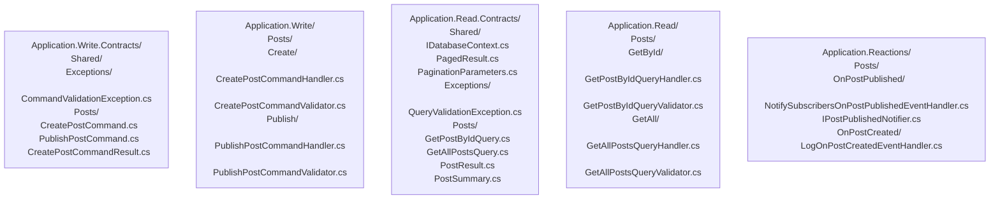

# Application Layer

This document is the authoritative guide for all design decisions in the five application layer projects. Read it in full before writing or modifying any application code.

> This convention implements ADR 0003 (CQRS split), ADR 0006 (Contracts projects), ADR 0008 (Reactions depends only on abstractions), and ADR 0016 (Transaction pipeline behaviors).

---

## 1. Guiding Philosophy

The application layer orchestrates use cases. It contains no business rules. It is split into five projects to enforce structural separation between write operations, read operations, and event reactions at the compiler level. If you find yourself writing an `if` statement that enforces a domain constraint in a handler, that logic belongs in the Domain layer.

---

## 2. The Five Projects

| Project | Responsibility | LiteBus Package |
|:---|:---|:---|
| `Application.Write.Contracts` | Commands, command results, `CommandValidationException`, write-side contract interfaces. No handlers. | `LiteBus.Commands.Abstractions` |
| `Application.Write` | Command handler and validator implementations. | `LiteBus.Commands.Abstractions` |
| `Application.Read.Contracts` | Query records, query result records, `IDatabaseContext` interface, `PagedResult<T>`, `PaginationParameters`, `QueryValidationException`. No handlers. | `LiteBus.Queries.Abstractions` |
| `Application.Read` | Query handler and validator implementations. References `Application.Read.Contracts`, `Domain`, `Microsoft.EntityFrameworkCore`. | `LiteBus.Queries.Abstractions` |
| `Application.Reactions` | Event handlers and narrow side-effect interfaces. May dispatch follow-up commands when eventual consistency is acceptable. | `LiteBus.Events.Abstractions`, `LiteBus.Commands.Abstractions` |

---

## 3. Folder Structure



Feature folders are named after the aggregate. Use case folders inside are named after the operation in imperative form (`Create/`, `Publish/`, `GetById/`). Event handler folders are named `On{EventName}/`.

---

## 4. What Goes in Contracts vs. Implementation

| Contracts Project | Implementation Project |
|:---|:---|
| Command record types | Command handler classes |
| Command result record types | Command validator classes |
| Query record types | Query handler classes |
| Query result record types | Query validator classes |
| `IDatabaseContext` (single interface in `Shared/`) | Implementation is `AppDbContext` in Infrastructure |
| Write-side contract interfaces | Narrow interfaces (in Reactions only) |

---

## 5. Command Pattern

### Command Record (in Application.Write.Contracts)

A command is a record that carries the input for a single operation. All properties use `required` with `init` setters.

```csharp
// GOOD: command record in Application.Write.Contracts/Posts/CreatePostCommand.cs
sealed record CreatePostCommand : ICommand<PostId>
{
    public required PostId Id { get; init; }
    public required string Title { get; init; }
    public required string Content { get; init; }
    public required AuthorId AuthorId { get; init; }
}
```

### Command Handler (in Application.Write)

A command handler loads an aggregate and calls the operation. It does not call `SaveChangesAsync`. The pipeline post-handler handles persistence.

```csharp
// GOOD: handler in Application.Write/Posts/Create/CreatePostCommandHandler.cs
internal sealed class CreatePostCommandHandler : ICommandHandler<CreatePostCommand, PostId>
{
    private readonly IPostRepository _postRepository;

    public CreatePostCommandHandler(IPostRepository postRepository)
    {
        _postRepository = postRepository;
    }

    public async Task<PostId> HandleAsync(CreatePostCommand command, CancellationToken cancellationToken)
    {
        var post = Post.Create(
            command.Id,
            new PostTitle(command.Title),
            new PostContent(command.Content),
            command.AuthorId);

        await _postRepository.AddAsync(post, cancellationToken);

        return post.Id;
        // SaveChangesAsync is called by SaveChangesCommandPostHandler in the pipeline
    }
}

// BAD: handler placed in the Contracts project
// Application.Write.Contracts/Posts/CreatePostCommandHandler.cs
// BAD: handler is public instead of internal sealed
public class CreatePostCommandHandler : ICommandHandler<CreatePostCommand, PostId> { }
```

### Command Validator (in Application.Write)

Validators run before the handler. They check structural validity only (non-null, non-empty, within range). They do NOT check business rules. Validators MUST throw `CommandValidationException` subclasses. Never throw `ArgumentException` or use `Guard.Against` in validators.

```csharp
// GOOD: throw CommandValidationException subclasses directly
internal sealed class CreatePostCommandValidator : ICommandValidator<CreatePostCommand>
{
    public Task ValidateAsync(CreatePostCommand command, CancellationToken cancellationToken)
    {
        if (command.Id == default)
        {
            throw new PostIdRequiredException();
        }
        if (string.IsNullOrWhiteSpace(command.Title))
        {
            throw new PostTitleRequiredException();
        }
        if (command.Title.Length > 200)
        {
            throw new PostTitleTooLongException(command.Title.Length);
        }
        return Task.CompletedTask;
    }
}

// BAD: Guard.Against throws ArgumentException, not CommandValidationException
internal sealed class CreatePostCommandValidator : ICommandValidator<CreatePostCommand>
{
    public Task ValidateAsync(CreatePostCommand command, CancellationToken cancellationToken)
    {
        Guard.Against.Default(command.Id, nameof(command.Id));
        // BAD: throws ArgumentException -> GlobalExceptionHandler maps to 500, not 400
        Guard.Against.NullOrWhiteSpace(command.Title, nameof(command.Title));
        return Task.CompletedTask;
    }
}
```

---

## 6. Query Pattern

### Query Record (in Application.Read.Contracts)

```csharp
// Application.Read.Contracts/Posts/GetPostByIdQuery.cs
public sealed record GetPostByIdQuery : IQuery<PostResult>
{
    public required PostId PostId { get; init; }
}
```

### `IDatabaseContext` Interface (in Application.Read.Contracts/Shared/)

`IDatabaseContext` is the single read-side database abstraction. It exposes one `IQueryable<T>` property per aggregate. Add a property here when a new aggregate needs query handlers.

```csharp
// Application.Read.Contracts/Shared/IDatabaseContext.cs
public interface IDatabaseContext
{
    IQueryable<Post> Posts { get; }
    IQueryable<Author> Authors { get; }
    IQueryable<Order> Orders { get; }
}
```

`IDatabaseContext` is NOT a repository. It does not load aggregates. It exposes queryable collections for EF Core LINQ projections. Query handlers write `Select` projections against these collections and never call aggregate methods.

### Paginated Query (in Application.Read.Contracts)

All list queries that return potentially large result sets MUST use `PagedResult<T>` and include `PaginationParameters` as a required property.

```csharp
// Application.Read.Contracts/Posts/GetAllPostsQuery.cs
public sealed record GetAllPostsQuery : IQuery<PagedResult<PostSummary>>
{
    public required PaginationParameters Pagination { get; init; }
}
```

`PaginationParameters` and `PagedResult<T>` are defined in `Application.Read.Contracts/Shared/`:

```csharp
// Application.Read.Contracts/Shared/PaginationParameters.cs
public sealed record PaginationParameters
{
    public int PageNumber { get; init; } = 1;
    public int PageSize { get; init; } = 20;
    public bool SkipTotalCount { get; init; } = false;
    public const int MaxPageSize = 100;
}

// Application.Read.Contracts/Shared/PagedResult.cs
public sealed record PagedResult<T>
{
    public required IReadOnlyList<T> Items { get; init; }
    public required int TotalCount { get; init; }
    public required int PageNumber { get; init; }
    public required int PageSize { get; init; }
    public int TotalPages => (int)Math.Ceiling(TotalCount / (double)PageSize);
    public bool HasNextPage => PageNumber < TotalPages;
    public bool HasPreviousPage => PageNumber > 1;
}
```

### Query Handler (in Application.Read)

Query handlers inject `IDatabaseContext` and write LINQ projections directly. They MUST NOT call any aggregate method. They MUST NOT load a full aggregate. Every query handler uses `Select` to project only the fields needed.

```csharp
// GOOD: Application.Read/Posts/GetById/GetPostByIdQueryHandler.cs
internal sealed class GetPostByIdQueryHandler
    : IQueryHandler<GetPostByIdQuery, PostResult>
{
    private readonly IDatabaseContext _db;

    public GetPostByIdQueryHandler(IDatabaseContext db)
    {
        _db = db;
    }

    public async Task<PostResult> HandleAsync(
        GetPostByIdQuery query,
        CancellationToken cancellationToken)
    {
        var result = await _db.Posts
            .Where(p => p.Id == query.PostId)
            .Select(p => new PostResult
            {
                Id = p.Id,
                Title = p.Title.Value,
                Content = p.Content.Value,
                AuthorName = p.Author.DisplayName,
                PublishedAt = p.State is PublishedPostState s ? s.PublishedAt : null
            })
            .FirstOrDefaultAsync(cancellationToken);

        if (result is null)
        {
            throw new PostNotFoundException(query.PostId);
        }

        return result;
    }
}

// BAD: loading a full aggregate in a query handler
internal sealed class GetPostByIdQueryHandler
    : IQueryHandler<GetPostByIdQuery, PostResult>
{
    private readonly IPostRepository _postRepository; // BAD: repository in query handler

    public async Task<PostResult> HandleAsync(
        GetPostByIdQuery query,
        CancellationToken cancellationToken)
    {
        var post = await _postRepository.GetByIdAsync(query.PostId, cancellationToken);
        // BAD: loading full aggregate, triggering all EF Core navigation loading
        return new PostResult { Id = post.Id, Title = post.Title.Value };
    }
}
```

### Paginated Query Handler (in Application.Read)

```csharp
// Application.Read/Posts/GetAll/GetAllPostsQueryHandler.cs
internal sealed class GetAllPostsQueryHandler
    : IQueryHandler<GetAllPostsQuery, PagedResult<PostSummary>>
{
    private readonly IDatabaseContext _db;

    public GetAllPostsQueryHandler(IDatabaseContext db)
    {
        _db = db;
    }

    public async Task<PagedResult<PostSummary>> HandleAsync(
        GetAllPostsQuery query,
        CancellationToken cancellationToken)
    {
        var pageSize = Math.Min(
            query.Pagination.PageSize,
            PaginationParameters.MaxPageSize);

        var baseQuery = _db.Posts
            .Where(p => p.State is PublishedPostState);

        var totalCount = query.Pagination.SkipTotalCount
            ? 0
            : await baseQuery.CountAsync(cancellationToken);

        var items = await baseQuery
            .OrderByDescending(p => ((PublishedPostState)p.State).PublishedAt)
            .Skip((query.Pagination.PageNumber - 1) * pageSize)
            .Take(pageSize)
            .Select(p => new PostSummary
            {
                Id = p.Id,
                Title = p.Title.Value,
                PublishedAt = ((PublishedPostState)p.State).PublishedAt
            })
            .ToListAsync(cancellationToken);

        return new PagedResult<PostSummary>
        {
            Items = items,
            TotalCount = totalCount,
            PageNumber = query.Pagination.PageNumber,
            PageSize = pageSize
        };
    }
}
```

### Multi-Aggregate Projections

`IDatabaseContext` exposes multiple aggregates. A single LINQ projection can join across them without multiple round trips:

```csharp
// Joining Post and Author in a single projection
var result = await _db.Posts
    .Where(p => p.Id == query.PostId)
    .Select(p => new PostResult
    {
        Id = p.Id,
        Title = p.Title.Value,
        // EF Core resolves this as a JOIN, no separate Author query
        AuthorName = _db.Authors
            .Where(a => a.Id == p.AuthorId)
            .Select(a => a.DisplayName)
            .FirstOrDefault() ?? string.Empty,
        PublishedAt = p.State is PublishedPostState s ? s.PublishedAt : null
    })
    .FirstOrDefaultAsync(cancellationToken);
```

### Query Validator (in Application.Read)

Query validators throw `QueryValidationException` subclasses. Never throw `ArgumentException` or `ArgumentNullException`.

```csharp
// GOOD:
internal sealed class GetPostByIdQueryValidator
    : IQueryValidator<GetPostByIdQuery>
{
    public Task ValidateAsync(
        GetPostByIdQuery query,
        CancellationToken cancellationToken)
    {
        if (query.PostId == default)
        {
            throw new PostIdRequiredException();
        }
        return Task.CompletedTask;
    }
}

// BAD:
internal sealed class GetPostByIdQueryValidator
    : IQueryValidator<GetPostByIdQuery>
{
    public Task ValidateAsync(
        GetPostByIdQuery query,
        CancellationToken cancellationToken)
    {
        Guard.Against.Default(query.PostId, nameof(query.PostId));
        // BAD: Guard.Against throws ArgumentException, not QueryValidationException
        // This maps to HTTP 500, not HTTP 400
        return Task.CompletedTask;
    }
}
```

### Query Result Types (in Application.Read.Contracts)

Result records are defined in the Contracts project, next to the query that returns them.

```csharp
// Application.Read.Contracts/Posts/PostResult.cs
public sealed record PostResult
{
    public required PostId Id { get; init; }
    public required string Title { get; init; }
    public required string Content { get; init; }
    public required string AuthorName { get; init; }
    public required DateTime? PublishedAt { get; init; }
}
```

---

## 7. Event Handler Pattern

### Event Handler Categories

```csharp
// Category 1: dispatches a follow-up command
internal sealed class SendConfirmationOnOrderPlacedEventHandler : IEventHandler<OrderPlaced>
{
    private readonly ICommandMediator _commandMediator;

    public SendConfirmationOnOrderPlacedEventHandler(ICommandMediator commandMediator)
    {
        _commandMediator = commandMediator;
    }

    public async Task HandleAsync(OrderPlaced @event, CancellationToken cancellationToken)
    {
        var command = new SendOrderConfirmationEmailCommand { OrderId = @event.OrderId };
        await _commandMediator.SendAsync(command, cancellationToken);
    }
}

// Category 2: triggers an external side effect via a narrow interface
internal sealed class NotifySubscribersOnPostPublishedEventHandler : IEventHandler<PostPublished>
{
    private readonly IPostPublishedNotifier _notifier;

    public NotifySubscribersOnPostPublishedEventHandler(
        IPostPublishedNotifier notifier)
    {
        _notifier = notifier;
    }

    public async Task HandleAsync(PostPublished @event, CancellationToken cancellationToken)
    {
        await _notifier.NotifySubscribersAsync(
            @event.PostId,
            @event.PostTitle,
            cancellationToken);
    }
}
```

Read model projection updates are not a default event-handler category. Query handlers use `IDatabaseContext` projections by default. If a project introduces denormalized read model tables, the project ADR must define whether they are updated inside the command transaction, by an outbox-backed projector, or by a reconciliation job. Do not dispatch ad hoc `UpdateReadModelCommand` commands from Reactions without that ADR.

### Narrow Interface Definition (in Application.Reactions)

```csharp
// GOOD: narrow interface defined in Application.Reactions
// Application.Reactions/Posts/OnPostPublished/IPostPublishedNotifier.cs
internal interface IPostPublishedNotifier
{
    Task NotifySubscribersAsync(PostId postId, string postTitle, CancellationToken cancellationToken);
}

// BAD: injecting a broad external service interface directly
internal sealed class NotifySubscribersOnPostPublishedEventHandler : IEventHandler<PostPublished>
{
    private readonly IEmailClient _emailClient; // BAD: external library in Application.Reactions
}
```

---

## 8. Validators

Validators MUST:
- Run before the handler (LiteBus pre-handler pipeline).
- Check structural validity only: null checks, empty string checks, range checks, format checks.
- Throw `CommandValidationException` subclasses (for command validators) or `QueryValidationException` subclasses (for query validators). Never throw `ArgumentException` or `ArgumentNullException`.
- Be `internal sealed`.

Validators MUST NOT:
- Query the database to check business rules (do not check whether a post already exists in a validator).
- Contain domain logic.
- Use `Guard.Against` from Ardalis.GuardClauses. `Guard.Against` throws `ArgumentException` by default, which maps to HTTP 500. Always throw custom `CommandValidationException` or `QueryValidationException` subclasses directly.

```csharp
// BAD: Guard.Against throws ArgumentException, which maps to HTTP 500
internal sealed class CreatePostCommandValidator : ICommandValidator<CreatePostCommand>
{
    public Task ValidateAsync(CreatePostCommand command, CancellationToken cancellationToken)
    {
        Guard.Against.NullOrWhiteSpace(command.Title, nameof(command.Title));
        // Guard.Against throws ArgumentException -> GlobalExceptionHandler maps it to 500
        return Task.CompletedTask;
    }
}

// GOOD: throw the correct custom exception directly
internal sealed class CreatePostCommandValidator : ICommandValidator<CreatePostCommand>
{
    public Task ValidateAsync(CreatePostCommand command, CancellationToken cancellationToken)
    {
        if (string.IsNullOrWhiteSpace(command.Title))
        {
            throw new PostTitleRequiredException();
        }

        if (command.AuthorId == default)
        {
            throw new AuthorIdRequiredException();
        }

        return Task.CompletedTask;
    }
}
```

---

## 9. Application Models and Mapping

The Application layer defines its own input and output types. It does not pass domain types out to callers.

When a command needs to pass data into domain factory methods or domain value objects, the handler constructs those types inline. There is no separate mapper class in the Application layer for domain construction; the handler is the translation site.

If the same mapping appears in multiple handlers, extract it to a feature-level `Shared/` extension method, applying the Promotion Rule from `docs/conventions/00-principles.md`.

---

The feature inventory for a specific project lives in the project repository. Copy `docs/templates/feature-inventory.md` from the standards repository into `docs/domain/feature-inventory.md` in the project repository and fill it in.
