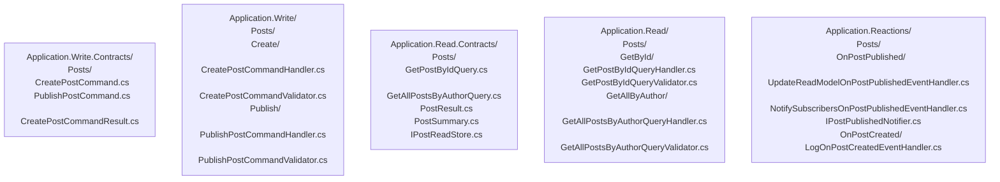

# Application Layer

This document is the authoritative guide for all design decisions in the five application layer projects. Read it in full before writing or modifying any application code.

---

## 1. Guiding Philosophy

The application layer orchestrates use cases. It contains no business rules. It is split into five projects to enforce structural separation between write operations, read operations, and event reactions at the compiler level. If you find yourself writing an `if` statement that enforces a domain constraint in a handler, that logic belongs in the Domain layer.

---

## 2. The Five Projects

| Project | Responsibility | LiteBus Package |
|:---|:---|:---|
| `Application.Write.Contracts` | Commands, command results, write-side contract interfaces. No handlers. | `LiteBus.Commands.Abstractions` |
| `Application.Write` | Command handler and validator implementations. | `LiteBus.Commands.Abstractions` |
| `Application.Read.Contracts` | Queries, query results, `IXxxReadStore` interfaces. No handlers. | `LiteBus.Queries.Abstractions` |
| `Application.Read` | Query handler and validator implementations. | `LiteBus.Queries.Abstractions` |
| `Application.Reactions` | Event handlers and narrow side-effect interfaces. | `LiteBus.Events.Abstractions` |

---

## 3. Folder Structure



Feature folders are named after the aggregate. Use case folders inside are named after the operation in imperative form (`Create/`, `Publish/`, `GetById/`). Event handler folders are named `On{EventName}/`.

---

## 4. What Goes in Contracts vs. Implementation

| Contracts Project | Implementation Project |
|:---|:---|
| Command record types | Command handler classes |
| Command result record types | Command validator classes |
| Query record types | Query handler classes |
| Query result record types | Query validator classes |
| `IXxxReadStore` interface | (Implementation is in Infrastructure) |
| Write-side contract interfaces | Narrow interfaces (in Reactions only) |

---

## 5. Command Pattern

### Command Record (in Application.Write.Contracts)

A command is a record that carries the input for a single operation. All properties use `required` with `init` setters.

```csharp
// GOOD: command record in Application.Write.Contracts/Posts/CreatePostCommand.cs
sealed record CreatePostCommand : ICommand<PostId>
{
    public required PostId Id { get; init; }
    public required string Title { get; init; }
    public required string Content { get; init; }
    public required AuthorId AuthorId { get; init; }
}
```

### Command Handler (in Application.Write)

A command handler loads an aggregate, calls the operation, and saves. Nothing else.

```csharp
// GOOD: handler in Application.Write/Posts/Create/CreatePostCommandHandler.cs
internal sealed class CreatePostCommandHandler : ICommandHandler<CreatePostCommand, PostId>
{
    private readonly IPostRepository _postRepository;

    public CreatePostCommandHandler(IPostRepository postRepository)
    {
        _postRepository = postRepository;
    }

    public async Task<PostId> HandleAsync(CreatePostCommand command, CancellationToken cancellationToken)
    {
        var post = Post.Create(
            command.Id,
            new PostTitle(command.Title),
            new PostContent(command.Content),
            command.AuthorId);

        await _postRepository.AddAsync(post, cancellationToken);

        return post.Id;
    }
}

// BAD: handler placed in the Contracts project
// Application.Write.Contracts/Posts/CreatePostCommandHandler.cs
// BAD: handler is public instead of internal sealed
public class CreatePostCommandHandler : ICommandHandler<CreatePostCommand, PostId> { }
```

### Command Validator (in Application.Write)

Validators run before the handler. They check structural validity only (non-null, non-empty, within range). They do NOT check business rules.

```csharp
// GOOD:
internal sealed class CreatePostCommandValidator : ICommandValidator<CreatePostCommand>
{
    public Task ValidateAsync(CreatePostCommand command, CancellationToken cancellationToken)
    {
        Guard.Against.Default(command.Id, nameof(command.Id));
        Guard.Against.Default(command.AuthorId, nameof(command.AuthorId));
        Guard.Against.NullOrWhiteSpace(command.Title, nameof(command.Title));
        Guard.Against.OutOfRange(command.Title.Length, nameof(command.Title), 1, 200);
        Guard.Against.NullOrWhiteSpace(command.Content, nameof(command.Content));

        return Task.CompletedTask;
    }
}
```

When `Guard.Against` is not expressive enough, throw the correct custom exception directly:

```csharp
if (command.Title.StartsWith(' '))
{
    throw new PostTitleCannotStartWithSpaceException();
}
```

---

## 6. Query Pattern

### Query Record (in Application.Read.Contracts)

```csharp
// Application.Read.Contracts/Posts/GetPostByIdQuery.cs
sealed record GetPostByIdQuery : IQuery<PostResult>
{
    public required PostId PostId { get; init; }
}
```

### Read Store Interface (in Application.Read.Contracts)

The read store interface lives in the Contracts project so both the query handlers (in Application.Read) and the Infrastructure implementation can reference it without circular dependencies.

```csharp
// Application.Read.Contracts/Posts/IPostReadStore.cs
interface IPostReadStore
{
    Task<PostResult?> GetByIdAsync(PostId postId, CancellationToken cancellationToken);
    Task<IReadOnlyList<PostSummary>> GetAllByAuthorAsync(AuthorId authorId, CancellationToken cancellationToken);
}
```

### Query Handler (in Application.Read)

A query handler injects the read store interface, never the repository.

```csharp
// GOOD: Application.Read/Posts/GetById/GetPostByIdQueryHandler.cs
internal sealed class GetPostByIdQueryHandler : IQueryHandler<GetPostByIdQuery, PostResult>
{
    private readonly IPostReadStore _postReadStore;

    public GetPostByIdQueryHandler(IPostReadStore postReadStore)
    {
        _postReadStore = postReadStore;
    }

    public async Task<PostResult> HandleAsync(GetPostByIdQuery query, CancellationToken cancellationToken)
    {
        var result = await _postReadStore.GetByIdAsync(query.PostId, cancellationToken);

        if (result is null)
        {
            throw new PostNotFoundException(query.PostId);
        }

        return result;
    }
}

// BAD: injecting repository into query handler
internal sealed class GetPostByIdQueryHandler : IQueryHandler<GetPostByIdQuery, PostResult>
{
    private readonly IPostRepository _postRepository; // BAD: repository in query handler
}
```

### Query Validator (in Application.Read)

Every query that has validatable inputs MUST have a corresponding validator.

```csharp
internal sealed class GetPostByIdQueryValidator : IQueryValidator<GetPostByIdQuery>
{
    public Task ValidateAsync(GetPostByIdQuery query, CancellationToken cancellationToken)
    {
        Guard.Against.Default(query.PostId, nameof(query.PostId));
        return Task.CompletedTask;
    }
}
```

### Query Result Types (in Application.Read.Contracts)

Result records are defined in the Contracts project, next to the query that returns them.

```csharp
// Application.Read.Contracts/Posts/PostResult.cs
sealed record PostResult
{
    public required PostId Id { get; init; }
    public required string Title { get; init; }
    public required string Content { get; init; }
    public required string AuthorName { get; init; }
    public required DateTime? PublishedAt { get; init; }
}
```

---

## 7. Event Handler Pattern

### Three Categories of Event Handler

```csharp
// Category 1: dispatches a follow-up command
internal sealed class SendConfirmationOnOrderPlacedEventHandler : IEventHandler<OrderPlaced>
{
    private readonly IMessageBus _messageBus;

    public SendConfirmationOnOrderPlacedEventHandler(IMessageBus messageBus)
    {
        _messageBus = messageBus;
    }

    public async Task HandleAsync(OrderPlaced @event, CancellationToken cancellationToken)
    {
        var command = new SendOrderConfirmationEmailCommand { OrderId = @event.OrderId };
        await _messageBus.SendAsync(command, cancellationToken);
    }
}

// Category 2: updates a read model projection (infrastructure handles the actual update)
internal sealed class UpdateReadModelOnPostPublishedEventHandler : IEventHandler<PostPublished>
{
    private readonly IPostReadStore _postReadStore;

    public UpdateReadModelOnPostPublishedEventHandler(IPostReadStore postReadStore)
    {
        _postReadStore = postReadStore;
    }

    public async Task HandleAsync(PostPublished @event, CancellationToken cancellationToken)
    {
        // Read store projection is updated via infrastructure
        await _postReadStore.MarkAsPublishedAsync(@event.PostId, cancellationToken);
    }
}

// Category 3: triggers an external side effect via a narrow interface
internal sealed class NotifySubscribersOnPostPublishedEventHandler : IEventHandler<PostPublished>
{
    private readonly IPostPublishedNotifier _notifier;
    private readonly IPostReadStore _postReadStore;

    public NotifySubscribersOnPostPublishedEventHandler(
        IPostPublishedNotifier notifier,
        IPostReadStore postReadStore)
    {
        _notifier = notifier;
        _postReadStore = postReadStore;
    }

    public async Task HandleAsync(PostPublished @event, CancellationToken cancellationToken)
    {
        var post = await _postReadStore.GetByIdAsync(@event.PostId, cancellationToken);
        if (post is not null)
        {
            await _notifier.NotifySubscribersAsync(@event.PostId, post.Title, cancellationToken);
        }
    }
}
```

### Narrow Interface Definition (in Application.Reactions)

```csharp
// GOOD: narrow interface defined in Application.Reactions
// Application.Reactions/Posts/OnPostPublished/IPostPublishedNotifier.cs
internal interface IPostPublishedNotifier
{
    Task NotifySubscribersAsync(PostId postId, string postTitle, CancellationToken cancellationToken);
}

// BAD: injecting a broad external service interface directly
internal sealed class NotifySubscribersOnPostPublishedEventHandler : IEventHandler<PostPublished>
{
    private readonly IEmailClient _emailClient; // BAD: external library in Application.Reactions
}
```

---

## 8. Validators

Validators MUST:
- Run before the handler (LiteBus pre-handler pipeline).
- Check structural validity only: null checks, empty string checks, range checks, format checks.
- Throw `ApplicationValidationException` subclasses. Never throw `ArgumentException` or `ArgumentNullException`.
- Be `internal sealed`.

Validators MUST NOT:
- Query the database to check business rules (e.g., do not check whether a post already exists in a validator).
- Contain domain logic.

---

## 9. Application Models and Mapping

The Application layer defines its own input and output types. It does not pass domain types out to callers.

When a command needs to pass data into domain factory methods or domain value objects, the handler constructs those types inline. There is no separate mapper class in the Application layer for domain construction; the handler is the translation site.

If the same mapping appears in multiple handlers, extract it to a feature-level `Shared/` extension method, applying the Promotion Rule from `docs/conventions/00-principles.md`.

---

## 10. Project-Specific: Feature Inventory

> **Note:** This section is filled in per project. It lists all features and their implemented use cases.

| Feature | Use Case | Type | Status |
|:---|:---|:---|:---|
| _(example) Posts_ | _(example) Create Post_ | Command | Implemented |
| _(example) Posts_ | _(example) Publish Post_ | Command | Implemented |
| _(example) Posts_ | _(example) Get Post By Id_ | Query | Implemented |
| _(example) Posts_ | _(example) List Posts by Author_ | Query | Planned |
| _(example) Orders_ | _(example) Place Order_ | Command | Planned |
