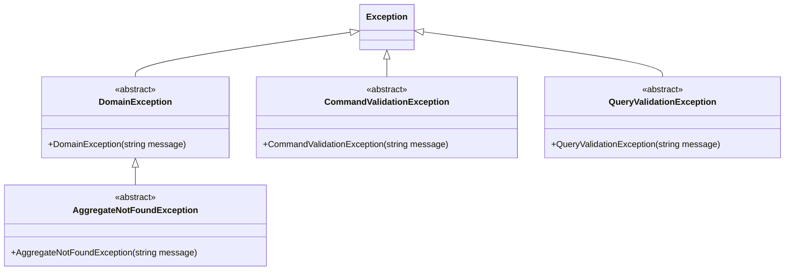

# Exception Hierarchy

This document defines the exception hierarchy. It is a critical contract. Deviating from it produces incorrect HTTP responses and breaks the agreement between the API layer and its clients.

---

## Why This Matters

When a server returns a 500 response to a client, the client has no idea whether the operation failed because the input was invalid, the resource was not found, or an unexpected error occurred. Each situation requires a different client action: show a validation message, navigate to a not-found page, or show a generic error and retry.

Without a defined hierarchy, teams drift into patterns like throwing `InvalidOperationException` from domain logic and `ArgumentException` from validators. Both produce 500 responses in a default ASP.NET Core setup. The hierarchy defines exactly four failure categories for expected failures. Every exception class maps to exactly one category. The `GlobalExceptionHandler` maps categories to HTTP status codes automatically. This is the contract.

---

## The Exception Hierarchy



---

## The Four Categories

| Category | Base Class | Location | HTTP Status | When to Throw |
|:---|:---|:---|:---|:---|
| Command Validation Failure | `CommandValidationException` | `Application.Write.Contracts/Shared/Exceptions/` | 400 | Thrown by `ICommandValidator<TCommand>` when command input is structurally invalid |
| Query Validation Failure | `QueryValidationException` | `Application.Read.Contracts/Shared/Exceptions/` | 400 | Thrown by `IQueryValidator<TQuery>` when query input is structurally invalid |
| Resource Not Found | `AggregateNotFoundException` | `Domain/Shared/Exceptions/` | 404 | Thrown by repository implementations when an aggregate cannot be found by ID |
| Domain Invariant Violation | `DomainException` | `Domain/Shared/Exceptions/` | 409 | Thrown by aggregate methods when the requested operation is not permitted in the current state |
| Unhandled | (any `Exception`) | Anywhere | 500 | Any exception not matching the above. Indicates a bug or unexpected external failure |

---

## Base Class Definitions

All base classes are `abstract`. Never throw a base class directly. Always throw a concrete subclass that names the specific failure.

Note that `CommandValidationException` and `QueryValidationException` have no shared base class beyond `Exception`. They are independent.

```csharp
// Domain/Shared/Exceptions/DomainException.cs
/// <summary>
/// The base class for all domain invariant violations.
/// Maps to HTTP 409 Conflict.
/// </summary>
public abstract class DomainException : Exception
{
    protected DomainException(string message)
        : base(message) { }
}

// Domain/Shared/Exceptions/AggregateNotFoundException.cs
/// <summary>
/// The base class for exceptions thrown when an aggregate cannot be
/// found by its ID. Maps to HTTP 404 Not Found.
/// </summary>
public abstract class AggregateNotFoundException : DomainException
{
    protected AggregateNotFoundException(string message)
        : base(message) { }
}

// Application.Write.Contracts/Shared/Exceptions/ValidationError.cs
public sealed record ValidationError(string PropertyName, string ErrorMessage);

// Application.Write.Contracts/Shared/Exceptions/CommandValidationException.cs
/// <summary>
/// The base class for exceptions thrown by command validators when
/// command input is structurally invalid. Maps to HTTP 400 Bad Request.
/// </summary>
public abstract class CommandValidationException : Exception
{
    protected CommandValidationException(string message, string propertyName)
        : base(message)
    {
        ValidationErrors = [new ValidationError(propertyName, message)];
    }

    protected CommandValidationException(
        string message,
        IReadOnlyList<ValidationError> validationErrors)
        : base(message)
    {
        ValidationErrors = validationErrors;
    }

    /// <summary>
    /// Field-level validation errors. Used by GlobalExceptionHandler to populate
    /// the RFC 7807 invalidParams extension.
    /// </summary>
    public IReadOnlyList<ValidationError> ValidationErrors { get; }
}

// Application.Read.Contracts/Shared/Exceptions/QueryValidationException.cs
/// <summary>
/// The base class for exceptions thrown by query validators when
/// query input is structurally invalid. Maps to HTTP 400 Bad Request.
/// </summary>
public abstract class QueryValidationException : Exception
{
    protected QueryValidationException(string message, string propertyName)
        : base(message)
    {
        ValidationErrors = [new ValidationError(propertyName, message)];
    }

    protected QueryValidationException(
        string message,
        IReadOnlyList<ValidationError> validationErrors)
        : base(message)
    {
        ValidationErrors = validationErrors;
    }

    /// <summary>
    /// Field-level validation errors. Used by GlobalExceptionHandler to populate
    /// the RFC 7807 invalidParams extension.
    /// </summary>
    public IReadOnlyList<ValidationError> ValidationErrors { get; }
}
```

---

## Concrete Exception Examples

```csharp
// AggregateNotFoundException subclass (in Domain/Posts/Exceptions/)
public sealed class PostNotFoundException : AggregateNotFoundException
{
    public PostNotFoundException(PostId id)
        : base($"Post '{id.Value}' was not found.") { }
}

// DomainException subclass (in Domain/Posts/Exceptions/)
public sealed class PostAlreadyPublishedException : DomainException
{
    public PostAlreadyPublishedException(PostId id)
        : base($"Post '{id.Value}' is already published.") { }
}

// CommandValidationException subclasses (in Application.Write.Contracts/Posts/Exceptions/)
// PostTitleRequiredException — thrown by command validator (and as last-resort defence in the value object)
public sealed class PostTitleRequiredException : CommandValidationException
{
    public PostTitleRequiredException()
        : base("A post title is required and cannot be empty.", nameof(CreatePostCommand.Title)) { }
}

// PostTitleTooLongException — thrown by command validator for structural length check
public sealed class PostTitleTooLongException : CommandValidationException
{
    public PostTitleTooLongException(int length)
        : base($"Post title cannot exceed 200 characters (was {length}).", nameof(CreatePostCommand.Title)) { }
}

// QueryValidationException subclass (in Application.Read.Contracts/Posts/Exceptions/)
public sealed class PostIdRequiredException : QueryValidationException
{
    public PostIdRequiredException()
        : base("A post ID is required and cannot be the default value.", nameof(GetPostByIdQuery.PostId)) { }
}

// Shared pagination validators (in Application.Read.Contracts/Shared/Exceptions/)
public sealed class PageNumberMustBePositiveException : QueryValidationException
{
    public PageNumberMustBePositiveException()
        : base("Page number must be at least 1.", nameof(PaginationParameters.PageNumber)) { }
}

public sealed class PageSizeMustBePositiveException : QueryValidationException
{
    public PageSizeMustBePositiveException()
        : base("Page size must be at least 1.", nameof(PaginationParameters.PageSize)) { }
}

public sealed class PageSizeExceedsMaximumException : QueryValidationException
{
    public PageSizeExceedsMaximumException(int maxPageSize)
        : base($"Page size cannot exceed {maxPageSize}.", nameof(PaginationParameters.PageSize)) { }
}
```

---

## The GlobalExceptionHandler

Endpoints MUST NOT contain `try-catch` blocks. All unhandled exceptions flow through a single `GlobalExceptionHandler` registered in `Program.cs`. The full implementation lives in this section. `docs/conventions/backend/05-api-layer.md` documents the HTTP status code table and the validation JSON schema the frontend consumes.

### Exception mapping

| Exception type | HTTP status | Response detail |
|:---|:---|:---|
| `CommandValidationException` | 400 | `invalidParams` array (see below) |
| `QueryValidationException` | 400 | `invalidParams` array (see below) |
| `AggregateNotFoundException` | 404 | `exception.Message` |
| `DomainException` | 409 | `exception.Message` |
| `DbUpdateConcurrencyException` | 409 | Fixed conflict message (no exception text) |
| All other exceptions | 500 | Generic message only (see security note) |

`DbUpdateConcurrencyException` from EF Core MUST be caught alongside `DomainException`. See `docs/conventions/backend/17-concurrency.md` for client retry guidance.

### Implementation

Create `WebApi/Middleware/GlobalExceptionHandler.cs`:

```csharp
internal sealed class GlobalExceptionHandler : IExceptionHandler
{
    private readonly ILogger<GlobalExceptionHandler> _logger;

    public GlobalExceptionHandler(ILogger<GlobalExceptionHandler> logger)
    {
        _logger = logger;
    }

    public async ValueTask<bool> TryHandleAsync(
        HttpContext httpContext,
        Exception exception,
        CancellationToken cancellationToken)
    {
        var (statusCode, title, detail) = exception switch
        {
            CommandValidationException ex =>
                (StatusCodes.Status400BadRequest,
                 "Validation failed.",
                 BuildValidationProblem(ex, httpContext)),

            QueryValidationException ex =>
                (StatusCodes.Status400BadRequest,
                 "Validation failed.",
                 BuildValidationProblem(ex, httpContext)),

            AggregateNotFoundException =>
                (StatusCodes.Status404NotFound,
                 "Resource not found.",
                 (object)new ProblemDetails
                 {
                     Status = StatusCodes.Status404NotFound,
                     Title = "Resource not found.",
                     Detail = exception.Message
                 }),

            DomainException =>
                (StatusCodes.Status409Conflict,
                 "Domain conflict.",
                 (object)new ProblemDetails
                 {
                     Status = StatusCodes.Status409Conflict,
                     Title = "Conflict",
                     Detail = exception.Message
                 }),

            DbUpdateConcurrencyException =>
                (StatusCodes.Status409Conflict,
                 "Conflict",
                 (object)new ProblemDetails
                 {
                     Status = StatusCodes.Status409Conflict,
                     Title = "Conflict",
                     Detail = "The resource was modified by another actor. Retrieve the latest version and retry."
                 }),

            _ =>
                (StatusCodes.Status500InternalServerError,
                 "An unexpected error occurred.",
                 (object)new ProblemDetails
                 {
                     Status = StatusCodes.Status500InternalServerError,
                     Title = "Internal server error.",
                     Detail = "An unexpected error occurred. Please contact support."
                 })
        };

        if (statusCode == StatusCodes.Status500InternalServerError)
        {
            _logger.LogError(exception, "Unhandled exception");
        }

        httpContext.Response.StatusCode = statusCode;
        httpContext.Response.ContentType = "application/problem+json";

        await httpContext.Response.WriteAsJsonAsync(detail, cancellationToken);

        return true;
    }

    private static object BuildValidationProblem(
        Exception ex, HttpContext httpContext)
    {
        var validationErrors = ex switch
        {
            CommandValidationException cve => cve.ValidationErrors,
            QueryValidationException qve => qve.ValidationErrors,
            _ => []
        };

        return new
        {
            type = "https://tools.ietf.org/html/rfc9110#section-15.5.1",
            title = "Validation failed.",
            status = StatusCodes.Status400BadRequest,
            detail = "One or more fields failed validation.",
            instance = httpContext.Request.Path.Value,
            invalidParams = validationErrors.Select(e => new
            {
                name = ToCamelCase(e.PropertyName),
                reason = e.ErrorMessage
            })
        };
    }

    private static string ToCamelCase(string name)
        => string.IsNullOrEmpty(name)
            ? name
            : char.ToLowerInvariant(name[0]) + name[1..];
}
```

Register the handler in `Program.cs`:

```csharp
builder.Services.AddProblemDetails();
builder.Services.AddExceptionHandler<GlobalExceptionHandler>();

// ...

app.UseExceptionHandler();
```

> **ValidationErrors shape.** The exact type of `ValidationErrors` on `CommandValidationException` and `QueryValidationException` depends on the validation library in use. Adjust the projection to match the exception's actual property names. The `invalidParams` array MUST use camelCase `name` values that match command and query property names on the frontend.

> **Security note.** Unhandled exceptions (HTTP 500) MUST NOT expose `exception.Message` in the `Detail` field of the response. Stack traces and internal system details in API responses are an information disclosure risk (OWASP A05). The `GlobalExceptionHandler` MUST use a generic message for 500 responses, as shown in the default case above. The concurrency conflict case MUST NOT expose database-level exception text.

---

## Throw Site Contract

| Exception Category | Thrown By | Never Thrown By |
|:---|:---|:---|
| `CommandValidationException` | `ICommandValidator<TCommand>` implementations; value object constructors (last-resort defence) | Handlers, repositories, query validators |
| `QueryValidationException` | `IQueryValidator<TQuery>` implementations | Handlers, aggregates, repositories, command validators |
| `AggregateNotFoundException` | Repository `GetByIdAsync` implementations | Handlers, validators, aggregates, endpoints |
| `DomainException` | Aggregate root methods | Handlers, validators, repositories, endpoints |

> **Intentional duplication in validators and value objects.** The same validation rule (e.g., empty title) appears in both the command validator and the value object constructor. The validator provides a structured 400 response with `invalidParams`. The value object provides a last-resort defence for direct domain usage outside the command pipeline. Both throw `PostTitleRequiredException` (`CommandValidationException`). This duplication is deliberate.

---

## Why Not `Guard.Against` in Validators

`Guard.Against` from Ardalis.GuardClauses throws `ArgumentException` and `ArgumentNullException` by default. These are not `CommandValidationException` or `QueryValidationException` subclasses. They map to HTTP 500, not HTTP 400.

Do not use direct `Guard.Against` calls in validators. In domain code, use explicit checks that throw concrete `DomainException` subclasses, or project-owned custom guard extensions that throw concrete `DomainException` subclasses. Never let `ArgumentException` or `ArgumentNullException` cross the domain or application boundary.

```csharp
// GOOD: throw CommandValidationException subclasses directly
internal sealed class CreatePostCommandValidator : ICommandValidator<CreatePostCommand>
{
    public Task ValidateAsync(CreatePostCommand command, CancellationToken cancellationToken)
    {
        if (string.IsNullOrWhiteSpace(command.Title))
        {
            throw new PostTitleRequiredException();
        }

        if (command.AuthorId == default)
        {
            throw new AuthorIdRequiredException();
        }

        if (command.Title.Length > 200)
        {
            throw new PostTitleTooLongException(command.Title.Length);
        }

        return Task.CompletedTask;
    }
}

// BAD: Guard.Against throws ArgumentException -> maps to HTTP 500
internal sealed class CreatePostCommandValidator : ICommandValidator<CreatePostCommand>
{
    public Task ValidateAsync(CreatePostCommand command, CancellationToken cancellationToken)
    {
        Guard.Against.NullOrWhiteSpace(command.Title, nameof(command.Title));
        // This throws ArgumentException, not PostTitleRequiredException.
        // The GlobalExceptionHandler maps it to 500, not 400.
        return Task.CompletedTask;
    }
}
```

---

## What NOT to Do

```csharp
// BAD: throwing a generic exception from a handler
internal sealed class PublishPostCommandHandler : ICommandHandler<PublishPostCommand>
{
    public async Task HandleAsync(PublishPostCommand command, CancellationToken cancellationToken)
    {
        var post = await _repository.GetByIdAsync(command.PostId, cancellationToken);

        if (post is null)
        {
            throw new InvalidOperationException("Post not found."); // BAD: wrong type, produces 500
        }

        post.Publish();
    }
}

// GOOD: repository throws the correct type; handler does not check for null
internal sealed class PublishPostCommandHandler : ICommandHandler<PublishPostCommand>
{
    private readonly IPostRepository _postRepository;

    public PublishPostCommandHandler(IPostRepository postRepository)
    {
        _postRepository = postRepository;
    }

    public async Task HandleAsync(PublishPostCommand command, CancellationToken cancellationToken)
    {
        var post = await _postRepository.GetByIdAsync(command.PostId, cancellationToken);
        // GetByIdAsync throws PostNotFoundException (404) if not found

        post.Publish();
        // Publish() throws PostAlreadyPublishedException (409) if already published
    }
}
```

---

The exception inventory for a specific project lives in the project repository. Copy `docs/templates/exception-inventory.md` into `docs/domain/exception-inventory.md` and fill it in.

