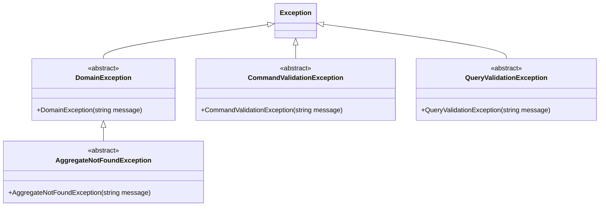

# Exception Hierarchy

This document defines the exception hierarchy. It is a critical contract. Deviating from it produces incorrect HTTP responses and breaks the agreement between the API layer and its clients.

---

## Why This Matters

When a server returns a 500 response to a client, the client has no idea whether the operation failed because the input was invalid, the resource was not found, or an unexpected error occurred. Each situation requires a different client action: show a validation message, navigate to a not-found page, or show a generic error and retry.

Without a defined hierarchy, teams drift into patterns like throwing `InvalidOperationException` from domain logic and `ArgumentException` from validators. Both produce 500 responses in a default ASP.NET Core setup. The hierarchy defines exactly four failure categories for expected failures. Every exception class maps to exactly one category. The `GlobalExceptionHandler` maps categories to HTTP status codes automatically. This is the contract.

---

## The Exception Hierarchy



---

## The Four Categories

| Category | Base Class | Location | HTTP Status | When to Throw |
|:---|:---|:---|:---|:---|
| Command Validation Failure | `CommandValidationException` | `Application.Write.Contracts/Shared/Exceptions/` | 400 | Thrown by `ICommandValidator<TCommand>` when command input is structurally invalid |
| Query Validation Failure | `QueryValidationException` | `Application.Read.Contracts/Shared/Exceptions/` | 400 | Thrown by `IQueryValidator<TQuery>` when query input is structurally invalid |
| Resource Not Found | `AggregateNotFoundException` | `Domain/Shared/Exceptions/` | 404 | Thrown by repository implementations when an aggregate cannot be found by ID |
| Domain Invariant Violation | `DomainException` | `Domain/Shared/Exceptions/` | 409 | Thrown by aggregate methods when the requested operation is not permitted in the current state |
| Unhandled | (any `Exception`) | Anywhere | 500 | Any exception not matching the above. Indicates a bug or unexpected external failure |

---

## Base Class Definitions

All base classes are `abstract`. Never throw a base class directly. Always throw a concrete subclass that names the specific failure.

Note that `CommandValidationException` and `QueryValidationException` have no shared base class beyond `Exception`. They are independent.

```csharp
// Domain/Shared/Exceptions/DomainException.cs
/// <summary>
/// The base class for all domain invariant violations.
/// Maps to HTTP 409 Conflict.
/// </summary>
public abstract class DomainException : Exception
{
    protected DomainException(string message)
        : base(message) { }
}

// Domain/Shared/Exceptions/AggregateNotFoundException.cs
/// <summary>
/// The base class for exceptions thrown when an aggregate cannot be
/// found by its ID. Maps to HTTP 404 Not Found.
/// </summary>
public abstract class AggregateNotFoundException : DomainException
{
    protected AggregateNotFoundException(string message)
        : base(message) { }
}

// Application.Write.Contracts/Shared/Exceptions/CommandValidationException.cs
/// <summary>
/// The base class for exceptions thrown by command validators when
/// command input is structurally invalid. Maps to HTTP 400 Bad Request.
/// </summary>
public abstract class CommandValidationException : Exception
{
    protected CommandValidationException(string message)
        : base(message) { }
}

// Application.Read.Contracts/Shared/Exceptions/QueryValidationException.cs
/// <summary>
/// The base class for exceptions thrown by query validators when
/// query input is structurally invalid. Maps to HTTP 400 Bad Request.
/// </summary>
public abstract class QueryValidationException : Exception
{
    protected QueryValidationException(string message)
        : base(message) { }
}
```

---

## Concrete Exception Examples

```csharp
// AggregateNotFoundException subclass (in Domain/Posts/Exceptions/)
public sealed class PostNotFoundException : AggregateNotFoundException
{
    public PostNotFoundException(PostId id)
        : base($"Post '{id.Value}' was not found.") { }
}

// DomainException subclass (in Domain/Posts/Exceptions/)
public sealed class PostAlreadyPublishedException : DomainException
{
    public PostAlreadyPublishedException(PostId id)
        : base($"Post '{id.Value}' is already published.") { }
}

// CommandValidationException subclass (in Application.Write.Contracts/Posts/Exceptions/)
public sealed class PostTitleRequiredException : CommandValidationException
{
    public PostTitleRequiredException()
        : base("A post title is required and cannot be empty.") { }
}

// QueryValidationException subclass (in Application.Read.Contracts/Posts/Exceptions/)
public sealed class PostIdRequiredException : QueryValidationException
{
    public PostIdRequiredException()
        : base("A post ID is required and cannot be the default value.") { }
}
```

---

## The GlobalExceptionHandler

The `GlobalExceptionHandler` is an `IExceptionHandler` implementation registered in `Program.cs`. It maps exception types to problem details responses. Endpoints MUST NOT contain `try-catch` blocks.

```csharp
internal sealed class GlobalExceptionHandler : IExceptionHandler
{
    private readonly ILogger<GlobalExceptionHandler> _logger;

    public GlobalExceptionHandler(ILogger<GlobalExceptionHandler> logger)
    {
        _logger = logger;
    }

    public async ValueTask<bool> TryHandleAsync(
        HttpContext httpContext,
        Exception exception,
        CancellationToken cancellationToken)
    {
        var (statusCode, title) = exception switch
        {
            CommandValidationException =>
                (StatusCodes.Status400BadRequest, "Command validation failure"),
            QueryValidationException =>
                (StatusCodes.Status400BadRequest, "Query validation failure"),
            AggregateNotFoundException =>
                (StatusCodes.Status404NotFound, "Resource not found"),
            DomainException =>
                (StatusCodes.Status409Conflict, "Domain rule violated"),
            _ =>
                (StatusCodes.Status500InternalServerError,
                 "An unexpected error occurred")
        };

        if (statusCode == StatusCodes.Status500InternalServerError)
        {
            _logger.LogError(
                exception,
                "Unhandled exception: {Message}",
                exception.Message);
        }
        else
        {
            _logger.LogWarning(
                exception,
                "Handled exception ({StatusCode}): {Message}",
                statusCode,
                exception.Message);
        }

        httpContext.Response.StatusCode = statusCode;

        var problem = new ProblemDetails
        {
            Status = statusCode,
            Title = title,
            Detail = exception.Message
        };

        await httpContext.Response.WriteAsJsonAsync(problem, cancellationToken);
        return true;
    }
}
```

Register in `Program.cs`:

```csharp
builder.Services.AddExceptionHandler<GlobalExceptionHandler>();
builder.Services.AddProblemDetails();

// ...

app.UseExceptionHandler();
```

---

## Throw Site Contract

| Exception Category | Thrown By | Never Thrown By |
|:---|:---|:---|
| `CommandValidationException` | `ICommandValidator<TCommand>` implementations | Handlers, aggregates, repositories, query validators |
| `QueryValidationException` | `IQueryValidator<TQuery>` implementations | Handlers, aggregates, repositories, command validators |
| `AggregateNotFoundException` | Repository `GetByIdAsync` implementations | Handlers, validators, aggregates, endpoints |
| `DomainException` | Aggregate root methods | Handlers, validators, repositories, endpoints |

---

## Why Not `Guard.Against` in Validators

`Guard.Against` from Ardalis.GuardClauses throws `ArgumentException` and `ArgumentNullException` by default. These are not `CommandValidationException` or `QueryValidationException` subclasses. They map to HTTP 500, not HTTP 400.

`Guard.Against` is appropriate in domain value object constructors where `ArgumentException` is the correct exception type for invalid construction arguments. In validators, always throw custom exception subclasses directly.

```csharp
// GOOD: throw CommandValidationException subclasses directly
internal sealed class CreatePostCommandValidator : ICommandValidator<CreatePostCommand>
{
    public Task ValidateAsync(CreatePostCommand command, CancellationToken cancellationToken)
    {
        if (string.IsNullOrWhiteSpace(command.Title))
        {
            throw new PostTitleRequiredException();
        }

        if (command.AuthorId == default)
        {
            throw new AuthorIdRequiredException();
        }

        if (command.Title.Length > 200)
        {
            throw new PostTitleTooLongException(command.Title.Length);
        }

        return Task.CompletedTask;
    }
}

// BAD: Guard.Against throws ArgumentException -> maps to HTTP 500
internal sealed class CreatePostCommandValidator : ICommandValidator<CreatePostCommand>
{
    public Task ValidateAsync(CreatePostCommand command, CancellationToken cancellationToken)
    {
        Guard.Against.NullOrWhiteSpace(command.Title, nameof(command.Title));
        // This throws ArgumentException, not PostTitleRequiredException.
        // The GlobalExceptionHandler maps it to 500, not 400.
        return Task.CompletedTask;
    }
}
```

---

## What NOT to Do

```csharp
// BAD: throwing a generic exception from a handler
internal sealed class PublishPostCommandHandler : ICommandHandler<PublishPostCommand>
{
    public async Task HandleAsync(PublishPostCommand command, CancellationToken cancellationToken)
    {
        var post = await _repository.GetByIdAsync(command.PostId, cancellationToken);

        if (post is null)
        {
            throw new InvalidOperationException("Post not found."); // BAD: wrong type, produces 500
        }

        post.Publish();
    }
}

// GOOD: repository throws the correct type; handler does not check for null
internal sealed class PublishPostCommandHandler : ICommandHandler<PublishPostCommand>
{
    private readonly IPostRepository _postRepository;

    public PublishPostCommandHandler(IPostRepository postRepository)
    {
        _postRepository = postRepository;
    }

    public async Task HandleAsync(PublishPostCommand command, CancellationToken cancellationToken)
    {
        var post = await _postRepository.GetByIdAsync(command.PostId, cancellationToken);
        // GetByIdAsync throws PostNotFoundException (404) if not found

        post.Publish();
        // Publish() throws PostAlreadyPublishedException (409) if already published
    }
}
```

---

The exception inventory for a specific project lives in the project repository. Copy `docs/templates/exception-inventory.md` into `docs/domain/exception-inventory.md` and fill it in.

