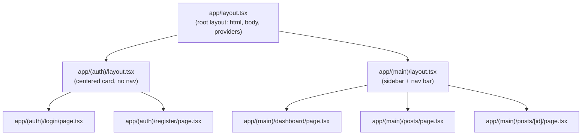

# Next.js App Router Conventions

## Agent Quick Rules

- Default to Server Components; `'use client'` MUST have an explanatory comment.
- `page.tsx` MUST be a thin shell; logic lives in `features/{feature}/`.
- MUST NOT import across `features/{a}/` and `features/{b}/`.
- `proxy.ts` MUST only do optimistic cookie checks; authoritative auth in Server Components/Actions.
- MUST await `params`, `searchParams`, `cookies`, `headers`.
- `route.ts` MUST NOT be used except webhooks, OAuth callbacks, or file/binary responses.
- ALL environment variable access MUST go through `lib/env.ts`. MUST NOT use `process.env.X` directly. See `docs/conventions/frontend/09-environment-and-runtime-config.md`.
- Stay on the latest Next.js 16.x and React 19.x patch releases. RSC and middleware advisories (May 2026) require `next@16.2.6+` and matching `react@19.2.6`.

## 1. Guiding Philosophy

The App Router is a full-stack rendering framework, not a client-side router. Its fundamental split between server components and client components maps directly to the read/write separation in the backend architecture. Server components are the read path: they fetch data, render HTML, and send it to the browser with zero JavaScript. Client components are the write path: they handle user interactions, manage local state, and trigger mutations. This split is enforced by the framework and MUST be respected, not worked around.

Every architectural decision in this guide follows from that split. A component that fetches data and renders it statically is a server component. A component that responds to a button click is a client component. A page that does both passes data from a server component parent to a client component child. The boundary is explicit, deliberate, and documented with a comment on every `"use client"` directive.

---

## 2. Server Components vs. Client Components

Every component is a server component by default. `"use client"` is an explicit opt-in that MUST be justified with a comment on the same line or the line immediately above explaining why the client boundary is needed.

| Capability | Server Component | Client Component |
|:---|:---:|:---:|
| Can fetch data directly | Yes | No (use TanStack Query or props) |
| Can use `useState` / `useEffect` | No | Yes |
| Can use browser APIs | No | Yes |
| Can handle click events | No | Yes |
| Sends JavaScript to browser | No | Yes |
| Can import server-only modules | Yes | No |
| Runs on server | Yes | No (runs in browser) |

```typescript
// GOOD: server component fetches data, passes to client component
// app/(main)/posts/[id]/page.tsx
type Props = {
  params: Promise<{ id: string }>
}

async function Page({ params }: Props) {
  const { id } = await params
  const post = await getPostById(id)
  if (!post) notFound()
  return <PostDetail post={post} />
}

// GOOD: client component only handles interaction
// domain/posts/detail/PostPublishButton.tsx
"use client"
// Needs onClick handler and isPending state - client component required.

type PostPublishButtonProps = {
  postId: string
  onPublish: () => void
}

function PostPublishButton({ postId, onPublish }: PostPublishButtonProps) {
  const [isPending, startTransition] = useTransition()
  // ...
}
```

```typescript
// BAD: client component fetches data it could receive as props from a server component
"use client"

function PostDetail({ postId }: { postId: string }) {
  const [post, setPost] = useState(null)
  useEffect(() => {
    fetch(`/api/posts/${postId}`).then(r => r.json()).then(setPost)
  }, [postId])
  // BAD: useEffect for data fetching, BAD: client component for read-only data
}
```

---

## 3. File Conventions

| File | Purpose | Notes |
|:---|:---|:---|
| `page.tsx` | Renders the UI for a route segment | Required for a route to be publicly accessible. MUST be a thin shell (see Section 4). |
| `layout.tsx` | Wraps child segments with shared UI | Does not re-render on navigation within its subtree. |
| `loading.tsx` | Suspense boundary UI for a segment | Shown while the segment's `page.tsx` is streaming. |
| `error.tsx` | Error boundary for a segment | MUST be a client component (`"use client"`). |
| `not-found.tsx` | UI shown when `notFound()` is called | Can be a server component. |
| `route.ts` | HTTP Route Handler for the segment | MUST NOT be used except for OAuth callbacks, webhooks, or binary/file responses. Otherwise use Server Actions or server component fetching. |
| `proxy.ts` | Runs before every request (renamed from `middleware.ts`) | `middleware.ts` is deprecated in Next.js 16. Run `npx @next/codemod@latest middleware-to-proxy` to migrate (run once when upgrading from Next.js 15; renames the file and updates the exported function name). MUST perform only optimistic checks (see Section 6). |
| `template.tsx` | Like `layout.tsx` but re-renders on navigation | Use only when a fresh instance is explicitly required on each navigation. |
| `default.tsx` | Fallback UI for parallel routes | Required when a slot has no matching segment during soft navigation. |

---

## 4. The Page-as-Thin-Shell Pattern

Every `page.tsx` file in `app/` is a thin shell. The page file handles Next.js-specific concerns only: `params` and `searchParams` extraction (with `await`), `notFound()` calls, and metadata export. The feature component handles all rendering.

```typescript
// GOOD: app/(main)/posts/[id]/page.tsx - thin shell
import type { Metadata } from "next"
import { notFound } from "next/navigation"
import { PostDetailPage } from "@/features/posts/detail/PostDetailPage"
import { getPostById } from "@/features/posts/detail/queries"

type Props = {
  params: Promise<{ id: string }>
}

export async function generateMetadata({ params }: Props): Promise<Metadata> {
  const { id } = await params
  const post = await getPostById(id)
  if (!post) return {}
  return { title: post.title }
}

export default async function Page({ params }: Props) {
  const { id } = await params
  const post = await getPostById(id)
  if (!post) notFound()
  return <PostDetailPage post={post} />
}
```

```typescript
// BAD: page.tsx contains component logic and data fetching mixed with routing concerns
export default async function Page({ params }: { params: Promise<{ id: string }> }) {
  const { id } = await params
  const post = await db.posts.findById(id)  // BAD: db access in page file
  return (
    <div>
      <h1>{post.title}</h1>  {/* BAD: rendering logic in page file */}
      <p>{post.content}</p>
    </div>
  )
}
```

---

## 5. Route Groups

Route groups use parentheses to organize routes without affecting the URL path. The primary use case is applying different layouts to different sections of the app.

```
app/
  (auth)/
    login/
      page.tsx
    register/
      page.tsx
    layout.tsx        <- auth layout (centered card, no sidebar)
  (main)/
    dashboard/
      page.tsx
    posts/
      page.tsx
      [id]/
        page.tsx
    layout.tsx        <- main app layout (sidebar, nav bar)
  layout.tsx          <- root layout (html, body, providers)
```



---

## 6. `proxy.ts` (Renamed from `middleware.ts`)

`proxy.ts` runs before every request. It MAY combine two non-authoritative concerns in one file:

1. **Optimistic auth redirect:** verify session cookie presence and redirect unauthenticated users.
2. **CSP nonce:** generate a per-request nonce and set the `Content-Security-Policy` header.

Copy the combined implementation from `docs/blueprints/frontend/proxy-ts.md`. For CSP layout wiring, see `docs/blueprints/frontend/csp-headers.md`.

It MUST NOT perform authoritative validation: no database lookups, no cryptographic JWT verification, no permission checks.

**CVE-2025-29927:** Relying on `proxy.ts` as the sole authorization gate is a known vulnerability. Protected route groups MUST call `auth()` in their `layout.tsx` and `redirect()` when unauthenticated. `proxy.ts` is a UX optimization only, not a security boundary.

```typescript
// GOOD: protected route group layout enforces auth (authoritative)
// app/(main)/layout.tsx
import { auth } from "@/lib/auth"
import { redirect } from "next/navigation"

export default async function MainLayout({ children }: { children: React.ReactNode }) {
  const session = await auth()
  if (!session) {
    redirect("/login")
  }

  return <>{children}</>
}
```

```typescript
// GOOD: use the combined blueprint (auth redirect + CSP nonce)
// See docs/blueprints/frontend/proxy-ts.md
```

```typescript
// BAD: proxy.ts performs cryptographic JWT verification
import { jwtVerify } from "jose"  // BAD: crypto in proxy, slow, error-prone

export async function proxy(request: NextRequest) {
  const token = request.cookies.get("token")?.value
  try {
    await jwtVerify(token, secret)  // BAD: authoritative check in proxy
  } catch {
    return NextResponse.redirect(new URL("/login", request.url))
  }
}
```

---

## 7. Environment Variables

The `NEXT_PUBLIC_` prefix exposes a variable to the browser bundle. Variables without this prefix are server-only and never sent to the client.

| Variable | Scope | Purpose |
|:---|:---|:---|
| `API_BASE_URL` | Server-only | The ASP.NET Core backend API base URL. Never exposed to the browser. |
| `NEXT_PUBLIC_APP_URL` | Public (browser) | The frontend application URL. Used for canonical links and redirects. |
| `AUTH_SECRET` | Server-only | Auth.js v5 secret key for signing session tokens. |
| `AUTH_*` | Server-only | All Auth.js v5 provider configuration variables use the `AUTH_` prefix. |

Never put secrets in `NEXT_PUBLIC_*` variables. They are inlined into the JavaScript bundle and visible to anyone who inspects the page source.

---

## 8. The React Compiler

Next.js 16 includes the React Compiler as a stable feature. When enabled via `reactCompiler: true` in `next.config.js`, the compiler automatically inserts memoization where it is beneficial. MUST NOT manually add `useMemo`, `useCallback`, or `React.memo` when the compiler is enabled. Manual memoization does not break anything but is redundant noise that makes the code harder to read.

```javascript
// next.config.js
const nextConfig = {
  reactCompiler: true,
}
```

```typescript
// GOOD: clean component code, compiler handles memoization
function ExpensiveList({ items }: { items: Item[] }) {
  const sorted = items.sort((a, b) => a.name.localeCompare(b.name))
  return <ul>{sorted.map(item => <li key={item.id}>{item.name}</li>)}</ul>
}
```

```typescript
// BAD: manual memoization when compiler is enabled
function ExpensiveList({ items }: { items: Item[] }) {
  const sorted = useMemo(
    () => items.sort((a, b) => a.name.localeCompare(b.name)),
    [items]
  )
  // BAD: useMemo is redundant when the React Compiler is enabled
  return <ul>{sorted.map(item => <li key={item.id}>{item.name}</li>)}</ul>
}
```

---

## 9. Caching and Revalidation

Next.js 16 stabilizes the `use cache` directive for the Cache Components model. Cache behavior is controlled by `cacheLife` profiles (`"seconds"`, `"minutes"`, `"hours"`, `"days"`, `"weeks"`, `"max"`).

`revalidateTag` in Next.js 16 requires a `cacheLife` second argument. Omitting it is a TypeScript error.

```typescript
// GOOD: revalidateTag with cacheLife second argument (required in Next.js 16)
import { revalidateTag } from "next/cache"

revalidateTag("posts", "minutes")  // cacheLife second argument required
```

```typescript
// BAD: revalidateTag without cacheLife (TypeScript error in Next.js 16)
revalidateTag("posts")  // BAD: missing cacheLife argument
```

`revalidatePath` remains available for simpler cases where tag-based granularity is not needed:

```typescript
import { revalidatePath } from "next/cache"

revalidatePath("/posts")  // revalidates all cached data for the /posts route
```

For functions that read from the database or external APIs, the `use cache` directive marks the function result as cacheable:

```typescript
// domain/posts/list/queries.ts
import { getApiClient } from "@/lib/api/client"

export async function getPublishedPosts() {
  "use cache"
  const client = await getApiClient()
  const { data } = await client.GET("/posts", {
    params: { query: { status: "published" } }
  })
  return data
}
```

### Authenticated data and `use cache`

MUST NOT use `use cache` on functions that call `getApiClient()` with a user-specific Bearer token unless the cache key includes the authenticated user identity. Cached authenticated responses without a user-scoped key leak data across sessions.

```typescript
// GOOD: no use cache on authenticated fetch; fetch in Server Component per request
export async function getMyPosts() {
  const session = await auth()
  if (!session) {
    redirect("/login")
  }

  const client = await getApiClient()
  const { data } = await client.GET("/posts/mine")
  return data
}

// BAD: use cache on authenticated API call without user in cache key
export async function getMyPosts() {
  "use cache"  // BAD: same cached payload served to every user
  const client = await getApiClient()
  const { data } = await client.GET("/posts/mine")
  return data
}
```

Public, unauthenticated data MAY use `use cache` when the response is identical for all users.

---

## 10. TypeScript Configuration

Projects MUST use this `tsconfig.json` baseline for Next.js 16 with TypeScript 6.0:

```json
{
  "compilerOptions": {
    "target": "ES2022",
    "lib": ["dom", "dom.iterable", "esnext"],
    "module": "ESNext",
    "moduleResolution": "bundler",
    "moduleDetection": "force",
    "jsx": "preserve",
    "strict": true,
    "noEmit": true,
    "esModuleInterop": true,
    "resolveJsonModule": true,
    "isolatedModules": true,
    "incremental": true,
    "plugins": [{ "name": "next" }],
    "paths": {
      "@/*": ["./*"]
    }
  },
  "include": ["next-env.d.ts", "**/*.ts", "**/*.tsx", ".next/types/**/*.ts"],
  "exclude": ["node_modules"]
}
```

`moduleResolution` MUST be `"bundler"` for Next.js projects. The `--outFile` compiler option has been removed in TypeScript 6.0 and MUST NOT be used.

---

## 11. Feature Use Case Modules

Frontend feature folders follow the same Feature → Use case boundaries as backend handlers and domain docs. Each feature folder owns its routes, components, actions, hooks, and stores for one bounded area (for example `posts`).

**Import rules:**

- Code under `features/{feature}/` MUST NOT import from `features/{otherFeature}/`.
- Cross-feature reuse MUST follow the promotion rule in `docs/conventions/00-principles.md`: promote shared implementation code to `shared/` (import as `@/shared/...`) or generic UI to `components/ui/`.
- `app/` route shells MUST import feature entry components from `features/{feature}/` only. They MUST NOT contain business logic.

```typescript
// GOOD: posts domain imports only its own modules and shared layers
import { PostCard } from "@/features/posts/list/PostCard"
import { formatRelativeDate } from "@/shared/dates/formatRelativeDate"
import { Button } from "@/components/ui/button"
```

```typescript
// BAD: posts domain imports authors domain internals
import { AuthorAvatar } from "@/features/authors/shared/AuthorAvatar"
// BAD: cross-feature coupling; promote AuthorAvatar to @/shared/ or components/ui/
```

Feature-local shared code (`features/{feature}/shared/`) is for reuse within one domain only. It MUST NOT be imported by other features.

See `docs/conventions/frontend/07-feature-boundaries.md`.

---

## 12. Environment Variable Validation

Define `lib/env.ts` in every project. Validate all required server-side environment variables at module load time so a missing variable causes an immediate startup failure with a clear error message, not a cryptic `TypeError` at request time.

```typescript
// lib/env.ts
import { z } from "zod"

const serverEnvSchema = z.object({
    API_BASE_URL: z.string().url({ error: "API_BASE_URL must be a valid URL" }),
    AUTH_SECRET: z.string().min(32, { error: "AUTH_SECRET must be at least 32 characters" }),
})

// Runs at module import time on the server.
// A missing variable causes an immediate startup failure with a clear error message.
export const serverEnv = serverEnvSchema.parse({
    API_BASE_URL: process.env.API_BASE_URL,
    AUTH_SECRET: process.env.AUTH_SECRET,
})
```

Use `serverEnv` in `lib/api/client.ts` instead of `process.env` directly:

```typescript
// lib/api/client.ts
import { serverEnv } from "@/lib/env"

export async function getApiClient() {
    // ...
    return createClient<paths>({
        baseUrl: serverEnv.API_BASE_URL,
        // ...
    })
}
```

Add all required server-side variables to the schema. A Zod validation error at startup names the missing variable and the violated constraint.

---

## 13. Project-Specific Configuration

Document project-specific API URLs and env values in the relevant use case doc under `docs/domain/` and in validated `lib/env.ts`. Do not extend this standards file.
