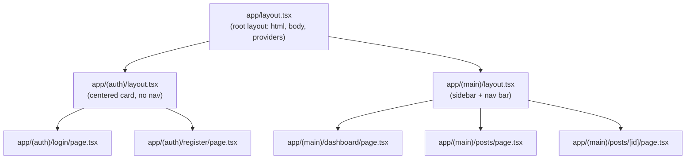

# Next.js App Router Conventions

## 1. Guiding Philosophy

The App Router is a full-stack rendering framework, not a client-side router. Its fundamental split between server components and client components maps directly to the read/write separation in the backend architecture. Server components are the read path: they fetch data, render HTML, and send it to the browser with zero JavaScript. Client components are the write path: they handle user interactions, manage local state, and trigger mutations. This split is enforced by the framework and should be respected, not worked around.

Every architectural decision in this guide follows from that split. A component that fetches data and renders it statically is a server component. A component that responds to a button click is a client component. A page that does both passes data from a server component parent to a client component child. The boundary is explicit, deliberate, and documented with a comment on every `"use client"` directive.

---

## 2. Server Components vs. Client Components

Every component is a server component by default. `"use client"` is an explicit opt-in that MUST be justified with a comment on the same line or the line immediately above explaining why the client boundary is needed.

| Capability | Server Component | Client Component |
|:---|:---:|:---:|
| Can fetch data directly | Yes | No (use TanStack Query or props) |
| Can use `useState` / `useEffect` | No | Yes |
| Can use browser APIs | No | Yes |
| Can handle click events | No | Yes |
| Sends JavaScript to browser | No | Yes |
| Can import server-only modules | Yes | No |
| Runs on server | Yes | No (runs in browser) |

```typescript
// GOOD: server component fetches data, passes to client component
// app/(main)/posts/[id]/page.tsx
type Props = {
  params: Promise<{ id: string }>
}

async function Page({ params }: Props) {
  const { id } = await params
  const post = await getPostById(id)
  if (!post) notFound()
  return <PostDetail post={post} />
}

// GOOD: client component only handles interaction
// features/posts/detail/PostPublishButton.tsx
"use client"
// Needs onClick handler and isPending state — client component required.

type PostPublishButtonProps = {
  postId: string
  onPublish: () => void
}

function PostPublishButton({ postId, onPublish }: PostPublishButtonProps) {
  const [isPending, startTransition] = useTransition()
  // ...
}
```

```typescript
// BAD: client component fetches data it could receive as props from a server component
"use client"

function PostDetail({ postId }: { postId: string }) {
  const [post, setPost] = useState(null)
  useEffect(() => {
    fetch(`/api/posts/${postId}`).then(r => r.json()).then(setPost)
  }, [postId])
  // BAD: useEffect for data fetching, BAD: client component for read-only data
}
```

---

## 3. File Conventions

| File | Purpose | Notes |
|:---|:---|:---|
| `page.tsx` | Renders the UI for a route segment | Required for a route to be publicly accessible. MUST be a thin shell (see Section 4). |
| `layout.tsx` | Wraps child segments with shared UI | Does not re-render on navigation within its subtree. |
| `loading.tsx` | Suspense boundary UI for a segment | Shown while the segment's `page.tsx` is streaming. |
| `error.tsx` | Error boundary for a segment | MUST be a client component (`"use client"`). |
| `not-found.tsx` | UI shown when `notFound()` is called | Can be a server component. |
| `route.ts` | HTTP Route Handler for the segment | Use sparingly; prefer Server Actions or direct server component fetching. |
| `proxy.ts` | Runs before every request (renamed from `middleware.ts`) | `middleware.ts` is deprecated in Next.js 16. Run `npx @next/codemod@canary middleware-to-proxy` to migrate. MUST perform only optimistic checks (see Section 6). |
| `template.tsx` | Like `layout.tsx` but re-renders on navigation | Use only when a fresh instance is explicitly required on each navigation. |
| `default.tsx` | Fallback UI for parallel routes | Required when a slot has no matching segment during soft navigation. |

---

## 4. The Page-as-Thin-Shell Pattern

Every `page.tsx` file in `app/` is a thin shell. The page file handles Next.js-specific concerns only: `params` and `searchParams` extraction (with `await`), `notFound()` calls, and metadata export. The feature component handles all rendering.

```typescript
// GOOD: app/(main)/posts/[id]/page.tsx — thin shell
import type { Metadata } from "next"
import { notFound } from "next/navigation"
import { PostDetailPage } from "@/features/posts/detail/PostDetailPage"
import { getPostById } from "@/features/posts/detail/queries"

type Props = {
  params: Promise<{ id: string }>
}

export async function generateMetadata({ params }: Props): Promise<Metadata> {
  const { id } = await params
  const post = await getPostById(id)
  if (!post) return {}
  return { title: post.title }
}

export default async function Page({ params }: Props) {
  const { id } = await params
  const post = await getPostById(id)
  if (!post) notFound()
  return <PostDetailPage post={post} />
}
```

```typescript
// BAD: page.tsx contains component logic and data fetching mixed with routing concerns
export default async function Page({ params }: { params: Promise<{ id: string }> }) {
  const { id } = await params
  const post = await db.posts.findById(id)  // BAD: db access in page file
  return (
    <div>
      <h1>{post.title}</h1>  {/* BAD: rendering logic in page file */}
      <p>{post.content}</p>
    </div>
  )
}
```

---

## 5. Route Groups

Route groups use parentheses to organize routes without affecting the URL path. The primary use case is applying different layouts to different sections of the app.

```
app/
  (auth)/
    login/
      page.tsx
    register/
      page.tsx
    layout.tsx        <- auth layout (centered card, no sidebar)
  (main)/
    dashboard/
      page.tsx
    posts/
      page.tsx
      [id]/
        page.tsx
    layout.tsx        <- main app layout (sidebar, nav bar)
  layout.tsx          <- root layout (html, body, providers)
```



---

## 6. `proxy.ts` (Renamed from `middleware.ts`)

`proxy.ts` runs before every request. It MUST perform only optimistic checks: verifying the presence of a session cookie and redirecting unauthenticated users based on cookie existence.

It MUST NOT perform authoritative validation: no database lookups, no cryptographic JWT verification, no permission checks.

**CVE-2025-29927:** Relying on `proxy.ts` as the sole authorization gate is a known vulnerability. An attacker can bypass the proxy by sending a request with a specific internal routing header. Always validate the session in the Server Component or Server Action that actually needs it. `proxy.ts` is a UX optimization (fast redirect for obviously unauthenticated users), not a security boundary.

```typescript
// GOOD: proxy.ts performs only optimistic cookie presence check
// proxy.ts
import type { NextRequest } from "next/server"
import { NextResponse } from "next/server"

export function proxy(request: NextRequest) {
  const sessionCookie = request.cookies.get("session")

  if (!sessionCookie && !request.nextUrl.pathname.startsWith("/login")) {
    return NextResponse.redirect(new URL("/login", request.url))
  }

  return NextResponse.next()
}

export const config = {
  matcher: ["/((?!_next/static|_next/image|favicon.ico).*)"]
}
```

```typescript
// BAD: proxy.ts performs cryptographic JWT verification
import { jwtVerify } from "jose"  // BAD: crypto in proxy, slow, error-prone

export async function proxy(request: NextRequest) {
  const token = request.cookies.get("token")?.value
  try {
    await jwtVerify(token, secret)  // BAD: authoritative check in proxy
  } catch {
    return NextResponse.redirect(new URL("/login", request.url))
  }
}
```

---

## 7. Environment Variables

The `NEXT_PUBLIC_` prefix exposes a variable to the browser bundle. Variables without this prefix are server-only and never sent to the client.

| Variable | Scope | Purpose |
|:---|:---|:---|
| `API_BASE_URL` | Server-only | The ASP.NET Core backend API base URL. Never exposed to the browser. |
| `NEXT_PUBLIC_APP_URL` | Public (browser) | The frontend application URL. Used for canonical links and redirects. |
| `AUTH_SECRET` | Server-only | Auth.js v5 secret key for signing session tokens. |
| `AUTH_*` | Server-only | All Auth.js v5 provider configuration variables use the `AUTH_` prefix. |

Never put secrets in `NEXT_PUBLIC_*` variables. They are inlined into the JavaScript bundle and visible to anyone who inspects the page source.

---

## 8. The React Compiler

Next.js 16 includes the React Compiler as a stable feature. When enabled via `reactCompiler: true` in `next.config.js`, the compiler automatically inserts memoization where it is beneficial. MUST NOT manually add `useMemo`, `useCallback`, or `React.memo` when the compiler is enabled. Manual memoization does not break anything but is redundant noise that makes the code harder to read.

```javascript
// next.config.js
const nextConfig = {
  reactCompiler: true,
}
```

```typescript
// GOOD: clean component code, compiler handles memoization
function ExpensiveList({ items }: { items: Item[] }) {
  const sorted = items.sort((a, b) => a.name.localeCompare(b.name))
  return <ul>{sorted.map(item => <li key={item.id}>{item.name}</li>)}</ul>
}
```

```typescript
// BAD: manual memoization when compiler is enabled
function ExpensiveList({ items }: { items: Item[] }) {
  const sorted = useMemo(
    () => items.sort((a, b) => a.name.localeCompare(b.name)),
    [items]
  )
  // BAD: useMemo is redundant when the React Compiler is enabled
  return <ul>{sorted.map(item => <li key={item.id}>{item.name}</li>)}</ul>
}
```

---

## 9. Caching and Revalidation

Next.js 16 stabilizes the `use cache` directive for the Cache Components model. Cache behavior is controlled by `cacheLife` profiles (`"seconds"`, `"minutes"`, `"hours"`, `"days"`, `"weeks"`, `"max"`).

`revalidateTag` in Next.js 16 requires a `cacheLife` second argument. Omitting it is a TypeScript error.

```typescript
// GOOD: revalidateTag with cacheLife second argument (required in Next.js 16)
import { revalidateTag } from "next/cache"

revalidateTag("posts", "minutes")  // cacheLife second argument required
```

```typescript
// BAD: revalidateTag without cacheLife (TypeScript error in Next.js 16)
revalidateTag("posts")  // BAD: missing cacheLife argument
```

`revalidatePath` remains available for simpler cases where tag-based granularity is not needed:

```typescript
import { revalidatePath } from "next/cache"

revalidatePath("/posts")  // revalidates all cached data for the /posts route
```

For functions that read from the database or external APIs, the `use cache` directive marks the function result as cacheable:

```typescript
// features/posts/list/queries.ts
import { getApiClient } from "@/lib/api/client"

export async function getPublishedPosts() {
  "use cache"
  const client = await getApiClient()
  const { data } = await client.GET("/posts", {
    params: { query: { status: "published" } }
  })
  return data
}
```

---

## 10. TypeScript Configuration

Recommended `tsconfig.json` for a Next.js 16 project with TypeScript 6.0:

```json
{
  "compilerOptions": {
    "target": "ES2022",
    "lib": ["dom", "dom.iterable", "esnext"],
    "module": "ESNext",
    "moduleResolution": "bundler",
    "moduleDetection": "force",
    "jsx": "preserve",
    "strict": true,
    "noEmit": true,
    "esModuleInterop": true,
    "resolveJsonModule": true,
    "isolatedModules": true,
    "incremental": true,
    "plugins": [{ "name": "next" }],
    "paths": {
      "@/*": ["./*"]
    }
  },
  "include": ["next-env.d.ts", "**/*.ts", "**/*.tsx", ".next/types/**/*.ts"],
  "exclude": ["node_modules"]
}
```

`moduleResolution: "bundler"` is recommended over `"node16"` for Next.js projects because it matches how Turbopack and Webpack resolve modules. The `--outFile` compiler option has been removed in TypeScript 6.0 and MUST NOT be used.

---

## 11. Project-Specific Configuration

> **Project teams: fill in this section when adopting these standards.**

The following configuration is project-specific and not defined in this standards file:

- **API base URL:** The value of `API_BASE_URL` for each environment (development, staging, production).
- **Custom `cacheLife` profiles:** Any project-specific cache duration profiles beyond the built-in ones.
- **Feature flags:** Whether feature flags are implemented and how they are read (environment variable, edge config, database).
- **Deployment target:** Vercel (with Edge Runtime), self-hosted Node.js, or Docker container. This affects which Next.js features are available.
- **Custom `next.config.js` options:** Any project-specific Next.js configuration beyond `reactCompiler: true`.
