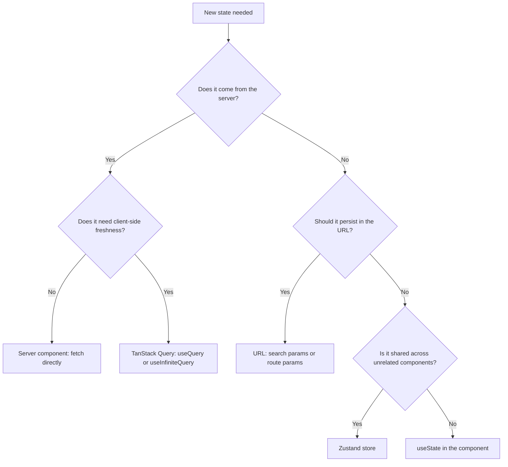

# State Management and Forms

## 1. Guiding Philosophy

State management complexity is the primary source of frontend bugs. The root cause is almost always conflating server state with UI state. Server state is not yours: it lives on the server, it can be stale, and it must be synchronized. UI state is yours: it lives in the browser, it is ephemeral, and it only needs to be consistent within the current session. Treating these as the same problem produces systems where a button click triggers three state updates across two stores and a cache invalidation, when a single `useMutation` call with `invalidateQueries` would suffice.

The state decision is architectural: choose the wrong container and you will fight synchronization bugs, stale data, and unnecessary re-renders for the lifetime of the feature. Choose correctly and data flows in one direction, updates are isolated, and the component tree stays predictable. Read Section 2 before writing any stateful code.

---

## 2. The State Decision Tree



---

## 3.1 Zod v4 Syntax Cheat Sheet

Projects use Zod 4.4.x. Import from `"zod"`. Agents frequently regress to v3 syntax from pre-training data. Use this table:

| Validation | Zod 4 (GOOD) | Zod 3 (BAD) |
|:---|:---|:---|
| Email | `z.email()` | `z.string().email()` |
| UUID | `z.uuid()` | `z.string().uuid()` |
| URL | `z.url()` | `z.string().url()` |
| Non-empty string | `z.string().min(1)` | same |
| Optional field | `z.string().optional()` | same |
| Object | `z.object({ ... })` | same |

```typescript
// GOOD: Zod 4 top-level validators
const schema = z.object({
  email: z.email(),
  postId: z.uuid(),
  website: z.url().optional(),
})

// BAD: v3 chained validators on z.string()
const schema = z.object({
  email: z.string().email(),
  postId: z.string().uuid(),
})
```

---

## 3. Zustand for UI State

Zustand manages UI state that is shared across components that are not in a parent-child relationship: the active tab in an editor, draft-saved status shared between a toolbar and a footer, word count shown in multiple places on the page.

```typescript
// domain/posts/store/postEditorStore.ts
import { create } from "zustand"

type PostEditorTab = "write" | "preview" | "settings"

type PostEditorState = {
  activeTab: PostEditorTab
  isDraftSaved: boolean
  wordCount: number
  setActiveTab: (tab: PostEditorTab) => void
  setWordCount: (count: number) => void
  markDraftSaved: () => void
  reset: () => void
}

const initialState = {
  activeTab: "write" as PostEditorTab,
  isDraftSaved: false,
  wordCount: 0,
}

export const usePostEditorStore = create<PostEditorState>((set) => ({
  ...initialState,
  setActiveTab: (tab) => set({ activeTab: tab }),
  setWordCount: (count) => set({ wordCount: count }),
  markDraftSaved: () => set({ isDraftSaved: true }),
  reset: () => set(initialState),
}))
```

Rules:

- Zustand stores MUST NOT contain server data. Use TanStack Query for anything fetched from the backend.
- Zustand stores MUST have a `reset` action for cleanup between sessions or user switches.
- Domain-specific stores live in `domain/{feature}/store/`. App-wide stores live in `lib/stores/`.
- A Zustand store MUST NOT expose more than 6 actions (including `reset`). If a store exceeds 6 actions, the agent MUST split it into focused stores by concern.

```typescript
// GOOD: Zustand for UI state only
const useEditorStore = create((set) => ({
  activeTab: "write",
  setActiveTab: (tab) => set({ activeTab: tab }),
}))
```

```typescript
// BAD: Zustand holding server data
const usePostStore = create((set) => ({
  posts: [],         // BAD: server data in Zustand
  isLoading: false,  // BAD: loading state that TanStack Query manages
  fetchPosts: async () => { /* BAD: manual fetch */ }
}))
```

### Server Cache vs. UI State Division

| Dimension | Server Cache (TanStack Query) | Ephemeral UI State (Zustand) |
|:---|:---|:---|
| **Source of Truth** | Remote database / Server endpoints | Browser memory / Local user actions |
| **Ownership** | Shared across all clients; not owned by this tab | Private to this browser tab and session |
| **Typical Data** | Post bodies, product catalogs, user details | Selected index, editor tabs, sidebar toggle, text drafts |
| **Staleness** | Immediately stale after fetching; needs revalidation | Always 100% accurate relative to user actions |
| **Primary Tool** | `useQuery`, `useMutation`, `useInfiniteQuery` | `useStore` custom hooks resolved via Zustand |
| **Key Operations** | Cache invalidation, query key refetching, pagination | Atomic state updates, store resets, local events |

### Coordination Code Example

The example below demonstrates how to coordinate server data and client-side UI selections cleanly. Zustand stores the selected post ID (client UI state), while TanStack Query manages the corresponding query lifecycle and caching (server state).

```typescript
// domain/posts/detail/usePostFocusStore.ts
import { create } from "zustand"

type FocusState = {
  focusedPostId: string | null
  setFocusedPostId: (id: string | null) => void
  reset: () => void
}

export const usePostFocusStore = create<FocusState>((set) => ({
  focusedPostId: null,
  setFocusedPostId: (id) => set({ focusedPostId: id }),
  reset: () => set({ focusedPostId: null }),
}))
```

```tsx
// domain/posts/detail/PostDetailsViewer.tsx
"use client"
// Needs useQuery from TanStack and custom selector hook - client boundary required.

import { useQuery } from "@tanstack/react-query"
import { usePostFocusStore } from "./usePostFocusStore"
import { fetchPostById } from "../api/fetchPost"

export function PostDetailsViewer() {
  // 1. Read ephemeral UI selection from Zustand
  const focusedPostId = usePostFocusStore((state) => state.focusedPostId)
  const setFocusedPostId = usePostFocusStore((state) => state.setFocusedPostId)

  // 2. Read remote server data from TanStack Query
  const { data: post, isLoading, error } = useQuery({
    queryKey: ["posts", focusedPostId],
    queryFn: () => fetchPostById(focusedPostId!),
    enabled: !!focusedPostId, // ONLY execute query when an ID is active
  })

  if (!focusedPostId) {
    return <p className="text-muted-foreground">Select a post to view details</p>
  }

  if (isLoading) return <span className="animate-pulse">Loading post data...</span>
  if (error) return <span className="text-destructive">Failed to fetch post details.</span>

  return (
    <div className="p-4 border rounded shadow bg-card text-card-foreground">
      <h2 className="text-xl font-bold">{post?.title}</h2>
      <p className="mt-2 text-sm">{post?.content}</p>
      <button 
        onClick={() => setFocusedPostId(null)}
        className="mt-4 px-3 py-1 bg-secondary text-secondary-foreground rounded hover:bg-secondary/80"
      >
        Close View
      </button>
    </div>
  )
}
```

---

## 4. URL State

URL state is the correct home for state that should persist across page refreshes and be shareable via link: search filters, sort order, current page, selected tab that forms part of the navigation context.

```typescript
// domain/posts/list/usePostFilters.ts
"use client"
// Needs useRouter and useSearchParams - client component hook required.

import { useRouter, useSearchParams, usePathname } from "next/navigation"
import { useTransition } from "react"

export function usePostFilters() {
  const router = useRouter()
  const pathname = usePathname()
  const searchParams = useSearchParams()
  const [isPending, startTransition] = useTransition()

  const status = searchParams.get("status") ?? "all"
  const page = parseInt(searchParams.get("page") ?? "1")

  const setFilter = (key: string, value: string) => {
    const params = new URLSearchParams(searchParams.toString())
    params.set(key, value)
    params.set("page", "1")  // reset page on filter change

    startTransition(() => {
      router.push(`${pathname}?${params.toString()}`)
    })
  }

  return { status, page, setFilter, isPending }
}
```

Use `useTransition` when updating search params so that the transition can be marked as non-urgent and the current UI can remain interactive during the navigation.

---

## 5. Forms with React Hook Form and Zod

React Hook Form with Zod is the standard for forms that require complex client-side validation UX, field arrays, or multi-step flows.

**Zod v4 schema:**

```typescript
// domain/posts/create/createPost.schema.ts
import { z } from "zod"

// Zod v4: string format validators are top-level functions, not chained methods.
// z.email() not z.string().email()
// z.uuid() not z.string().uuid()
// z.url() not z.string().url()
export const createPostSchema = z.object({
  title: z.string()
    .min(5, { error: "Title must be at least 5 characters" })
    .max(200, { error: "Title cannot exceed 200 characters" }),
  slug: z.string()
    .min(3, { error: "Slug must be at least 3 characters" })
    .regex(/^[a-z0-9-]+$/, { error: "Slug must contain only lowercase letters, numbers, and hyphens" }),
  content: z.string()
    .min(1, { error: "Content is required" }),
  // Zod v4: z.email() is a top-level function
  authorEmail: z.email({ error: "Please enter a valid email address" }),
})

export type CreatePostInput = z.infer<typeof createPostSchema>
```

**React Hook Form integration with `useMutation`:**

```typescript
// domain/posts/create/CreatePostForm.tsx
"use client"
// Needs useForm, useState, and form event handlers - client component required.

import { useForm } from "react-hook-form"
import { zodResolver } from "@hookform/resolvers/zod"
import { createPostSchema, type CreatePostInput } from "./createPost.schema"
import { useCreatePost } from "./useCreatePost"
import { toast } from "sonner"
import { Button } from "@/components/ui/button"
import { Input } from "@/components/ui/input"
import {
  Form,
  FormControl,
  FormField,
  FormItem,
  FormLabel,
  FormMessage,
} from "@/components/ui/form"

export function CreatePostForm() {
  const form = useForm<CreatePostInput>({
    resolver: zodResolver(createPostSchema),
    defaultValues: {
      title: "",
      slug: "",
      content: "",
      authorEmail: "",
    },
  })

  const createPost = useCreatePost()

  const onSubmit = form.handleSubmit(async (data) => {
    try {
      await createPost.mutateAsync(data)
      toast.success("Post created successfully.")
      form.reset()
    } catch (error) {
      toast.error("Failed to create post. Please try again.")
    }
  })

  return (
    <Form {...form}>
      <form onSubmit={onSubmit} className="space-y-4">
        <FormField
          control={form.control}
          name="title"
          render={({ field }) => (
            <FormItem>
              <FormLabel>Title</FormLabel>
              <FormControl>
                <Input placeholder="Post title" {...field} />
              </FormControl>
              <FormMessage />
            </FormItem>
          )}
        />
        <Button type="submit" disabled={createPost.isPending}>
          {createPost.isPending ? "Creating..." : "Create Post"}
        </Button>
      </form>
    </Form>
  )
}
```

---

## 6. Simple Forms with `useActionState`

For forms that do not need complex client-side validation UX, `useActionState` with a Server Action is simpler and provides progressive enhancement (the form works without JavaScript):

```typescript
// domain/posts/publish/PublishPostForm.tsx
"use client"
// Needs useActionState for form state management - client component required.

import { useActionState } from "react"
import { publishPostAction } from "./publishPost.action"
import { Button } from "@/components/ui/button"

type Props = {
  postId: string
}

export function PublishPostForm({ postId }: Props) {
  const [state, formAction, isPending] = useActionState(
    publishPostAction.bind(null, postId),
    null
  )

  return (
    <form action={formAction}>
      {state?.success === false && (
        <p role="alert" className="text-sm text-destructive">
          {state.message}
        </p>
      )}
      <Button type="submit" disabled={isPending} variant="publish">
        {isPending ? "Publishing..." : "Publish Post"}
      </Button>
    </form>
  )
}
```

---

## 7. When to Use Each Form Pattern

| Pattern | When to Use | When Not to Use |
|:---|:---|:---|
| `useActionState` + Server Action | Simple forms, progressive enhancement needed, no complex field interactions, single-purpose forms | Multi-step flows, field arrays, complex conditional validation |
| React Hook Form + Zod + `useMutation` | Complex validation UX, field arrays, multi-step forms, inline edits triggered by non-form UI | Simple single-field forms, when progressive enhancement is required |
| React Hook Form + Zod + Server Action | Complex validation UX with progressive enhancement; the fullest pattern | Most forms: the added complexity is only justified when both rich UX and progressive enhancement are required |

---

## 8. Form Error Display

Validation errors returned from the backend use `ProblemDetails`. Field errors appear next to the field. Form-level errors appear once near the submit button or at the top of the form.

```typescript
// GOOD: field and form errors are displayed separately
{form.formState.errors.title && (
  <FormMessage>{form.formState.errors.title.message}</FormMessage>
)}

{serverError && (
  <p role="alert" className="text-sm text-destructive">
    {serverError}
  </p>
)}
```

```typescript
// BAD: every error is collapsed into a generic toast
toast.error("Something went wrong")
```

Use toasts for completion feedback and non-field failures. Do not use toasts as the only place where validation errors appear.

---

## 9. File Uploads

File uploads use Server Actions or route handlers that stream to the backend or storage provider. Client components may collect files, show previews, and display progress, but they must not contain storage credentials.

Rules:

- Validate file type, size, and count on the server.
- Store files through a narrow Infrastructure interface.
- Virus scan or quarantine user-uploaded files when the project handles untrusted documents.
- Do not persist uploads until the command that owns the business operation succeeds.
- Do not put file bytes in Zustand or TanStack Query cache.

```typescript
// GOOD: Zod validates File metadata in a Server Action
const uploadSchema = z.object({
  attachment: z.instanceof(File)
    .refine(file => file.size <= 10 * 1024 * 1024, {
      error: "File must be 10 MB or smaller",
    }),
})
```

```typescript
// BAD: client-only file validation is treated as sufficient
if (file.size > maxSize) {
  return
}
await uploadFile(file)
```

---

## 10. Discriminated Unions for State Modeling

TypeScript discriminated unions are the correct way to model states that have different shapes. They are the frontend equivalent of a backend state machine. They make impossible states impossible at compile time.

```typescript
// GOOD: discriminated union makes impossible states impossible
type PostState =
  | { status: "draft" }
  | { status: "published"; publishedAt: Date }
  | { status: "archived"; archivedAt: Date; reason: string }

function PostStatusBadge({ state }: { state: PostState }) {
  switch (state.status) {
    case "draft":
      return <span className="text-gray-500">Draft</span>
    case "published":
      // TypeScript knows publishedAt is defined here
      return <span className="text-green-600">Published {state.publishedAt.toLocaleDateString()}</span>
    case "archived":
      // TypeScript knows archivedAt and reason are defined here
      return <span className="text-red-500">Archived: {state.reason}</span>
  }
}
```

```typescript
// BAD: boolean flags allow impossible states
type Post = {
  isPublished: boolean
  publishedAt?: Date    // can be undefined even when isPublished is true
  isArchived: boolean   // can be true at the same time as isPublished
}
// BAD: nothing prevents isPublished: true, isArchived: true simultaneously
```

Map backend aggregate states to discriminated unions at the API boundary. The frontend MUST model state with the same rigor as the backend.

---

## 11. Project-Specific State Conventions

Document global Zustand stores in the relevant feature README or use case doc under `docs/domain/`.
