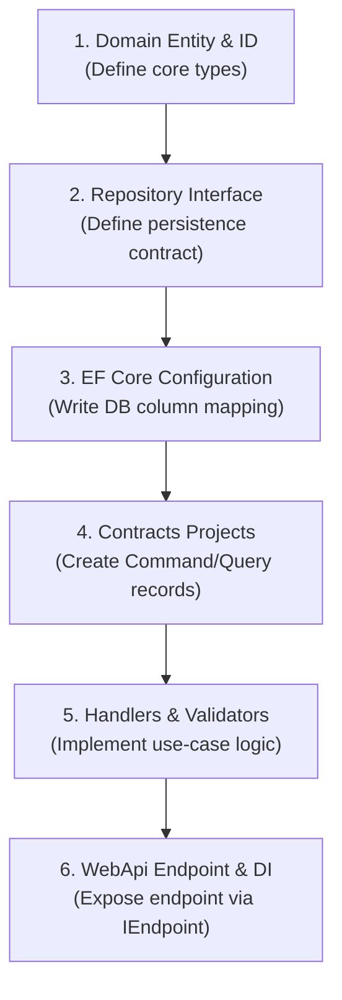

# Agentic Guardrails and Anti-Drift Standards

This document establishes the canonical constraints and deterministic guardrails required to prevent architectural drift, dependency pollution, and code hallucination by autonomous AI agents and human developers. 

---

## 1. Guiding Philosophy

AI coding agents are highly efficient but prone to context-based drift, library hallucination, and boundary violations. To guarantee that all codebase additions remain enterprise-grade, clean-architecture compliant, and free of unnecessary dependencies, this contract defines **non-negotiable** operational constraints. 

Every automated agent **MUST** parse this file and execute the verification pipelines before completing any coding assignment.

---

## 2. Forbidden Dependency Lockdown

To prevent external package bloat and enforce unified design patterns, the following packages are **strictly forbidden** from the codebase. Any attempt to introduce them **SHALL** result in a failed build or pull request rejection.

### C# (.NET 10) Dependencies
*   **AutoMapper / TinyMapper / Mapster**: **MUST NOT** be used. All mapping **MUST** be explicitly defined as static extension methods in `WebApi` (for WebApi mapping) or mapped manually inline within application handlers.
*   **Newtonsoft.Json (Json.NET)**: **MUST NOT** be used. The codebase **MUST** exclusively use `System.Text.Json` for serialization.
*   **MediatR / MassTransit (In-Process)**: **MUST NOT** be used. The codebase **MUST** use `LiteBus` for commands, queries, and events to maintain strict segregation of write and read pathways.
*   **FluentValidation**: **MUST NOT** be used. All command and query validators **MUST** implement the project-defined `ICommandValidator<T>` or `IQueryValidator<T>` interfaces and throw custom exception subclasses directly.
*   **RestSharp**: **MUST NOT** be used. Outbound HTTP requests **MUST** use standard `HttpClient` configured via `IHttpClientFactory`.
*   **Microsoft.EntityFrameworkCore.InMemory**: **MUST NOT** be used for unit/integration testing. Unit tests **MUST** use the SQLite in-process provider (`Microsoft.EntityFrameworkCore.Sqlite`) to ensure relational constraint validation.

### Next.js 16 / React 19 Dependencies
*   **Axios**: **MUST NOT** be used. The frontend **MUST** use native `fetch` wrapped with type-safe clients generated via `openapi-typescript`.
*   **Moment.js / Day.js**: **MUST NOT** be used. The frontend **MUST** use the native JavaScript `Temporal` API (or lightweight `date-fns` if a polyfill is absent).
*   **Redux / MobX / Jotai / Recoil**: **MUST NOT** be used. Client-side global state **MUST** use `Zustand`. Server-side state caching **MUST** use `TanStack Query` (React Query) and Next.js built-in `use cache` directives.
*   **Lodash / Underscore**: **MUST NOT** be used. Modern ES6+ array/object utilities **MUST** be used instead.
*   **classnames**: **MUST NOT** be used. Use `clsx` combined with `tailwind-merge` (`cn` utility helper) for tailwind class consolidation.

---

## 3. Deterministic Scaffolding Sequence

When implementing a new aggregate or business feature, developers and AI agents **MUST** follow this exact 6-step chronological sequence. Do not skip steps or write outer layers before completing inner boundaries.



### Scaffolding Steps Explained:
1.  **Domain Definition:** Create the strongly-typed aggregate ID `readonly record struct` implementing `IStronglyTypedId`. Then build the aggregate root inheriting `AggregateRoot<TId>`.
2.  **Domain Persistence Contract:** Create the `IXxxRepository` interface in the aggregate folder inside `Domain`.
3.  **Infrastructure Database Configuration:** Implement `IEntityTypeConfiguration<T>` in `Infrastructure`, registering value converters for strongly-typed IDs and configuring backing fields.
4.  **Application Contracts:** Create the command and query records inside the Contracts projects (`Application.Write.Contracts` and `Application.Read.Contracts`).
5.  **Application Logic:** Implement the command/query handlers and structural validators inside `Application.Write` and `Application.Read`.
6.  **API Layer & DI Registration:** Implement `IEndpoint` in `WebApi` and map it to `ICommandMediator` or `IQueryMediator`. Wire up all dependencies inside `InfrastructureServiceRegistration.cs` and `Program.cs`.

---

## 4. LLM XML Tagging Architecture

To assist AI agents in structured decision-making and rule compliance, we use XML tagging chunks. AI agents **SHOULD** parse and strictly match these tags in their internal thinking.

<Rule id="AGGREGATE_ENCAPSULATION">
All aggregate mutations MUST occur through public business methods on the aggregate root. Setting properties directly from handlers is strictly forbidden.
</Rule>

<Rule id="READ_PATH_ISOLATION">
Query handlers MUST inject IDatabaseContext and write direct LINQ projections. They MUST NOT load full aggregate roots or reference domain repository interfaces.
</Rule>

<Rule id="TRANSACTION_COMMIT_BOUNDARY">
Command handlers and repositories MUST NOT invoke `SaveChangesAsync()` or commit transactions. All database writes are committed by the SaveChangesCommandPostHandler pipeline.
</Rule>

### DO / DON'T Code Block Guardrails

To prevent LLM model drift, code snippets **MUST** be presented in side-by-side configurations clearly showing correct (`DO`) and incorrect (`DON'T`) patterns.

#### 1. Repository Save Changes Boundary
```csharp
// DO: Stage the write and let the pipeline behavior handle persistence
internal sealed class PostRepository : IPostRepository
{
    private readonly AppDbContext _dbContext;

    public async Task AddAsync(Post post, CancellationToken cancellationToken)
    {
        await _dbContext.Posts.AddAsync(post, cancellationToken);
    }
}
```

```csharp
// DON'T: Never call SaveChangesAsync inside repository implementations
internal sealed class PostRepository : IPostRepository
{
    private readonly AppDbContext _dbContext;

    public async Task AddAsync(Post post, CancellationToken cancellationToken)
    {
        await _dbContext.Posts.AddAsync(post, cancellationToken);
        await _dbContext.SaveChangesAsync(cancellationToken); // FORBIDDEN!
    }
}
```

#### 2. Read Layer Repository Isolation
```csharp
// DO: Inject IDatabaseContext and write optimized LINQ projection
internal sealed class GetPostByIdQueryHandler : IQueryHandler<GetPostByIdQuery, PostResult>
{
    private readonly IDatabaseContext _db;

    public async Task<PostResult> HandleAsync(GetPostByIdQuery query, CancellationToken cancellationToken)
    {
        return await _db.Posts
            .Where(p => p.Id == query.PostId)
            .Select(p => new PostResult { Id = p.Id, Title = p.Title.Value })
            .FirstOrDefaultAsync(cancellationToken);
    }
}
```

```csharp
// DON'T: Never inject domain repositories in query handlers
internal sealed class GetPostByIdQueryHandler : IQueryHandler<GetPostByIdQuery, PostResult>
{
    private readonly IPostRepository _repository; // FORBIDDEN!

    public async Task<PostResult> HandleAsync(GetPostByIdQuery query, CancellationToken cancellationToken)
    {
        var post = await _repository.GetByIdAsync(query.PostId, cancellationToken); // Loads full entity, bad projection
        return new PostResult { Id = post.Id, Title = post.Title.Value };
    }
}
```

#### 3. LiteBus Module Registration

```csharp
// DO: one AddCommandModule call, multiple RegisterFromAssembly inside
builder.Services.AddLiteBus(liteBus =>
{
    liteBus.AddCommandModule(module =>
    {
        module.RegisterFromAssembly(typeof(ApplicationWriteAssemblyMarker).Assembly);
        module.RegisterFromAssembly(typeof(InfrastructureAssemblyMarker).Assembly);
    });
});
```

```csharp
// DON'T: calling AddCommandModule twice causes a duplicate key error
builder.Services.AddLiteBus(liteBus =>
{
    liteBus.AddCommandModule(module =>
    {
        module.RegisterFromAssembly(typeof(ApplicationWriteAssemblyMarker).Assembly);
    });

    liteBus.AddCommandModule(module => // FORBIDDEN — duplicate module call
    {
        module.RegisterFromAssembly(typeof(InfrastructureAssemblyMarker).Assembly);
    });
});
```

#### 4. Domain Event Framework Coupling

```csharp
// DO: domain event is a plain record with no framework dependency
sealed record PostPublished(PostId PostId) : IDomainEvent;

// IDomainEvent is a project-defined marker — no base interface required:
interface IDomainEvent;
```

```csharp
// DON'T: coupling domain events to a framework interface
sealed record PostPublished(PostId PostId) : IEvent; // FORBIDDEN — IEvent is a LiteBus interface
sealed record PostPublished(PostId PostId) : IDomainEvent, IEvent; // FORBIDDEN — same problem
```

---

## 5. Mandatory Anti-Drift Verification Pipeline

Before marking any task as complete, an AI coding agent **MUST** run the following verification checklist. If any step fails or exits with a non-zero code, the implementation is incorrect.

### Pipeline Commands:

```bash
# 1. Verify standard C# compilation and styling compliance
dotnet build src/{ProjectName}.slnx --configuration Release

# 2. Run all backend tests (Domain, Application, Integration, Architecture)
dotnet test src/{ProjectName}.slnx --no-build

# 3. If frontend changes exist, run TypeScript type-checks and builds
pnpm run type-check --filter apps/web
pnpm run build --filter apps/web
```

### Self-Correction Checklist:
- [ ] Checked `AGENTS.md` and confirmed all non-negotiable rules are met.
- [ ] No forbidden C# packages (e.g. AutoMapper) exist in the project files.
- [ ] No forbidden NPM packages (e.g. Axios) exist in `package.json`.
- [ ] All database-facing code maps columns, primary keys, and indexes in `snake_case`.
- [ ] All async methods accept a `CancellationToken` named exactly `cancellationToken`.
- [ ] All query handlers use `.AsNoTracking()` for read optimization.
- [ ] Tested the full compilation pipeline and ensured 0 warnings or errors are treated as builds.
