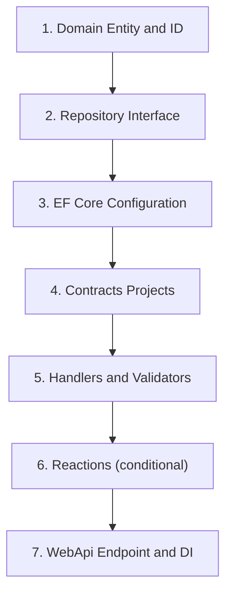

# Agentic Guardrails and Anti-Drift Standards

Scaffolding sequence, XML rule tags, anti-drift patterns, and verification pipelines. Forbidden packages: `forbidden-packages.md`. Writing rules: `writing-style.md`.

Every automated agent **MUST** read `AGENTS.md` first, then this file when implementing features or running verification.

---

## 1. Rule Index (XML)

AI agents MUST parse and apply these `<Rule>` tags.

<Rule id="AGGREGATE_ENCAPSULATION">
All aggregate mutations MUST occur through public business methods on the aggregate root. Setting properties directly from handlers is forbidden.
</Rule>

<Rule id="READ_PATH_ISOLATION">
Query handlers MUST inject IDatabaseContext and write direct LINQ projections. They MUST NOT load full aggregate roots or reference domain repository interfaces.
</Rule>

<Rule id="TRANSACTION_COMMIT_BOUNDARY">
Command handlers and repositories MUST NOT invoke SaveChangesAsync or commit transactions. The SaveChangesCommandPostHandler pipeline commits.
</Rule>

<Rule id="NO_STUB_CODE">
Committed code MUST NOT contain TODO, FIXME, NotImplementedException stubs, or placeholder comments that defer required behavior.
</Rule>

<Rule id="FILE_SIZE_LIMIT">
A single source file MUST NOT exceed 300 lines. Split into composed modules when approaching the limit.
</Rule>

<Rule id="FEATURE_IMPORT_BOUNDARY">
features/{a}/ MUST NOT import from features/{b}/. Promote shared code to @/shared/ or components/ui/.
</Rule>

<Rule id="UI_COPY_SOURCE">
User-visible strings MUST come from API fields, next-intl keys, or frontend-feature-inventory.md. Agents MUST NOT invent product or policy text.
</Rule>

<Rule id="TAILWIND_THEME_ONLY">
Styling MUST use @theme tokens and standard scales. Arbitrary values (p-[13px], custom hex in className) are forbidden unless a project ADR documents an exception.
</Rule>

<Rule id="TYPED_API_CLIENT">
Frontend HTTP calls MUST use getApiClient() with openapi-typescript paths. Raw fetch to ad-hoc URLs is forbidden except in Playwright mocks.
</Rule>

<Rule id="ARCHITECTURE_TESTS_REQUIRED">
Solutions following these standards MUST include {ProjectName}.Architecture.Tests with NetArchTest rules from `docs/decisions/architecture-tests-as-enforcement.md`.
</Rule>

<Rule id="MONOREPO_LAYOUT">
In monorepos, the .NET solution MUST live under apps/api/, not at the repository root src/. All runnable apps MUST live under apps/. See `docs/conventions/shared/monorepo-structure.md`.
</Rule>

---

## 2. Deterministic Scaffolding Sequence

When implementing a new aggregate or business feature, developers and AI agents **MUST** follow this exact 7-step chronological sequence. Do not skip steps or write outer layers before completing inner boundaries.



1. **Domain:** Strongly-typed ID and aggregate root.
2. **Repository interface** in `Domain`.
3. **EF configuration** in `Infrastructure`.
4. **Command/query records** in Contracts projects.
5. **Handlers and validators** in `Application.Write` / `Application.Read`.
6. **Narrow interface in `Application.Reactions` + Infrastructure implementation** (conditional: add only when an aggregate method raises a domain event that requires an external side effect; skip if no domain event is needed).
7. **`IEndpoint` and DI** in `WebApi` / `Infrastructure`.

---

## 3. DO / DON'T Guardrails

#### Repository save boundary

```csharp
// DO: stage write; pipeline persists
public async Task AddAsync(Post post, CancellationToken cancellationToken)
{
    await _dbContext.Posts.AddAsync(post, cancellationToken);
}
```

```csharp
// DON'T: SaveChangesAsync in repository
await _dbContext.SaveChangesAsync(cancellationToken); // FORBIDDEN
```

#### Anti-drift: no stubs

```typescript
// DO: implement behavior or omit until spec exists
export async function publishPost(postId: PostId) {
  const client = await getApiClient()
  const { error } = await client.POST("/posts/{id}/publish", { params: { path: { id: postId } } })
  if (error) throw new Error("Publish failed")
}
```

```typescript
// DON'T: placeholder stub
export async function publishPost(_postId: PostId) {
  // TODO: implement later
  throw new Error("Not implemented")
}
```

#### Anti-drift: Tailwind

```tsx
// DO: theme token
<div className="p-4 text-foreground bg-background" />
```

```tsx
// DON'T: arbitrary spacing/color
<div className="p-[13px] text-[#3a3f51]" />
```

#### 3. LiteBus Module Registration

```csharp
// DO: one AddCommandModule call, multiple RegisterFromAssembly inside
builder.Services.AddLiteBus(liteBus =>
{
    liteBus.AddCommandModule(module =>
    {
        module.RegisterFromAssembly(typeof(ApplicationWriteAssemblyMarker).Assembly);
        module.RegisterFromAssembly(typeof(InfrastructureAssemblyMarker).Assembly);
    });
});
```

```csharp
// DON'T: calling AddCommandModule twice causes a duplicate key error
builder.Services.AddLiteBus(liteBus =>
{
    liteBus.AddCommandModule(module =>
    {
        module.RegisterFromAssembly(typeof(ApplicationWriteAssemblyMarker).Assembly);
    });

    liteBus.AddCommandModule(module => // FORBIDDEN — duplicate module call
    {
        module.RegisterFromAssembly(typeof(InfrastructureAssemblyMarker).Assembly);
    });
});
```

#### 4. Domain Event Framework Coupling

```csharp
// DO: domain event is a plain record with no framework dependency
sealed record PostPublished(PostId PostId) : IDomainEvent;

// IDomainEvent is a project-defined marker — no base interface required:
interface IDomainEvent;
```

```csharp
// DON'T: coupling domain events to a framework interface
sealed record PostPublished(PostId PostId) : IEvent; // FORBIDDEN — IEvent is a LiteBus interface
sealed record PostPublished(PostId PostId) : IDomainEvent, IEvent; // FORBIDDEN — same problem
```

---

## 4. Mandatory Verification Pipeline

Before marking any task complete, an agent **MUST** complete `docs/guides/definition-of-done.md` and run every gate in `docs/conventions/shared/ci.md` that applies to the change.

Minimum commands:

```bash
dotnet build apps/api/{ProjectName}.slnx --configuration Release
dotnet test apps/api/{ProjectName}.slnx --configuration Release --no-build
pnpm install --frozen-lockfile
pnpm lint
pnpm type-check
pnpm test
pnpm build
pnpm exec playwright test --config apps/web/playwright.config.ts
```

Skip frontend steps when the project has no `apps/web/`.

### Self-Correction Checklist

- [ ] Completed `docs/guides/definition-of-done.md`.
- [ ] No forbidden packages (`docs/conventions/shared/forbidden-packages.md`).
- [ ] `snake_case` on all PostgreSQL mappings.
- [ ] `cancellationToken` naming on all async methods.
- [ ] `.AsNoTracking()` on read queries.
- [ ] No cross-feature imports when frontend changed.
- [ ] OpenAPI artifacts committed when API contract changed.
