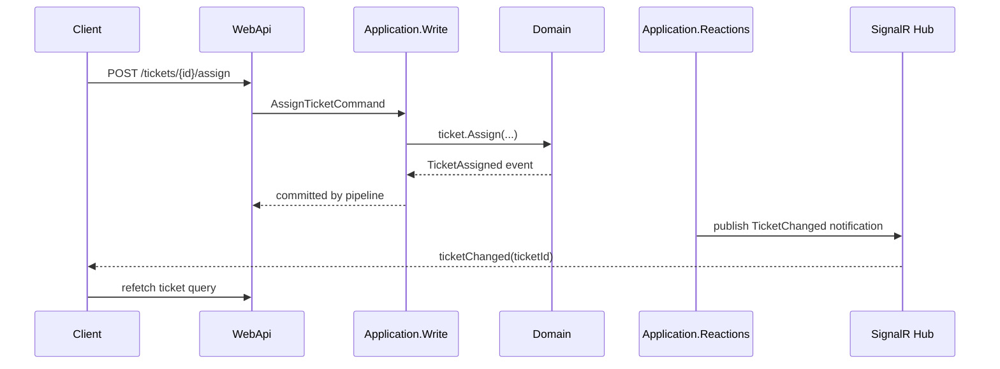

# Real-Time Updates

This document defines the standard for real-time server-to-client updates across the ASP.NET Core API and the Next.js frontend.

---

## 1. Default Choice

Use ASP.NET Core SignalR when the product needs server-pushed updates. SignalR is appropriate for notifications, dashboards, collaborative workflows, and status changes where waiting for the next page load is not acceptable.

Use polling only when the update interval is coarse, the data is not user-facing, or the deployment environment cannot support persistent connections.

---

## 2. Event Flow

Real-time updates are notifications that data changed. They are not the source of truth.



The SignalR message carries enough information for the frontend to invalidate or refetch. It does not carry full domain state unless a project ADR approves that payload shape.

---

## 3. Backend Rules

Hubs live in WebApi. Hub-facing notification services live in Infrastructure and implement narrow interfaces defined in `Application.Reactions`.

```csharp
// GOOD: Reactions defines intent through a narrow interface
internal interface ITicketChangedPublisher
{
    Task PublishTicketChangedAsync(
        TicketId ticketId,
        TenantId tenantId,
        CancellationToken cancellationToken);
}
```

```csharp
// BAD: Application.Reactions depends on SignalR directly
internal sealed class PublishTicketChangedEventHandler : IEventHandler<TicketAssigned>
{
    private readonly IHubContext<TicketHub> _hubContext;
}
```

SignalR hubs MUST:

- Require authorization unless explicitly public.
- Use groups for tenant, team, or resource scoping.
- Never trust client-sent group names without server-side authorization.
- Emit correlation IDs in logs for connection, group join, and publish operations.
- Avoid sending PII in event names or group names.

---

## 4. Frontend Rules

The frontend subscribes to real-time notifications in a client component or client hook, then invalidates TanStack Query keys or calls `router.refresh()`.

```typescript
"use client"
// Needs a browser SignalR connection and TanStack Query invalidation.

import { HubConnectionBuilder } from "@microsoft/signalr"
import { useQueryClient } from "@tanstack/react-query"
import { useEffect } from "react"
import { ticketQueryKeys } from "./queryKeys"

export function useTicketRealtime() {
  const queryClient = useQueryClient()

  useEffect(() => {
    const connection = new HubConnectionBuilder()
      .withUrl("/hubs/tickets")
      .withAutomaticReconnect()
      .build()

    connection.on("ticketChanged", (ticketId: string) => {
      queryClient.invalidateQueries({
        queryKey: ticketQueryKeys.byId(ticketId),
      })
    })

    void connection.start()

    return () => {
      void connection.stop()
    }
  }, [queryClient])
}
```

Do not store real-time server state in Zustand. Use SignalR as an invalidation channel and keep TanStack Query or server components as the data source.

---

## 5. Scaling

Single-instance deployments may use in-process SignalR. Multi-instance deployments require a backplane or managed SignalR service, documented in a project ADR.

When real-time updates are required for correctness, pair SignalR with the Outbox pattern. SignalR alone is not durable. Disconnected clients must recover by refetching current state.

