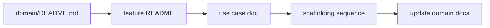

# Agentic Domain-Driven Design

This guide defines how domain documentation is written, organized, and consumed by agents. It is our adaptation of spec-driven development: explicit, reviewable contracts written in ubiquitous language, aligned with screaming architecture and agent-first delivery.

Industry practice (Thoughtworks, GitHub Spec Kit, BDD) treats specifications as living source-of-truth artifacts that agents implement against. We apply the same intent under DDD terms: **domain docs describe the system; use case docs describe behavior; code enforces it.**

---

## Agent Quick Rules

- Every non-trivial use case MUST have a domain doc in the project repository before agent implementation starts.
- Domain documentation lives under `docs/domain/` in a Feature → Use case tree.
- Ubiquitous language, invariants, endpoints, UI flows, and exceptions belong in domain docs, not separate inventory files.
- Update the relevant domain doc in the same PR as the code change it describes.
- Implementation MUST follow the scaffolding sequence in `docs/conventions/shared/agentic-guardrails.md` section 2.
- OpenAPI is generated from WebApi; domain docs describe intent in business language.

---

## 1. Documentation Tree

```text
docs/domain/
├── README.md                    # System map: all features and use cases
├── posts/
│   ├── README.md                # Feature domain: Post aggregate, glossary, invariants
│   ├── create-post.md           # Use case
│   ├── publish-post.md
│   └── list-posts.md
└── authors/
    ├── README.md
    └── register-author.md
```

| Level | File | Describes |
|:---|:---|:---|
| System | `docs/domain/README.md` | Index of all features and use cases; cross-domain notes |
| Feature | `docs/domain/{feature}/README.md` | Aggregate(s), ubiquitous language, invariants, events, persistence |
| Use case | `docs/domain/{feature}/{use-case}.md` | One command, query, or UI flow with acceptance criteria |

There are no separate glossaries, route inventories, exception lists, or API maps. Those details live in the feature or use case doc where they belong.

---

## 2. Alignment With Code

Domain docs, backend projects, and frontend folders MUST use the same boundaries and names.

| Layer | Pattern | Example |
|:---|:---|:---|
| Domain docs | `docs/domain/{feature}/{use-case}.md` | `docs/domain/posts/create-post.md` |
| Backend write | `{Feature}/{UseCase}/` handlers | `Posts/Create/PublishPostCommandHandler.cs` |
| Backend read | `{Feature}/{UseCase}/` handlers | `Posts/List/GetAllPostsQueryHandler.cs` |
| Frontend | `domain/{feature}/{use-case}/` | `domain/posts/create/CreatePostForm.tsx` |
| App Router | Thin shell imports domain entry | `app/(main)/posts/new/page.tsx` |

This is screaming architecture applied to documentation and UI: an engineer or agent should follow Feature → Use case the same way in docs, backend, and frontend.

---

## 3. Feature Domain Doc

Copy `docs/templates/domain-feature.md` to `docs/domain/{feature}/README.md`.

A feature README MUST include:

- Ubiquitous language table for this feature (terms, definitions, banned synonyms)
- Aggregate definition, state transitions, invariants
- Domain events and reactions
- Persistence overview (tables, key relationships)
- Links to all use case docs under this feature

Update the feature README when aggregate shape, language, or invariants change.

---

## 4. Use Case Doc

Copy `docs/templates/domain-use-case.md` to `docs/domain/{feature}/{use-case}.md`.

A use case doc MUST include:

- Summary and acceptance criteria (numbered, mapped to test types)
- Command or query contract (when applicable)
- HTTP endpoint (method, path, auth, idempotency)
- UI flow with loading, empty, error, and loaded states (when applicable)
- Exceptions raised and their HTTP mapping

Update the use case doc in the same PR as the handler, endpoint, or UI change.

---

## 5. Agent Workflow



1. Read `docs/domain/README.md` for orientation.
2. Read `docs/domain/{feature}/README.md` for language and invariants.
3. Read `docs/domain/{feature}/{use-case}.md` for the task contract.
4. Implement per `agentic-guardrails.md` section 2 with checkpoint commands.
5. Update the use case doc (and feature README if domain changed) before marking complete.

---

## 6. Relationship to Spec-Driven Development

| Industry term | Our term |
|:---|:---|
| Specification | Domain doc (feature README or use case doc) |
| Spec-first | Use case doc written before agent implementation |
| Spec-anchored | Domain docs updated in the same PR as code |
| Ubiquitous language | Glossary section in each feature README |
| Acceptance criteria | Numbered section in each use case doc |

We do not use spec-as-source (code generated only from docs). Code remains explicit and compiler-enforced; domain docs remain the human-readable source of truth for intent and current behavior.

---

## 7. When a Use Case Doc Is Optional

Skip a formal use case doc only for:

- Typo or copy fix with no behavior change
- Dependency patch with no contract change
- Pure refactor with no observable behavior change

Everything else requires a use case doc.

---

## 8. Related Documents

| Document | Purpose |
|:---|:---|
| `docs/guides/add-new-use-case.md` | Implementation checklist after the use case doc exists |
| `docs/guides/definition-of-done.md` | Completion checklist |
| `docs/templates/domain-feature.md` | Feature README template |
| `docs/templates/domain-use-case.md` | Use case doc template |
| `docs/templates/domain-use-case.example.md` | Approved example (Create Post) |
