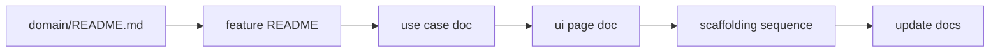

# Agentic Domain-Driven Design

This guide defines how domain documentation is written, organized, and consumed by agents. It is our adaptation of spec-driven development: explicit, reviewable contracts written in ubiquitous language, aligned with screaming architecture and agent-first delivery.

Industry practice (Thoughtworks, GitHub Spec Kit, BDD) treats specifications as living source-of-truth artifacts that agents implement against. We apply the same intent under DDD terms: **domain docs describe policy and operations; use case docs describe one operation; UI projection docs describe shell and page composition; code enforces all three.**

---

## Agent Quick Rules

- Every non-trivial use case MUST have a domain doc in the project repository before agent implementation starts.
- Domain documentation lives under `docs/domain/` in a Feature → Use case tree.
- UI projection documentation lives under `docs/ui/{app}/` for shell and page composition (when the project has frontends).
- Feature READMEs hold **invariants** and ubiquitous language. Use case docs hold **operations**, endpoints, and acceptance criteria. UI docs hold **routes, shell, and which use cases compose on each page**. Do not duplicate rules across layers.
- Update the relevant domain, use case, and UI projection docs in the same PR as the code change they describe.
- Implementation MUST follow the scaffolding sequence in `docs/conventions/shared/agentic-guardrails.md` section 2.
- OpenAPI is generated from WebApi; domain docs describe intent in business language.

---

## 1. Documentation Tree

```text
docs/domain/
├── README.md                    # System map: all features and use cases
├── posts/
│   ├── README.md                # Feature domain: Post aggregate, glossary, invariants
│   ├── create-post.md           # Use case
│   ├── publish-post.md
│   └── list-published-posts.md
└── authors/
    ├── README.md
    └── register-author.md

docs/ui/                         # Optional but recommended when frontends exist
├── README.md                    # Layer model and agent read order
├── web/                         # One folder per app under apps/
│   ├── README.md                # Route index (links only)
│   ├── shell.md                 # Shared layout chrome
│   └── pages/
│       └── home.md              # Page composition (many use cases allowed)
└── admin/
    ├── README.md
    ├── shell.md
    └── pages/
        └── post-editor.md
```

| Level | File | Describes |
|:---|:---|:---|
| System | `docs/domain/README.md` | Index of all features and use cases; cross-domain notes |
| Feature | `docs/domain/{feature}/README.md` | Aggregate(s), ubiquitous language, **invariants**, events, persistence |
| Use case | `docs/domain/{feature}/{use-case}.md` | One command or query; HTTP contract; **operation** acceptance criteria |
| UI app | `docs/ui/{app}/README.md` | Route index linking to page docs and use cases |
| UI shell | `docs/ui/{app}/shell.md` | Layout regions and cross-page presentation rules |
| UI page | `docs/ui/{app}/pages/{page}.md` | One route; which use cases compose; visible states; e2e links |

Do not maintain parallel **behavior** specs (duplicate glossaries, exception catalogs, or API maps). UI projection docs are **composition indexes**, not a second domain layer. Invariants stay in feature READMEs; operation rules stay in use case docs.

---

## 2. Alignment With Code

Domain docs, backend projects, and frontend folders MUST use the same boundaries and names.

| Layer | Pattern | Example |
|:---|:---|:---|
| Domain docs | `docs/domain/{feature}/{use-case}.md` | `docs/domain/posts/create-post.md` |
| Backend write | `{Feature}/{UseCase}/` handlers | `Posts/Create/PublishPostCommandHandler.cs` |
| Backend read | `{Feature}/{UseCase}/` handlers | `Posts/List/GetAllPostsQueryHandler.cs` |
| Frontend | `domain/{feature}/{use-case}/` | `domain/posts/create/CreatePostForm.tsx` |
| App Router | Thin shell imports domain entry | `app/(main)/posts/new/page.tsx` |
| UI projection | `docs/ui/{app}/pages/{page}.md` | Composes one or more use cases on a route |

Use cases and pages are **many-to-many**. One page (for example admin post editor) may compose several use cases. One use case may appear on several pages (for example list published posts on home and tag filter). Page docs capture that mapping; use case docs stay one operation each.

This is screaming architecture applied to documentation and UI: an engineer or agent should follow Feature → Use case the same way in docs, backend, and frontend domain folders.

---

## 3. Feature Domain Doc

Copy `docs/templates/domain-feature.md` to `docs/domain/{feature}/README.md`.

A feature README MUST include:

- Ubiquitous language table for this feature (terms, definitions, banned synonyms)
- Aggregate definition, state transitions, invariants
- Domain events and reactions
- Persistence overview (tables, key relationships)
- Links to all use case docs under this feature

Update the feature README when aggregate shape, language, or invariants change.

---

## 4. Use Case Doc

Copy `docs/templates/domain-use-case.md` to `docs/domain/{feature}/{use-case}.md`.

A use case doc MUST include:

- Summary and acceptance criteria (numbered, mapped to test types)
- Command or query contract (when applicable)
- HTTP endpoint (method, path, auth, idempotency)
- Operation-level UI notes (loading, empty, error, loaded) when a frontend implements this use case
- Exceptions raised and their HTTP mapping
- Link to UI page doc(s) where this operation appears (when `docs/ui/` exists)

Use case docs MUST NOT list Tailwind classes, shadcn variants, or page layout details. Those belong in UI projection docs or app README runbooks.

Update the use case doc in the same PR as the handler, endpoint, or UI change.

---

## 5. UI Projection Docs

Copy `docs/templates/ui-shell.md` and `docs/templates/ui-page.md` when adding or changing frontend routes.

UI projection docs live under `docs/ui/{app}/` where `{app}` matches the folder name under `apps/` (for example `web`, `admin`).

**Shell doc** (`shell.md`) — shared layout: header, footer, nav, auth gates, presentation defaults. Cross-page rules (for example sticky footer) and links to Playwright layout specs.

**Page doc** (`pages/{name}.md`) — one user-facing route:

- Route path and route shell file
- Domain component entry path(s)
- Table of **use case doc links** composed on this page
- Visible states on this screen (not domain invariants)
- Links to e2e specs and use-case acceptance criteria

UI docs MUST NOT restate domain invariants. Link to the feature README or use case doc instead (for example "Delete hidden when Published — see delete-post.md").

**App README** (`apps/{app}/README.md`) remains the **runbook**: stack, env, run, build, test commands. Link to `docs/ui/{app}/` for screen composition.

Update UI projection docs in the same PR as route, layout, or page composition changes.

---

## 6. Agent Workflow



1. Read `docs/domain/README.md` for orientation.
2. Read `docs/domain/{feature}/README.md` for language and invariants.
3. Read `docs/domain/{feature}/{use-case}.md` for the operation contract.
4. For frontend work, read `docs/ui/{app}/shell.md` and the relevant `pages/*.md`.
5. Implement per `agentic-guardrails.md` section 2 with checkpoint commands.
6. Update domain, use case, and UI projection docs before marking complete.

---

## 7. Relationship to Spec-Driven Development

| Industry term | Our term |
|:---|:---|
| Specification | Domain doc (feature README or use case doc) |
| Spec-first | Use case doc written before agent implementation |
| Spec-anchored | Domain docs updated in the same PR as code |
| Ubiquitous language | Glossary section in each feature README |
| Acceptance criteria | Numbered section in each use case doc |

We do not use spec-as-source (code generated only from docs). Code remains explicit and compiler-enforced; domain docs remain the human-readable source of truth for intent and current behavior.

---

## 8. When a Use Case Doc Is Optional

Skip a formal use case doc only for:

- Typo or copy fix with no behavior change
- Dependency patch with no contract change
- Pure refactor with no observable behavior change

Everything else requires a use case doc.

---

## 9. Related Documents

| Document | Purpose |
|:---|:---|
| `docs/guides/add-new-use-case.md` | Implementation checklist after the use case doc exists |
| `docs/guides/definition-of-done.md` | Completion checklist |
| `docs/templates/domain-feature.md` | Feature README template |
| `docs/templates/domain-use-case.md` | Use case doc template |
| `docs/templates/domain-use-case.example.md` | Approved example (Create Post) |
| `docs/templates/ui-shell.md` | App shell / layout template |
| `docs/templates/ui-page.md` | Page composition template |
