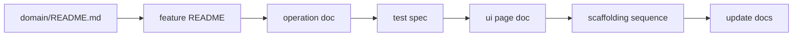

# Agentic Domain-Driven Design

This guide defines how domain documentation is written, organized, and consumed by agents. It is our adaptation of spec-driven development: explicit, reviewable contracts written in ubiquitous language, aligned with screaming architecture and agent-first delivery.

Industry practice (Thoughtworks, GitHub Spec Kit, BDD) treats specifications as living source-of-truth artifacts that agents implement against. We apply the same intent under DDD terms: **domain docs describe policy and operations; test specs describe verification; UI projection docs describe shell and page composition; code enforces all three.**

---

## Agent Quick Rules

- Every non-trivial use case MUST have an operation doc and a test spec in the project repository before agent implementation starts.
- Domain documentation lives under `docs/domain/` in a Feature → Use case tree.
- Test specifications live at `docs/domain/{feature}/{use-case}.tests.md`, adjacent to the operation doc.
- UI projection documentation lives under `docs/ui/{app}/` for shell and page composition (when the project has frontends).
- Feature READMEs hold **invariants** and ubiquitous language. Operation docs hold **contracts**. Test specs hold **Test Coverage** tables. UI docs hold **routes and composition**. Do not duplicate rules across layers.
- Update operation docs, test specs, and UI projection docs in the same PR as the code change they describe.
- Implementation MUST follow the scaffolding sequence in `docs/conventions/shared/agentic-guardrails.md` section 2.
- OpenAPI is generated from WebApi; operation docs describe intent in business language.

---

## 1. Documentation Tree

```text
docs/domain/
├── README.md                    # System map: features, use cases, doc status
├── posts/
│   ├── README.md                # Feature domain: Post aggregate, glossary, invariants
│   ├── create-post.md           # Operation contract
│   ├── create-post.tests.md     # Test specification
│   ├── publish-post.md
│   └── publish-post.tests.md
└── authors/
    ├── README.md
    ├── register-author.md
    └── register-author.tests.md

docs/ui/                         # Optional but recommended when frontends exist
├── README.md                    # Layer model and agent read order
├── web/
│   ├── README.md                # Route index (links only)
│   ├── shell.md                 # Shared layout chrome
│   └── pages/
│       └── home.md              # Page composition (many use cases allowed)
```

| Level | File | Describes |
|:---|:---|:---|
| System | `docs/domain/README.md` | Index of features and use cases; doc completeness status |
| Feature | `docs/domain/{feature}/README.md` | Aggregate(s), language, **invariants**, events, invariants under test |
| Operation | `docs/domain/{feature}/{use-case}.md` | One command or query; HTTP contract; domain behavior |
| Test spec | `docs/domain/{feature}/{use-case}.tests.md` | Test Coverage table, variations, explicit exclusions |
| UI app | `docs/ui/{app}/README.md` | Route index linking to page docs and use cases |
| UI shell | `docs/ui/{app}/shell.md` | Layout regions and cross-page presentation rules |
| UI page | `docs/ui/{app}/pages/{page}.md` | One route; which use cases compose; links to test specs |

Do not maintain parallel **behavior** specs (duplicate glossaries, exception catalogs, or API maps). UI projection docs are **composition indexes**, not a second domain layer. Invariants stay in feature READMEs; operation rules stay in operation docs; verification stays in test specs.

---

## 2. Alignment With Code

Domain docs, backend projects, and frontend folders MUST use the same boundaries and names.

| Layer | Pattern | Example |
|:---|:---|:---|
| Operation doc | `docs/domain/{feature}/{use-case}.md` | `docs/domain/posts/create-post.md` |
| Test spec | `docs/domain/{feature}/{use-case}.tests.md` | `docs/domain/posts/create-post.tests.md` |
| Backend write | `{Feature}/{UseCase}/` handlers | `Posts/Create/PublishPostCommandHandler.cs` |
| Backend read | `{Feature}/{UseCase}/` handlers | `Posts/List/GetAllPostsQueryHandler.cs` |
| Frontend | `features/{feature}/{use-case}/` | `features/posts/create/CreatePostForm.tsx` |
| App Router | Thin shell imports feature entry | `app/(main)/posts/new/page.tsx` |
| UI projection | `docs/ui/{app}/pages/{page}.md` | Composes one or more use cases on a route |
| Acceptance tests | `Features/{Feature}/{UseCase}.feature` | `Features/Posts/PublishPost.feature` |

Use cases and pages are **many-to-many**. One page may compose several use cases. One use case may appear on several pages. Page docs capture that mapping; operation docs stay one operation each.

---

## 3. Feature Domain Doc

Copy `docs/templates/domain-feature.md` to `docs/domain/{feature}/README.md`.

A feature README MUST include:

- Ubiquitous language table for this feature (terms, definitions, banned synonyms)
- Aggregate definition, state transitions (with test annotations on transitions), invariants
- **Invariants Under Test** table linking invariants to test class and method
- Domain events and reactions
- Persistence overview (tables, key relationships)
- Links to all operation and test spec docs under this feature

Update the feature README when aggregate shape, language, or invariants change.

---

## 4. Operation Doc

Copy `docs/templates/domain-use-case.md` to `docs/domain/{feature}/{use-case}.md`.

An operation doc MUST include:

- Summary, Risk Level, command or query contract, domain behavior, exceptions, HTTP endpoint
- Persistence when schema changes
- UI cross-reference to page doc(s), not full route or mutation detail
- Pointer to `{use-case}.tests.md`

Operation docs MUST NOT contain Test Coverage tables, numbered acceptance lists, or Tailwind or layout detail.

Authoring workflow: `docs/guides/write-use-case-doc.md`.

---

## 5. Test Specification Doc

Copy `docs/templates/domain-use-case.tests.md` to `docs/domain/{feature}/{use-case}.tests.md`.

A test spec MUST include:

- **Test Coverage** table: scenario, Given, When, Then, Layer, Class, Method, Variations
- **Acceptance test classification** when API acceptance or BDD applies
- **Explicitly Not Tested** for intentional gaps
- **Related E2E Specs** when Playwright applies

### Test Coverage table conventions

- Row number `N` is criterion ID `AC-00N` for `@ac:` tags in Reqnroll and plain API acceptance tests.
- **Layer** values: `Domain Unit`, `Application Unit`, `Integration`, `Frontend Unit`, `E2E` only.
- **Variations:** list boundary and error variants; `N/A` when none apply.
- Agents MUST add a row before writing a test for a scenario. MUST NOT write tests for undeclared scenarios.

Risk Level on the test spec MUST match the operation doc. It drives mandatory layers (Low / Medium / High) per the template and `08-testing.md`.

Update the test spec in the same PR as any new or changed test.

---

## 6. UI Projection Docs

Copy `docs/templates/ui-shell.md` and `docs/templates/ui-page.md` from this standards repository when adding or changing frontend routes.

UI projection docs live under `docs/ui/{app}/` where `{app}` matches the folder name under `apps/`.

**Shell doc** (`shell.md`): shared layout, nav, auth gates, presentation defaults.

**Page doc** (`pages/{name}.md`): route, feature entry, use case links, screen states, content modes, links to test specs (not duplicated tables).

UI docs MUST NOT restate domain invariants. Link to the feature README or operation doc instead.

---

## 7. Executable Acceptance Criteria

Operation and test specs are the source of truth for behavior. BDD feature files and plain API acceptance tests are **executable projections** of selected Test Coverage rows, not a second specification.

Rules:

- Do not duplicate glossary, invariants, HTTP contract, or exception mapping in feature files.
- When behavior changes, update the operation doc and test spec first, then update tests and code.
- Feature files MUST use terms from the feature README.
- Every Reqnroll scenario MUST reference `@usecase:{feature}/{use-case}` and `@ac:AC-00N` matching a Test Coverage row.
- If a scenario and the test spec disagree, the test spec wins until a human explicitly changes it.

See `docs/conventions/backend/20-api-acceptance-tests.md`.

---

## 8. Agent Workflow


```mermaid
flowchart LR
  A[domain/README.md]
  B[feature README]
  C[operation doc]
  T[test spec]
  U[ui page doc]
  D[scaffolding sequence]
  E[update docs]
  A --> B --> C --> T --> U --> D --> E
```

1. Read `docs/domain/README.md` for orientation.
2. Read `docs/domain/{feature}/README.md` for language and invariants.
3. Read `docs/domain/{feature}/{use-case}.md` for the operation contract.
4. Read `docs/domain/{feature}/{use-case}.tests.md` before writing or changing tests.
5. For frontend work, read `docs/ui/{app}/shell.md` and the relevant `pages/*.md`.
6. Implement per `agentic-guardrails.md` section 2 with checkpoint commands.
7. Update operation doc, test spec, and UI projection docs before marking complete.

---

## 9. Relationship to Spec-Driven Development

| Industry term | Our term |
|:---|:---|
| Specification | Operation doc + test spec |
| Spec-first | Operation and test docs written before implementation |
| Spec-anchored | Domain docs updated in the same PR as code |
| Ubiquitous language | Glossary in each feature README |
| Acceptance criteria | Test Coverage rows in `{use-case}.tests.md` |
| Executable acceptance | BDD or API acceptance tests traced to `AC-00N` |

We do not use spec-as-source. Code remains explicit and compiler-enforced; domain docs remain the human-readable source of truth for intent and current behavior.

---

## 10. When a Use Case Doc Is Optional

Skip formal operation and test docs only for:

- Typo or copy fix with no behavior change
- Dependency patch with no contract change
- Pure refactor with no observable behavior change

Everything else requires both docs.

---

## 11. Related Documents

| Document | Purpose |
|:---|:---|
| `docs/guides/write-use-case-doc.md` | Authoring workflow for operation and test docs |
| `docs/guides/add-new-use-case.md` | Implementation checklist after docs exist |
| `docs/guides/definition-of-done.md` | Completion checklist |
| `docs/templates/domain-use-case.md` | Operation doc template |
| `docs/templates/domain-use-case.tests.md` | Test spec template |
| `docs/conventions/backend/20-api-acceptance-tests.md` | ADDD executable acceptance testing |
| `docs/blueprints/backend/api-acceptance-tests/` | Reqnroll project blueprints |
