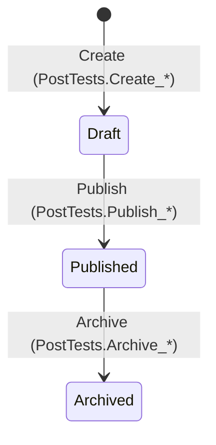

<!-- Copy to docs/domain/{feature}/README.md in the project repository -->
---
doc-type: feature-spec
feature: {feature}
aggregate: {AggregateName}
use-cases: [{use-case}, {use-case-2}]
layer-context: [backend.domain]
conventions: [backend.domainLayer, backend.exceptionHierarchy]
status: active
---
# {Feature Name}

| Field | Value |
|:---|:---|
| Status | Active / Deprecated |
| Last updated | |

---

## Ubiquitous Language

| Term | Definition | Maps To | Do Not Use |
|:---|:---|:---|:---|
| `{Term}` | | `{Type}` | |

---

## Aggregate

### `{AggregateName}`

Describe the aggregate root, identity, and lifecycle.

### State transitions

Annotate each transition with the test class and method prefix pattern that covers it, for example `(PostTests.Publish_*)`. A transition with no annotation is a coverage gap until a test spec row exists.

### Invariants

- ...

### Invariants Under Test

| Invariant | Use case doc | Test class | Test method |
|:----------|:-------------|:-----------|:------------|
| Post can only be published once | [{use-case}.md]({use-case}.md) | `PostTests` | `Publish_WhenPostIsAlreadyPublished_ShouldThrowPostAlreadyPublishedException` |

Add a row when a domain invariant has automated coverage. Link to the use case test spec for full scenario and variation detail.

---

## Domain Events

| Event | Raised when | Payload | Outbox required |
|:---|:---|:---|:---:|
| `{Aggregate}{PastTenseVerb}` | | | Yes / No |

---

## Reactions (if any)

| Event | Handler | Side effect interface | Notes |
|:---|:---|:---|:---|
| | | | |

---

## Persistence

| Table | Purpose |
|:---|:---|
| `{table}` | |

---

## Use Cases

| Use case | Operation doc | Test spec | Backend | UI appearances |
|:---|:---|:---|:---|:---|
| `{Use case name}` | [{use-case}.md]({use-case}.md) | [{use-case}.tests.md]({use-case}.tests.md) | `{Feature}/{UseCase}/` | `apps/web/features/{feature}/{use-case}/`, `apps/admin/features/...` |

List every frontend app path where the use case has UI. Omit apps that have no surface for this use case.
