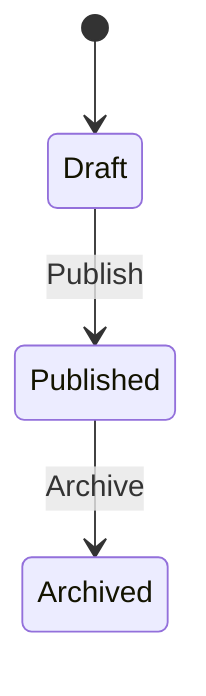

<!-- Copy to docs/domain/{feature}/README.md in the project repository -->
# {Feature Name}

| Field | Value |
|:---|:---|
| Status | Active / Deprecated |
| Last updated | |

---

## Ubiquitous Language

| Term | Definition | Maps To | Do Not Use |
|:---|:---|:---|:---|
| `{Term}` | | `{Type}` | |

---

## Aggregate

### `{AggregateName}`

Describe the aggregate root, identity, and lifecycle.

### State transitions

### Invariants

- ...

---

## Domain Events

| Event | Raised when | Payload | Outbox required |
|:---|:---|:---|:---:|
| `{Aggregate}{PastTenseVerb}` | | | Yes / No |

---

## Reactions (if any)

| Event | Handler | Side effect interface | Notes |
|:---|:---|:---|:---|
| | | | |

---

## Persistence

| Table | Purpose |
|:---|:---|
| `{table}` | |

---

## Use Cases

| Use case | Doc | Backend | Frontend |
|:---|:---|:---|:---|
| `{Use case name}` | [{use-case}.md]({use-case}.md) | `{Feature}/{UseCase}/` | `features/{feature}/{use-case}/` |
